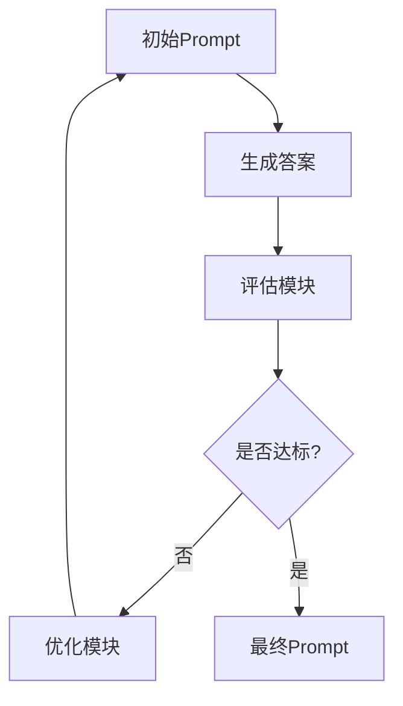
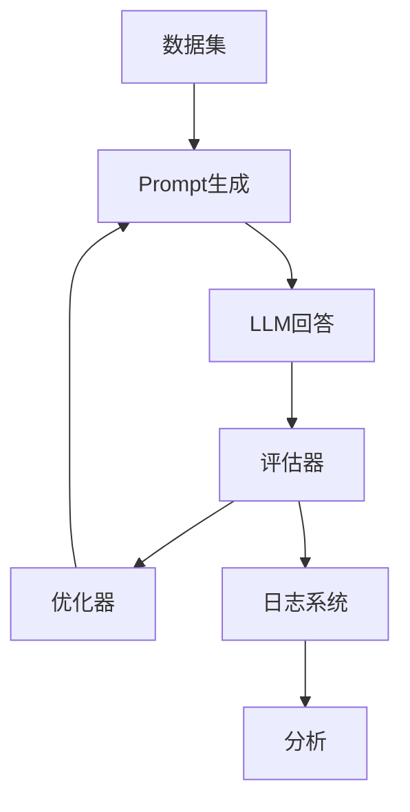

# 🤖 Prompt 自动优化器（Auto Prompt Optimization）设计与实现

> 目标：让 Prompt **自动变好**（更准、更稳、更少幻觉），用于企业级 Agent / RAG 系统

---

# 🧠 一、本质理解

```text id="l7k2fa"
Prompt优化 = 搜索最优Prompt
```

👉 本质是一个：

```text id="m8p3dz"
优化问题（Optimization Problem）
```

---

## 📌 输入 / 输出

```text id="q2n1vx"
输入：
- 初始 Prompt
- 数据集（问题 + 标准答案）

输出：
- 更优 Prompt（准确率更高）
```

---

# 🧩 二、整体架构（核心）



---

# ⚙️ 三、核心模块拆解

---

## 📌 3.1 Generator（生成器）

```text id="mb1q2a"
用当前Prompt生成答案
```

```python id="z3k9dw"
def generate(prompt, question):
    return llm(prompt.format(question=question))
```

---

## 📌 3.2 Evaluator（评估器）

👉 判断答案好不好

---

### 方法1：规则评估（简单）

```python id="x8w2lp"
def eval(answer, gt):
    return answer == gt
```

---

### 方法2：LLM评估（推荐）

```python id="m7k1fz"
def eval(answer, gt):
    prompt = f"""
    判断以下答案是否正确：
    标准答案：{gt}
    模型答案：{answer}
    输出：correct / wrong
    """
    return llm(prompt)
```

---

### 方法3：打分制

```python id="h2q7cs"
score = 0~10
```

---

## 📌 3.3 Optimizer（优化器）

👉 核心：改写 Prompt

---

# 🔥 四、三种主流优化策略（重点）

---

## 🧠 4.1 LLM-Based 优化（最常用）

---

### 思路

```text id="z9c1kx"
让 LLM 自己改 Prompt
```

---

### 示例

```python id="r2x5me"
def optimize(prompt, bad_cases):
    return llm(f"""
    当前Prompt：
    {prompt}

    以下是失败案例：
    {bad_cases}

    请优化Prompt，使其更准确：
    """)
```

---

### 优点

* 简单
* 效果好

---

## 🧬 4.2 遗传算法（高级）

---

### 思路

```text id="x9m2ql"
Prompt = 基因
```

---

### 流程

```text id="d5p8zn"
1. 初始化多个Prompt
2. 评估
3. 选择最优
4. 交叉 / 变异
5. 迭代
```

---

### 示例

```python id="k1n9tw"
population = [prompt1, prompt2]

for _ in range(10):
    scores = [eval(p) for p in population]
    best = select(population, scores)
    population = mutate(best)
```

---

## ⚙️ 4.3 强化学习（企业级）

---

### 思路

```text id="c7t4hv"
Prompt = policy
奖励 = accuracy
```

---

👉 类似：

```text id="t1g8bs"
RLHF / PPO
```

---

# 🧪 五、完整实现（可运行简化版）

---

```python id="p8x1wd"
dataset = [
    {"q": "LangChain是什么", "a": "框架"},
    {"q": "RAG是什么", "a": "检索增强生成"}
]

prompt = "请回答问题：{question}"

for epoch in range(5):
    bad_cases = []

    for item in dataset:
        pred = generate(prompt, item["q"])

        if not eval(pred, item["a"]):
            bad_cases.append(item)

    if not bad_cases:
        break

    prompt = optimize(prompt, bad_cases)

print("最终Prompt：", prompt)
```

---

# 📊 六、评估指标（必须有）

---

## 📌 常见指标

```text id="x2c6ks"
- Accuracy（准确率）
- Hallucination Rate（幻觉率）
- Consistency（一致性）
- Token Cost（成本）
```

---

## 📌 企业级指标

```text id="z1y7jq"
- 拒答率（Refusal Rate）
- 置信度分布
```

---

# 🔒 七、防幻觉优化策略（重点）

---

## 📌 自动加入约束

```text id="u6w2kp"
- 不允许编造
- 必须基于上下文
- 不知道就拒答
```

---

## 📌 自动结构化

```json id="k7j9af"
{
  "answer": "...",
  "confidence": "..."
}
```

---

## 📌 自动增加 Self-check

```text id="y3d8hx"
请检查答案是否正确
```

---

# 🚀 八、企业级优化架构

---



---

# ⚠️ 九、常见坑

---

## ❌ 1. 数据集太小

```text id="q6k1rp"
导致过拟合
```

---

## ❌ 2. 评估不准

```text id="m2c7tx"
LLM评估可能有偏差
```

---

## ❌ 3. Prompt过长

```text id="r4v8wn"
成本爆炸
```

---

# 🧠 十、进阶（高手必备）

---

## 📌 多Prompt融合

```text id="f1k3yb"
多个Prompt → 投票
```

---

## 📌 动态Prompt

```text id="k5v2pc"
根据问题类型切换Prompt
```

---

## 📌 Online Learning

```text id="t9w6ql"
实时优化Prompt（线上学习）
```

---

# 🏁 十一、终极总结

---

```text id="n4p9ds"
Prompt优化本质：

试错 + 反馈 + 改进
```

---

```text id="z7c1bx"
从“写Prompt”
→ “训练Prompt”
```

---

```text id="x3g8kf"
真正的高手：

不是写最好的Prompt  
而是让Prompt自动变好
```

---

# 🧾 END
