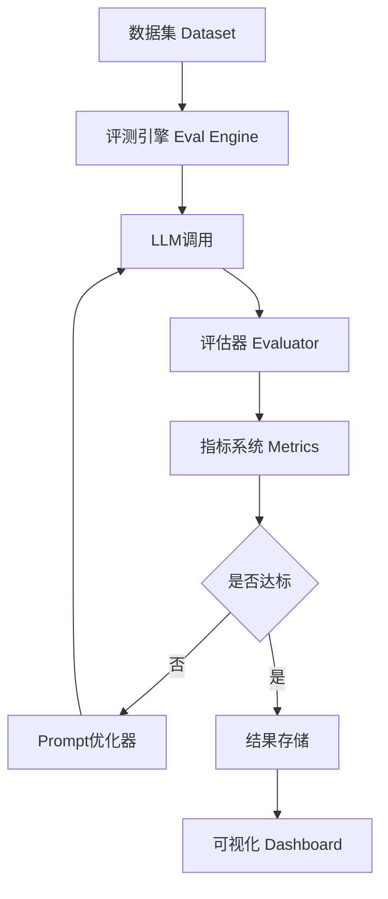
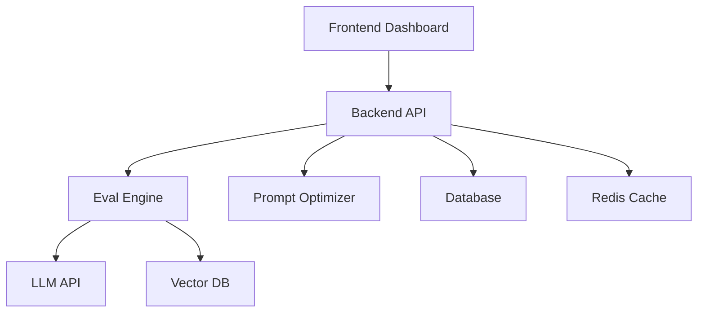

# 🏗️ 自动评测 + Prompt优化 + RAG评估 平台（企业级完整方案）

> 目标：构建一套类似 **OpenAI Evals** 的系统
> 👉 能自动评估、优化、监控你的 Agent / RAG / Prompt

---

# 🧠 一、系统总体架构



---

# 🧩 二、核心模块拆解

---

## 📌 2.1 Dataset（数据集）

```text id="j3a9w2"
用于评测质量（核心基础）
```

---

### 数据格式（推荐）

```json id="k3p9d1"
{
  "question": "LangChain是什么？",
  "context": "LangChain 是一个框架",
  "answer": "LangChain 是一个框架"
}
```

---

### 数据来源

```text id="z5m1q8"
- 人工标注
- 真实用户问题
- 日志回放
```

---

## 📌 2.2 Eval Engine（评测引擎）

👉 控制整个评测流程

---

### 核心逻辑

```python id="n8p2x6"
for sample in dataset:
    result = run_model(sample)
    score = evaluate(result, sample)
```

---

## 📌 2.3 Generator（模型调用）

```python id="d7t4k1"
def run_model(sample):
    return llm(
        prompt.format(
            context=sample["context"],
            question=sample["question"]
        )
    )
```

---

## 📌 2.4 Evaluator（评估器）

---

### 方法1：精确匹配

```python id="g1m9v4"
def exact_match(pred, gt):
    return pred == gt
```

---

### 方法2：语义匹配（推荐）

```python id="s3q8k2"
def llm_eval(pred, gt):
    return llm(f"""
    判断答案是否语义一致：
    标准答案：{gt}
    模型答案：{pred}
    输出：0~1分
    """)
```

---

### 方法3：RAG专用评估

```text id="u6k2p1"
- 是否使用了正确文档？
- 是否引用了错误信息？
```

---

## 📊 2.5 Metrics（指标系统）

---

### 必备指标

```text id="t9r3m6"
- Accuracy（准确率）
- Hallucination Rate（幻觉率）
- Recall（召回率）
- Precision（精确率）
```

---

### RAG 专属

```text id="v2m8q1"
- Context Recall（是否检索到正确文档）
- Faithfulness（是否忠于上下文）
```

---

# 🔁 三、Prompt 自动优化模块

---

## 📌 核心流程

```text id="p6w8x3"
失败样本 → 分析 → 改写 Prompt → 再评测
```

---

## 📌 实现

```python id="b2n7x4"
def optimize(prompt, bad_cases):
    return llm(f"""
    当前Prompt：
    {prompt}

    错误案例：
    {bad_cases}

    请优化Prompt：
    """)
```

---

## 📌 优化策略

```text id="r4p2k9"
- 增加约束（禁止幻觉）
- 强化格式
- 加入示例（Few-shot）
```

---

# 🔍 四、RAG 专项评估（关键）

---

## 📌 评估拆分

```text id="k8t3m7"
RAG = 检索 + 生成
```

---

### 1️⃣ 检索评估

```text id="q7m1v9"
问题：是否找到正确文档？
```

---

### 指标

```text id="x2n6p4"
Recall@K
```

---

### 2️⃣ 生成评估

```text id="z9r1k5"
问题：答案是否基于文档？
```

---

---

### 示例

```python id="c1m7p8"
def faithfulness(answer, context):
    return llm(f"""
    判断答案是否完全基于上下文：
    {context}
    {answer}
    """)
```

---

# 🧠 五、完整执行流程

---

```text id="w3k8p2"
1. 加载数据集
2. 调用模型（RAG / Agent）
3. 获取答案
4. 评估结果
5. 统计指标
6. 找出失败案例
7. 自动优化 Prompt
8. 再次评测
```

---

# 🚀 六、系统部署架构

---



---

## 📌 技术选型

```text id="t1k7m3"
后端：FastAPI
前端：Next.js
数据库：PostgreSQL
缓存：Redis
向量库：Milvus / FAISS
```

---

# 💰 七、成本控制（关键）

---

## 📌 优化策略

```text id="p3k9m1"
- 批量评测（Batch）
- 缓存结果
- 限制样本量
```

---

## 📌 分级评测

```text id="v7m2p4"
开发阶段：小数据集
上线前：全量评测
线上：抽样评测
```

---

# ⚠️ 八、常见坑

---

## ❌ 1. 没有高质量数据

```text id="z4p8m2"
→ 评测无意义
```

---

## ❌ 2. 评估器不准

```text id="x6m3k9"
→ LLM评估可能偏差
```

---

## ❌ 3. 优化过度

```text id="n2k7p5"
→ Prompt过拟合
```

---

# 🧠 九、进阶能力（拉开差距）

---

## 🔥 9.1 A/B测试系统

```text id="r8k1m6"
不同Prompt对比效果
```

---

## 🔥 9.2 在线学习

```text id="p6m4k2"
根据用户反馈优化
```

---

## 🔥 9.3 自动数据生成

```text id="k3m7p1"
LLM生成训练数据
```

---

# 🏁 十、终极总结

---

```text id="m9k2p7"
企业级AI系统核心：

不是模型  
而是评测体系
```

---

```text id="v3k8m1"
没有评测 → 无法优化  
没有优化 → 无法进化
```

---

```text id="x7m1k9"
真正的壁垒：

Prompt + RAG + Eval 三位一体
```

---

# 🧾 END
