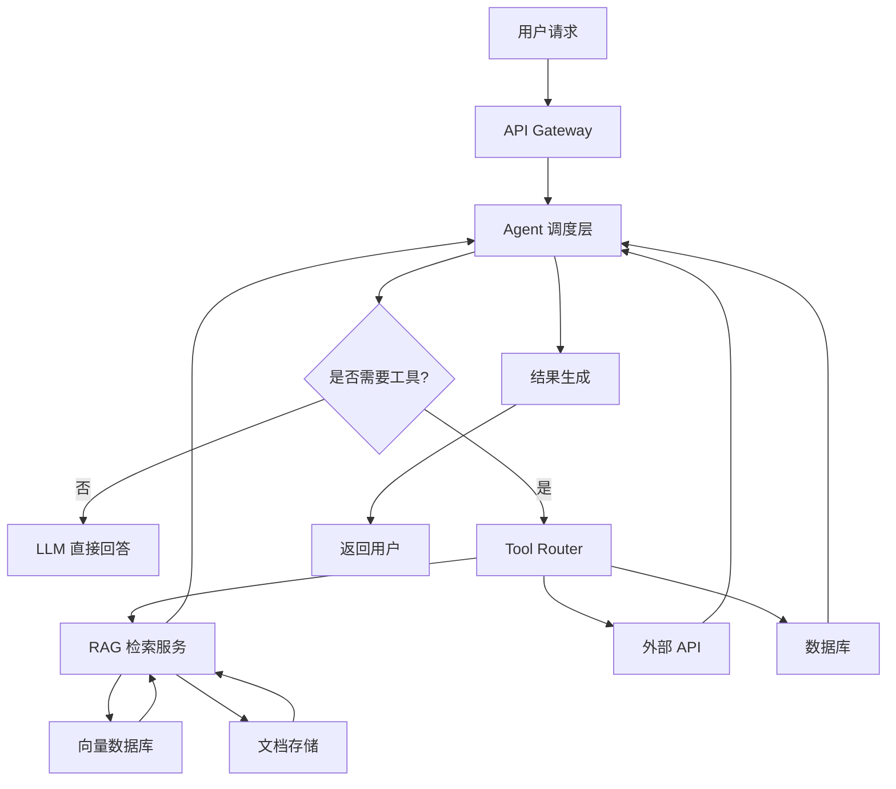
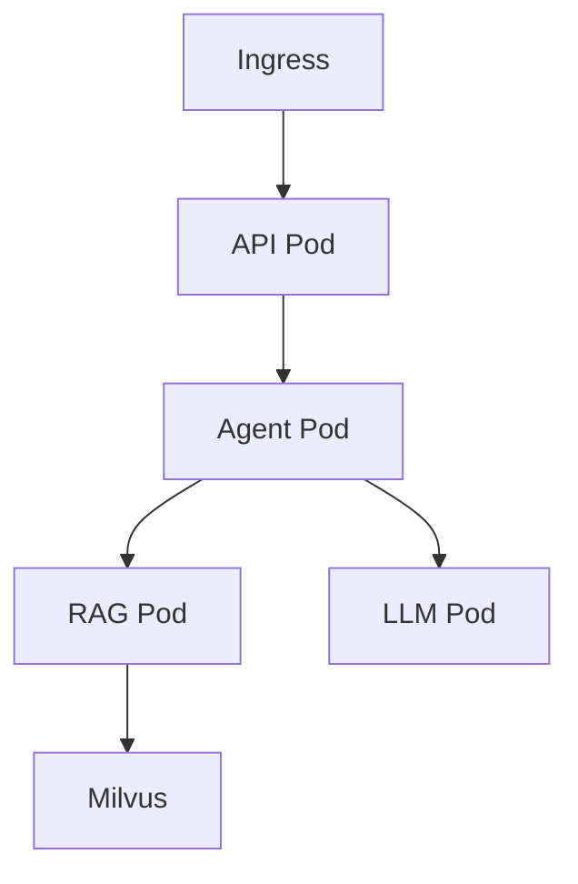

# 🏗️ 企业级 Agentic RAG 架构设计 + 部署方案（含GPU与成本）

> 目标：构建一个**可上线、可扩展、可控成本**的 Agentic RAG 系统

---

# 🧠 一、整体架构（核心图）



---

# 🧩 二、系统分层设计

## 📌 1. 接入层（API Gateway）

```text
职责：
- 统一入口
- 鉴权（JWT / API Key）
- 限流（Rate Limit）
```

推荐：

* Nginx / Kong / FastAPI

---

## 📌 2. Agent 调度层（核心）

```text
职责：
- Thought / Action / Observation 循环
- 工具调用决策
- 控制执行流程
```

技术选型：

```text
LangChain / LlamaIndex / 自研 Agent
```

---

## 📌 3. Tool 层

```text
统一工具接口（Tool Interface）
```

包括：

* RAG 检索
* Web Search
* 数据库查询
* 代码执行

---

## 📌 4. RAG 检索层

```text
Query → Embedding → Vector Search → Rerank → 返回文档
```

---

## 📌 5. 存储层

### 向量数据库

```text
- FAISS（单机）
- Milvus（推荐）
- Weaviate
```

### 文档存储

```text
- Elasticsearch
- PostgreSQL
- S3 / OSS
```

---

## 📌 6. 模型层

```text
LLM + Embedding Model
```

---

# ⚙️ 三、部署架构（生产级）

## 📌 3.1 服务拆分

```text
services:
- api-service
- agent-service
- rag-service
- embedding-service
- vector-db
- llm-service
```

---

## 📌 3.2 容器化部署

```bash
Docker + Docker Compose / Kubernetes
```

---

## 📌 3.3 Kubernetes 架构



---

# 🧠 四、Agentic RAG 核心流程（生产版）

```text
1. 用户请求进入 API
2. Agent 判断任务类型
3. 是否需要 RAG？
4. 调用检索服务
5. 检索 → Rerank → 返回
6. Agent 判断是否足够
7. 不够 → 再调用工具
8. 最终生成答案
```

---

# 🚀 五、GPU 资源规划

---

## 📌 5.1 模型部署方案

### 方案A：调用API（推荐）

```text
OpenAI / Claude / 通义
```

✔ 优点：

* 无需GPU
* 成本可控

---

### 方案B：自部署模型

| 模型    | 推荐GPU       |
| ----- | ----------- |
| 7B模型  | 1× RTX 4090 |
| 13B模型 | 1-2× 4090   |
| 70B模型 | A100 / H100 |

---

## 📌 5.2 Embedding 模型

```text
可用CPU or 小GPU
```

推荐：

* BGE-small（CPU）
* BGE-large（GPU）

---

## 📌 5.3 RAG 服务

```text
不需要GPU（主要是向量检索）
```

---

# 💰 六、成本评估（关键）

---

## 📌 6.1 低成本方案（推荐个人/小团队）

```text
LLM：API（按量付费）
向量库：FAISS
部署：单机（16GB RAM）
```

💰 成本：

* $20 ~ $100 / 月

---

## 📌 6.2 中等规模（企业起步）

```text
LLM：部分API + 部分自部署
向量库：Milvus
部署：K8s + 云服务器
```

💰 成本：

* $300 ~ $1500 / 月

---

## 📌 6.3 高并发（企业级）

```text
LLM：自部署（多GPU）
向量库：分布式
缓存：Redis
```

💰 成本：

* $3000+ / 月

---

# ⚠️ 七、性能优化（必须做）

---

## 🔥 7.1 缓存（最重要）

```text
- Query缓存
- 检索结果缓存
- LLM输出缓存
```

---

## 🔥 7.2 并发优化

```text
- 异步调用
- 批量embedding
```

---

## 🔥 7.3 限制 Agent

```text
max_iterations = 3~5
```

---

## 🔥 7.4 RAG优化

```text
- Top-K优化
- Rerank模型
- Chunk大小控制
```

---

# 🧩 八、企业级增强能力

---

## 📌 8.1 多 Agent 架构

```text
Planner → Executor → Reviewer
```

---

## 📌 8.2 审计 & 日志

```text
记录：
- 每一步 Thought
- Tool调用
- Token消耗
```

---

## 📌 8.3 安全

```text
- Prompt注入防护
- 数据隔离
- 权限控制
```

---

## 📌 8.4 监控

```text
Prometheus + Grafana
```

---

# 🏁 九、最终架构总结

```text
用户 → API → Agent → Tool → RAG/DB/API → Agent → LLM → 返回
```

---

## 📌 核心思想

```text
把“检索”变成工具  
把“决策”交给 Agent
```

---

## 📌 你必须掌握的能力

```text
1. RAG 架构设计
2. Agent 调度逻辑
3. 工具系统设计
4. 成本与性能权衡
```

---

# 🧾 END

```text
企业级 Agentic RAG 的本质：

不是“模型多强”  
而是“系统设计是否合理”
```
