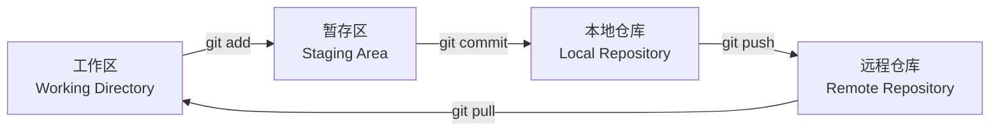

---
tags:
  - git
  - 版本控制
  - 教程
  - 入门
cssclass: git-tutorial
created: 2026-03-02
updated: 2026-03-02
---

# Git 入门教程

> Git 是一个「版本控制工具」，相当于给代码装了一个「无限撤销 + 时间机器 + 协作系统」

> [!tip] 学习路径
> 1. 理解 Git 是什么
> 2. 安装和配置
> 3. 掌握基础操作
> 4. 学会分支管理
> 5. 远程协作

---

# 1. Git 基础概念

## Git 是什么？

> [!info] 三大核心功能
> - **保存代码的历史版本**：可以回到任何一个过去的状态
> - **多人协作不冲突**：每个人都能同时改代码
> - **安全地实验新功能**：用分支，不怕改坏

## Git 的核心思想

### 本地优先

> [!summary] 与 SVN 最大的区别
> - 所有历史记录都在你电脑上
> - 不联网也能提交、回退、切换分支

### Git 管理的是「快照」，不是「差异」

每次 commit 会记录**整个项目当时的状态**，内部会智能复用没变的文件（不浪费空间）。

---

# 2. Git 配置

## 配置层级

| 级别 | 作用范围 | 文件位置 | 命令格式 |
|------|----------|----------|----------|
| **system** | 整台电脑 | `/etc/gitconfig` | `git config --system` |
| **global** | 当前用户 | `~/.gitconfig` | `git config --global` |
| **local** | 当前项目 | `.git/config` | `git config` |

## 常用配置命令

```bash
# 设置用户名和邮箱（必须）
git config --global user.name "Your Name"
git config --global user.email "your@email.com"

# 查看所有配置
git config --list --show-origin

# 设置默认分支名为 main
git config --global init.defaultBranch main

# 开启颜色输出
git config --global color.ui true
```

> [!tip] 建议
> - 使用 `--global` 配置个人信息（90% 的配置都在这里）
> - 使用 `--local` 为特定项目设置不同身份（如公司项目）

> [!info] 安装 Git
> 详细的安装和环境变量配置请参阅 [[../../AI学习/02-工具使用/如何使用Claude code#安装-git-并配置环境变量|Git 安装指南]]

---

# 3. 创建仓库

## 创建仓库的三种方式

### 方式一：从零开始

```bash
mkdir my-project && cd my-project
git init
touch README.md
git add README.md
git commit -m "initial commit"
```

### 方式二：克隆远程仓库

```bash
git clone https://github.com/user/repo.git
cd repo
```

### 方式三：已有代码转为 Git 仓库

```bash
cd existing-project
git init
git add .
git commit -m "initial commit"
```

## .git 目录结构

```
.git/
├── config      # 当前仓库配置
├── HEAD        # 当前分支指针
├── objects/    # Git 核心数据（存储所有对象）
└── refs/       # 分支、标签引用
```

---

# 4. Git 的区域与状态

## 四个区域



| 区域 | 说明 | 对应命令 |
|------|------|----------|
| **工作区** | 你正在写代码的地方 | 直接编辑 |
| **暂存区** | 临时存放"下一次要提交的内容" | `git add` |
| **本地仓库** | 你电脑上的 Git 历史库 | `git commit` |
| **远程仓库** | GitHub/GitLab 上的仓库 | `git push` |

## 四种文件状态

| 状态 | 所在区域 | 说明 | 如何处理 |
|------|----------|------|----------|
| **Untracked** | 工作区 | 新文件，Git 不知道 | `git add` |
| **Modified** | 工作区 | 已跟踪文件被修改 | `git add` |
| **Staged** | 暂存区 | 已添加到暂存区 | `git commit` |
| **Committed** | 本地仓库 | 已提交到历史 | 可回退/推送 |

## 状态变化示例

```bash
# 完整生命周期
touch app.js          # → Untracked
git add app.js        # → Staged
git commit            # → Committed
vim app.js           # → Modified
git add app.js        # → Staged
git commit            # → Committed
```

---

# 5. 基础操作

## 添加文件

```bash
git add main.py              # 添加单个文件
git add a.txt b.txt         # 添加多个文件
git add .                   # 添加所有修改（最常用）
git add -u                  # 只添加已跟踪文件的修改
```

> [!warning] 重要细节
> `git add` 不会自动跟踪后续修改！如果你 add 后又改了文件，需要再次 add。

## 提交文件

```bash
git commit -m "添加用户登录功能"      # 最常用方式
git commit -am "修复登录 bug"            # 跳过 add，直接提交已跟踪文件
git commit --amend -m "修改提交说明"     # 修改最后一次提交
```

## 查看版本历史

```bash
git log                              # 完整日志
git log --oneline                     # 简洁显示（推荐）
git log -n 5                        # 只看最近 5 条
git log --graph --oneline --decorate  # 图形化显示分支
git log README.md                    # 查看某个文件的历史
```

## 查看差异

```bash
git diff                    # 工作区 vs 暂存区
git diff --staged          # 暂存区 vs HEAD（即将提交什么）
git diff HEAD              # 工作区 vs HEAD（所有改动）
git diff app.js            # 只看某个文件
git diff --name-only       # 只看改了哪些文件
```

## 删除文件

```bash
git rm file.txt           # 删除并暂存（推荐）
git rm --cached file.txt  # 从 Git 删除，但保留本地文件
```

> [!tip] 普通删除方式
> 如果用 `rm file.txt`，还需要运行 `git add file.txt` 来通知 Git。

## 回退版本

| 模式 | HEAD | 暂存区 | 工作区 | 使用场景 |
|------|------|--------|--------|----------|
| `--soft` | 回退 | 保留 | 保留 | 想重新组织提交 |
| `--mixed`（默认） | 回退 | 清空 | 保留 | 回退但保留代码 |
| `--hard` | 回退 | 清空 | 丢弃 | 确认不要所有改动 |

```bash
git reset --soft HEAD~1        # 回退 1 次，改动保留在暂存区
git reset --mixed HEAD~1       # 回退 1 次，改动保留在工作区（默认）
git reset --hard HEAD~1        # 回退 1 次，丢弃所有改动

git reset --hard b91e7a2      # 回退到指定提交
```

> [!warning] reset 后悔了？
> ```bash
> git reflog                    # 查看 HEAD 历史记录
> git reset --hard <commit-id>   # 恢复到之前的提交
> ```

---

# 6. 分支管理

## 分支基本操作

```bash
git branch                    # 查看本地分支（* 表示当前）
git branch -a                 # 查看所有分支（含远程）
git branch feature-login        # 创建分支
git checkout -b feature-login  # 创建并切换分支
git switch -c feature-login    # 新版本命令（同上）
git checkout main              # 切换到 main 分支
git branch -d feature-login    # 删除已合并的分支
git branch -D feature-login    # 强制删除分支
```

## 分支命名规范

| 类型 | 命名格式 | 示例 |
|------|----------|------|
| 新功能 | `feature/功能名` | `feature/user-login` |
| 修复 bug | `bugfix/问题描述` | `bugfix/login-timeout` |
| 紧急修复 | `hotfix/问题描述` | `hotfix/security-fix` |
| 重构 | `refactor/模块名` | `refactor/api-module` |
| 文档 | `docs/内容` | `docs/readme-update` |

## 合并分支

```bash
# 1. 切换到目标分支
git checkout main

# 2. 合并其他分支
git merge feature-login

# 3. 解决冲突后
git add <conflict-file>
git commit

# 4. 删除已合并的分支
git branch -d feature-login
```

> [!tip] 推荐工作流
> ```bash
> # 先 rebase 保持历史线性
> git checkout feature-login
> git rebase main
> git checkout main
> git merge feature-login
> ```

---

# 7. 远程仓库与协作

## SSH 配置

### 检查现有 SSH Key

```bash
ls ~/.ssh
# 如果看到 id_ed25519 和 id_ed25519.pub，说明已有
```

### 生成新的 SSH Key

```bash
ssh-keygen -t ed25519 -C "your@email.com"
# 直接回车使用默认路径， passphrase 可以留空
```

### 添加公钥到 GitHub

```bash
cat ~/.ssh/id_ed25519.pub  # 复制输出内容
# GitHub → Settings → SSH and GPG keys → New SSH key
```

### 验证 SSH 连接

```bash
ssh -T git@github.com
# 成功会看到：Hi username! You've successfully authenticated...
```

## 远程仓库操作

```bash
git remote add origin git@github.com:user/repo.git  # 添加远程仓库
git remote -v                                        # 查看远程仓库
git remote show origin                                 # 查看远程仓库详情
git remote set-url origin <new-url>                   # 修改远程仓库地址
git remote remove origin                              # 删除远程仓库关联
```

## 推送与拉取

```bash
# 推送
git push                           # 推送当前分支
git push -u origin main             # 首次推送并建立跟踪关系
git push origin --delete branch-name  # 删除远程分支

# 拉取
git fetch                          # 只下载，不合并（安全）
git pull                           # Fetch + Merge
git pull --rebase                  # Fetch + Rebase（推荐）
```

> [!warning] 常见错误处理
> ```bash
> # 错误：Updates were rejected
> git pull --rebase  # 或 git pull
>
> # 错误：Permission denied (publickey)
> ssh -T git@github.com  # 检查 SSH 配置
> ```

---

# 下一步学习

恭喜你完成了 Git 入门！接下来可以：

> [!tip] 进阶学习
> - [[Git 命令速查]] - 快速查找常用命令
> - [[Git 高级技巧]] - Rebase、Stash、.gitignore 等
> - [[分支管理最佳实践]] - 团队协作分支策略
> - [[Git 常见错误解决方案]] - 按错误信息快速定位

## 相关文档
- [[Git/Git MOC]] - Git 知识体系索引
- [[../../AI学习/02-工具使用/如何使用Claude code]] - Git 安装与环境变量配置

---

**最后更新**：2026-03-02
