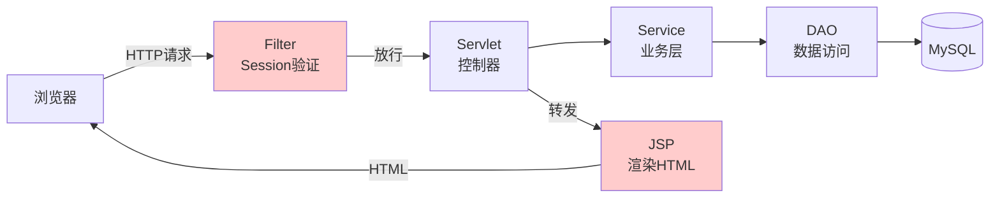
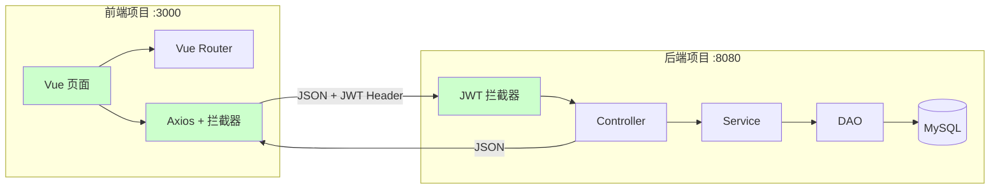

---
tags:
  - JavaWeb
  - SpringBoot
  - Vue
  - JWT
  - 前后端分离
  - 架构改造
aliases:
  - 学生管理系统分离版
  - JavaWeb转SpringBoot+Vue
created: 2026-06-23
---

# 🚀 学生信息管理系统：经典 JavaWeb → 前后端分离 + JWT

> 基于 [[零基础学生信息管理系统开发教程]] 的架构升级方案。不改业务逻辑，只改架构方式。

---

## 一、为什么要改造？

原项目是**经典 JavaWeb（Servlet + JSP + Filter + Session）**，教学优秀，但如果想面向真实场景：

| 痛点 | 经典架构的问题 | 改造后 |
|------|--------------|--------|
| 每次点击刷新整页 | JSP 服务端渲染，体验差 | Vue 局部刷新，像 App |
| 前端后端耦合 | 一个人改 JSP 可能搞崩 Servlet | 前后端独立开发部署 |
| 无法给 App 用 | 后端返回 HTML，App 无法解析 | 后端返回 JSON，全端通用 |
| Session 有状态 | 服务器重启用户全掉线 | JWT 无状态，横向扩展友好 |
| 部署笨重 | 打 War 包丢 Tomcat | 前端 Nginx + 后端 Jar |

---

## 二、架构对比：一图看懂变化

### 原架构（经典 JavaWeb）



### 新架构（前后端分离 + JWT）



**一句话**：原来 Filter → Servlet → JSP 的一条线，拆成 **前端 Vue 项目** + **后端 SpringBoot 项目** 两个独立项目，中间用 JSON 对话。

---

## 三、改造总览：什么变、什么不变

```
┌──────────────────────────────────────────────────────────────┐
│                        保持不变                              │
│  • 业务逻辑（增删改查学生/班级）                               │
│  • 数据库设计（tb_admin / tb_student / tb_clazz）            │
│  • 权限模型（管理员 vs 学生）                                  │
│  • MVC 分层思想                                              │
├──────────────────────────────────────────────────────────────┤
│                        需要改变                              │
│                                                              │
│  原                     →                    新              │
│  ─────────────────────────────────────────────                │
│  Servlet               →  SpringBoot @RestController         │
│  Filter + Session      →  Spring Interceptor + JWT           │
│  JSP + JSTL            →  Vue 3 + Element Plus               │
│  response.sendRedirect →  前端 router.push()                  │
│  JDBC 手写             →  MyBatis-Plus（可选，看阶段）         │
│  War 包 Tomcat         →  Jar 包内置 Tomcat                   │
│  一个项目              →  两个项目独立部署                     │
└──────────────────────────────────────────────────────────────┘
```

---

## 四、项目结构：从一个变两个

### 原项目结构

```
StudentManager/          ← 一个项目
├── src/
│   ├── filter/
│   │   └── LoginFilter.java
│   ├── servlet/
│   │   ├── LoginServlet.java
│   │   ├── StudentServlet.java
│   │   └── ClazzServlet.java
│   ├── service/
│   ├── dao/
│   └── entity/
└── web/
    ├── login.jsp
    ├── index.jsp
    ├── studentList.jsp
    └── ...
```

### 新项目结构

```
📁 student-frontend/              ← 前端项目（Vue 3）
├── src/
│   ├── views/
│   │   ├── LoginView.vue         ← 替代 login.jsp
│   │   ├── StudentListView.vue   ← 替代 studentList.jsp
│   │   ├── ClazzListView.vue     ← 替代 clazzList.jsp
│   │   └── ProfileView.vue       ← 替代 profile.jsp
│   ├── router/
│   │   └── index.js              ← 替代 Filter 的页面拦截
│   ├── utils/
│   │   └── request.js            ← axios 封装 + JWT 拦截器
│   └── store/
│       └── user.js               ← 替代 Session 的用户状态

📁 student-backend/               ← 后端项目（SpringBoot）
├── src/main/java/com/example/
│   ├── config/
│   │   └── JwtInterceptor.java   ← 替代 LoginFilter
│   ├── controller/
│   │   ├── AuthController.java   ← 替代 LoginServlet
│   │   ├── StudentController.java← 替代 StudentServlet
│   │   └── ClazzController.java  ← 替代 ClazzServlet
│   ├── service/
│   ├── mapper/                   ← 替代 DAO（MyBatis）
│   ├── entity/
│   └── util/
│       └── JwtUtil.java          ← JWT 工具类
└── src/main/resources/
    └── application.yml
```

---

## 五、核心改造点逐项拆解

### 5.1 身份验证：Session → JWT

这是最大的变化。

#### 原来的做法（Session + Filter）

```java
// ========== 登录（LoginServlet） ==========
Admin admin = adminService.login(username, password);
if (admin != null) {
    request.getSession().setAttribute("user", admin);  // 存 Session
    response.getWriter().write("{\"success\":true}");
}

// ========== 拦截（LoginFilter） ==========
HttpSession session = request.getSession();
Object user = session.getAttribute("user");
if (user == null) {
    response.sendRedirect("login.jsp");  // 未登录，跳转
    return;
}
chain.doFilter(request, response);  // 已登录，放行
```

#### 改造后（JWT + Interceptor）

```java
// ========== 登录（AuthController） ==========
@PostMapping("/login")
public Result login(@RequestBody LoginDTO dto) {
    Admin admin = adminService.login(dto.getUsername(), dto.getPassword());
    if (admin != null) {
        // 生成 JWT，把用户信息"塞"进 Token
        String token = JwtUtil.generateToken(admin.getUsername(), "admin");
        return Result.ok(Map.of("token", token));  // 返回 JSON → 前端存 localStorage
    }
    return Result.fail("用户名或密码错误");
}

// ========== 拦截（JwtInterceptor） ==========
public class JwtInterceptor implements HandlerInterceptor {
    @Override
    public boolean preHandle(HttpServletRequest request, 
                             HttpServletResponse response, 
                             Object handler) {
        String token = request.getHeader("Authorization");  // 从请求头取 Token
        if (token == null || !JwtUtil.validate(token)) {
            response.setStatus(401);
            response.getWriter().write("{\"code\":401,\"msg\":\"未登录\"}");
            return false;  // 拦截
        }
        // 从 Token 中解析出用户信息，存入请求上下文
        request.setAttribute("username", JwtUtil.getUsername(token));
        request.setAttribute("role", JwtUtil.getRole(token));
        return true;  // 放行
    }
}
```

> **关键区别**：
> - Session 存在服务器内存 → 服务器重启就没了 → 多台服务器要共享 Session（麻烦）
> - JWT 存在客户端（localStorage）→ 服务器完全无状态 → 加 100 台服务器也不需要共享任何东西

#### JWT 工具类

```java
public class JwtUtil {
    private static final String SECRET = "your-secret-key-keep-it-safe";
    private static final long EXPIRE = 7 * 24 * 60 * 60 * 1000; // 7天

    // 生成 Token
    public static String generateToken(String username, String role) {
        return Jwts.builder()
            .setSubject(username)
            .claim("role", role)           // 自定义字段：角色
            .setIssuedAt(new Date())
            .setExpiration(new Date(System.currentTimeMillis() + EXPIRE))
            .signWith(SignatureAlgorithm.HS256, SECRET)
            .compact();
    }

    // 验证 Token
    public static boolean validate(String token) {
        try {
            Jwts.parser().setSigningKey(SECRET).parseClaimsJws(token);
            return true;
        } catch (Exception e) {
            return false;
        }
    }

    // 从 Token 取用户名
    public static String getUsername(String token) {
        return Jwts.parser()
            .setSigningKey(SECRET)
            .parseClaimsJws(token)
            .getBody()
            .getSubject();
    }

    // 从 Token 取角色
    public static String getRole(String token) {
        return (String) Jwts.parser()
            .setSigningKey(SECRET)
            .parseClaimsJws(token)
            .getBody()
            .get("role");
    }
}
```

---

### 5.2 控制器：Servlet → @RestController

#### 原来的做法（一个 Servlet 处理多个操作）

```java
@WebServlet("/student")
public class StudentServlet extends HttpServlet {
    protected void doGet(HttpServletRequest req, HttpServletResponse resp) {
        String action = req.getParameter("action");  // 根据参数分发
        if ("list".equals(action)) {
            handleList(req, resp);
        } else if ("toAdd".equals(action)) {
            req.getRequestDispatcher("/studentAdd.jsp").forward(req, resp);
        }
    }
    // 返回的要么是 JSP 页面，要么是手动拼接的 JSON
}
```

#### 改造后（一个 Controller，不同 URL）

```java
@RestController
@RequestMapping("/api/student")
public class StudentController {

    @Autowired
    private StudentService studentService;

    // GET /api/student?page=1&size=10
    @GetMapping
    public Result list(@RequestParam(defaultValue = "1") int page,
                       @RequestParam(defaultValue = "10") int size) {
        PageResult<Student> result = studentService.findByPage(page, size);
        return Result.ok(result);
    }

    // POST /api/student
    @PostMapping
    public Result add(@RequestBody Student student) {
        studentService.add(student);
        return Result.ok();
    }

    // DELETE /api/student/2022001
    @DeleteMapping("/{sno}")
    public Result delete(@PathVariable String sno) {
        studentService.delete(sno);
        return Result.ok();
    }

    // PUT /api/student/2022001
    @PutMapping("/{sno}")
    public Result update(@PathVariable String sno, @RequestBody Student student) {
        student.setSno(sno);
        studentService.update(student);
        return Result.ok();
    }
}
```

**关键变化**：
- `@WebServlet("/student")` → `@RestController` + `@RequestMapping("/api/student")`
- `req.getParameter("action")` → RESTful URL（`GET /list`、`POST /add`）
- `request.getRequestDispatcher(".jsp").forward()` → 不返回页面，只返回 JSON
- `resp.getWriter().write(手动拼JSON)` → Spring 自动把对象序列化成 JSON

---

### 5.3 页面渲染：JSP → Vue 组件

#### 原来的做法（JSP 服务端渲染）

```jsp
<!-- studentList.jsp -->
<%@ taglib prefix="c" uri="http://java.sun.com/jsp/jstl/core" %>
<table>
    <thead>
        <tr><th>学号</th><th>姓名</th><th>操作</th></tr>
    </thead>
    <tbody>
        <c:forEach items="${studentList}" var="stu">
            <tr>
                <td>${stu.sno}</td>
                <td>${stu.name}</td>
                <td>
                    <a href="student?action=delete&sno=${stu.sno}">删除</a>
                </td>
            </tr>
        </c:forEach>
    </tbody>
</table>
```

#### 改造后（Vue 前端渲染）

```vue
<!-- StudentListView.vue -->
<template>
  <el-table :data="studentList" border stripe>
    <el-table-column prop="sno" label="学号" />
    <el-table-column prop="name" label="姓名" />
    <el-table-column prop="clazzName" label="班级" />
    <el-table-column label="操作">
      <template #default="{ row }">
        <el-button type="danger" size="small" @click="handleDelete(row.sno)">
          删除
        </el-button>
      </template>
    </el-table-column>
  </el-table>

  <!-- 分页组件 -->
  <el-pagination
    v-model:current-page="currentPage"
    :total="total"
    @current-change="fetchData"
  />
</template>

<script setup>
import { ref, onMounted } from 'vue'
import { ElMessage, ElMessageBox } from 'element-plus'
import request from '@/utils/request'

const studentList = ref([])
const currentPage = ref(1)
const total = ref(0)

const fetchData = async () => {
  const res = await request.get('/api/student', {
    params: { page: currentPage.value, size: 10 }
  })
  studentList.value = res.data.records
  total.value = res.data.total
}

const handleDelete = async (sno) => {
  await ElMessageBox.confirm('确认删除该学生？', '警告', { type: 'warning' })
  await request.delete(`/api/student/${sno}`)
  ElMessage.success('删除成功')
  fetchData()
}

onMounted(() => fetchData())
</script>
```

**关键变化**：
- `<c:forEach>` → `v-for`
- 页面跳转由服务端 `forward` → 前端 `router.push()`
- 表单提交整页刷新 → `axios` 异步请求 + 局部刷新

---

### 5.4 页面拦截：Filter → 前端路由守卫 + 后端拦截器

```
【原来】全靠 Filter 一个东西

   浏览器 → 所有请求 → Filter → Session检查 → 放行/重定向


【现在】两层防护，各管各的

   前端：Vue Router 守卫（防用户看到空白页）
         ↓
   后端：JWT Interceptor（防未授权访问 API）
```

#### 前端路由守卫

```javascript
// router/index.js
router.beforeEach((to, from, next) => {
  const token = localStorage.getItem('token')
  
  if (to.path === '/login') {
    next()  // 登录页直接放行
  } else if (!token) {
    next('/login')  // 没 Token → 跳到登录页
  } else {
    next()  // 有 Token → 放行
  }
})
```

#### 后端拦截器

```java
@Configuration
public class WebConfig implements WebMvcConfigurer {
    @Override
    public void addInterceptors(InterceptorRegistry registry) {
        registry.addInterceptor(new JwtInterceptor())
            .addPathPatterns("/api/**")             // 拦截所有 API
            .excludePathPatterns("/api/auth/login"); // 登录接口放行
    }
}
```

> ⚠️ **重要**：前端路由守卫只是"防君子"——让没登录的用户看不到空白页面。真正保护数据的是后端 Interceptor。永远不能信任前端！

---

### 5.5 前端 axios 封装（自动带 JWT + 401 处理）

```javascript
// utils/request.js
import axios from 'axios'
import router from '@/router'
import { ElMessage } from 'element-plus'

const request = axios.create({
  baseURL: 'http://localhost:8080',
  timeout: 10000
})

// 请求拦截器：每次请求自动带上 Token
request.interceptors.request.use(config => {
  const token = localStorage.getItem('token')
  if (token) {
    config.headers.Authorization = token  // 不需要写 "Bearer "，看后端约定
  }
  return config
})

// 响应拦截器：统一处理 401
request.interceptors.response.use(
  response => response.data,
  error => {
    if (error.response?.status === 401) {
      localStorage.removeItem('token')
      router.push('/login')
      ElMessage.error('登录已过期，请重新登录')
    }
    return Promise.reject(error)
  }
)

export default request
```

> 这就是替代原来 `LoginFilter` 的那句 `response.sendRedirect("login.jsp")` ——以前服务端帮你跳，现在前端自己跳。

---

## 六、API 接口设计（前后端约定）

前后端分离后，**API 接口就是前后端的"合同"**。前后端各自开发，只要接口不变就不互相影响。

| 方法 | URL | 说明 | 需要 JWT |
|------|-----|------|:---:|
| POST | `/api/auth/login` | 管理员/学生登录 | ❌ |
| GET | `/api/student?page=1&size=10` | 分页查询学生 | ✅ |
| POST | `/api/student` | 添加学生 | ✅ admin |
| PUT | `/api/student/{sno}` | 修改学生 | ✅ |
| DELETE | `/api/student/{sno}` | 删除学生 | ✅ admin |
| GET | `/api/clazz` | 查询班级列表 | ✅ |
| POST | `/api/clazz` | 添加班级 | ✅ admin |
| PUT | `/api/clazz/{clazzno}` | 修改班级 | ✅ admin |
| GET | `/api/student/profile` | 查自己的信息 | ✅ student |

统一返回格式：

```json
{
  "code": 200,
  "msg": "操作成功",
  "data": { ... }
}
```

---

## 七、技术改造路线（分阶段实施建议）

不要企图一次性全改完，分三步走最稳妥：

```
第1阶段：后端先行
├── 新建 SpringBoot 项目
├── 搬数据库 → 复制 entity
├── 搬 DAO → 改成 MyBatis Mapper
├── 搬 Service → 几乎原样复制
├── 搬 Servlet → 写成 @RestController
├── 实现 JWT 登录 + Interceptor
└── ✅ 用 Postman 验证所有 API 返回正确 JSON

第2阶段：前端跟进
├── 新建 Vue 3 项目
├── 安装 Element Plus + axios + vue-router
├── 写 LoginView → 调 /api/auth/login → 存 Token
├── 写 StudentListView → 调 /api/student → 渲染表格
├── 写 axios 拦截器 → 自动带 Token + 处理 401
├── 写路由守卫 → 未登录跳登录页
└── ✅ 前后端联调通过

第3阶段：体验优化
├── 加 Loading 状态、错误提示
├── 加分页组件
├── 权限细化（管理员才能看到删除按钮）
└── 部署：前端 npm run build → Nginx，后端 mvn package → java -jar
```

---

## 八、快速对照表

| 原项目（经典 JavaWeb） | 新项目（前后端分离 + JWT） | 说明 |
|------------------------|--------------------------|------|
| `HttpServlet` | `@RestController` | SpringBoot 自动处理 |
| `req.getParameter("action")` | `@GetMapping` / `@PostMapping` | RESTful 风格 |
| `session.setAttribute("user")` | 返回 JWT Token | 无状态 |
| `session.getAttribute("user")` 判登录 | `JwtInterceptor` + `request.getHeader("Authorization")` | Token 在请求头 |
| `response.sendRedirect()` | 前端 `router.push()` | 跳转逻辑移到前端 |
| `request.getRequestDispatcher().forward()` | 不存在了 | 后端不返回页面 |
| `JSP + JSTL + EL` | `Vue 3 + Element Plus` | 前后端彻底分离 |
| `resp.getWriter().write(手动拼JSON)` | 直接 `return` 对象 | Spring 自动序列化 |
| `LoginFilter` | `JwtInterceptor` + 前端路由守卫 | 两层防护 |
| `@WebFilter(urlPatterns={...})` | `addPathPatterns("/api/**")` | Spring 配置式拦截 |
| War 包 → Tomcat | Jar 包 → `java -jar` | 内置 Tomcat |

---

## 九、关键提醒

> [!warning] **前后端分离不是更简单，而是更专业**
> 经典架构适合一个人快速开发；分离架构适合团队协作和真实产品。学习成本更高，但天花板也更高。

> [!tip] **先跑通再优化**
> 第1阶段（后端）跑通前，不要碰前端。后端 API 用 Postman 验证通过了，再开始写 Vue。

> [!important] **安全铁律：永远不信任前端**
> 前端路由守卫只是 UI 层面的拦截，真正的权限验证必须在后端 Interceptor 里做。JWT Token 验证要检查：是否过期、签名是否正确、角色是否有权限。

> [!tip] **与经典架构的关系**
> 理解了 [[零基础学生信息管理系统开发教程]] 的每一层在做什么，再看这套方案就会觉得 "只是换了一套工具"。MVC 思想不变、数据库设计不变、业务逻辑不变——变的只是中间传递的方式。

---
