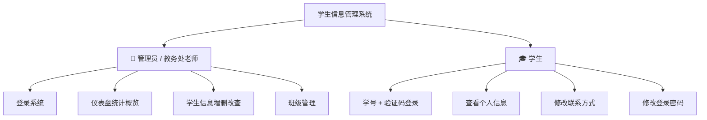
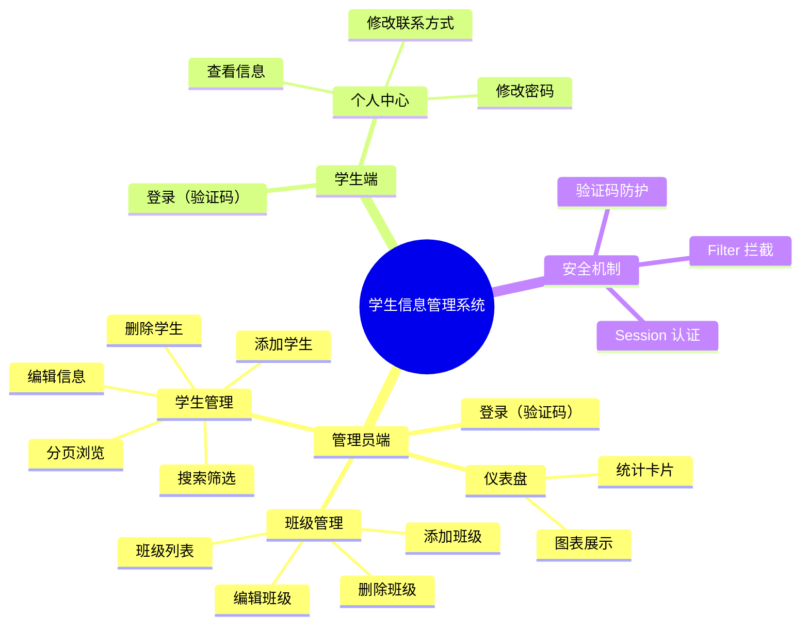
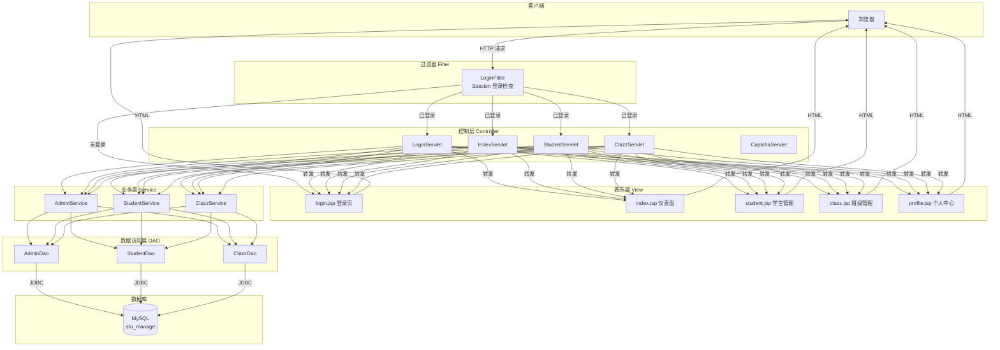
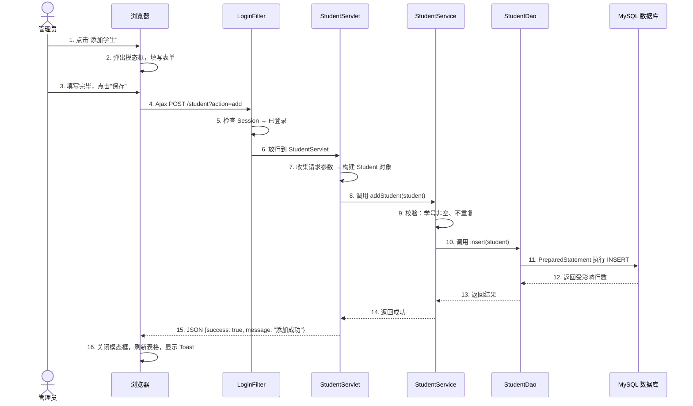
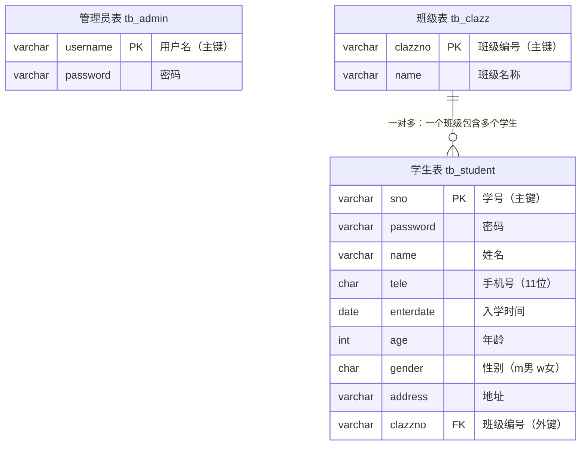
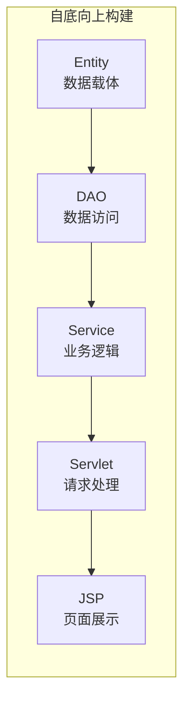
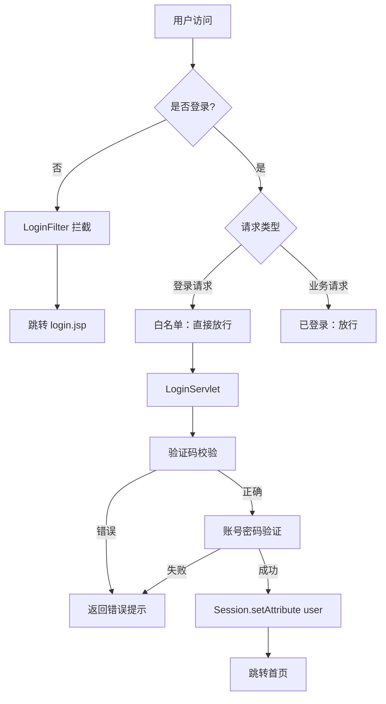
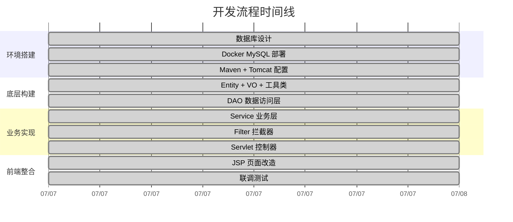
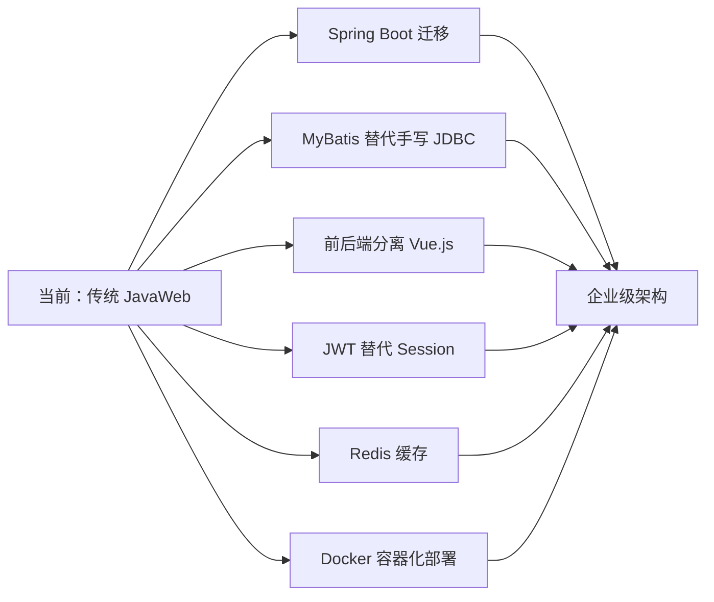
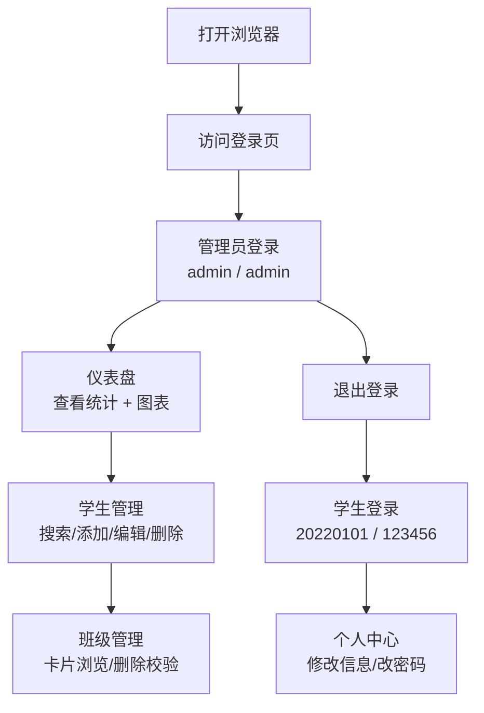

# 学生信息管理系统 — 答辩报告

> **项目性质**：JavaWeb 课程实训
> **架构模式**：MVC（Model-View-Controller）
> **技术栈**：原生 Servlet + JSP + JDBC + MySQL
> **开发周期**：2026年7月

---

## 一、项目概述

### 1.1 项目背景

高校教务管理中存在以下痛点：

| 传统方式 | 问题 |
|----------|------|
| Excel 表格管理学生信息 | 数据分散、版本不一致 |
| 手动录入 | 容易出错、效率低下 |
| 文件共享 | 无权限控制、隐私泄露风险 |
| 纸质档案 | 查询困难、无法快速检索 |

本系统旨在通过信息化手段解决上述问题，实现学生与班级信息的集中化、规范化管理。

### 1.2 项目目标

- 构建一个 B/S 架构的学生信息管理系统
- 实现管理员对学生和班级的完整 CRUD 操作
- 实现学生端个人信息查看与修改
- 通过权限控制保障数据安全

### 1.3 系统角色



### 1.4 界面展示

| 登录 | 仪表盘 |
|------|--------|
| ![[images/login.png]] | ![[images/dashboard.png]] |

| 学生管理 | 班级管理 |
|----------|----------|
| ![[images/student.png]] | ![[images/clazz.png]] |

### 1.5 默认账号

| 角色 | 账号 | 密码 |
|------|------|------|
| 管理员 | admin | admin |
| 学生 | 20220101 | 123456 |

---

## 二、功能模块

### 2.1 功能总览



### 2.2 管理员端功能

| 功能模块 | 具体操作 | 说明 |
|----------|---------|------|
| 仪表盘 | 统计概览 | 学生总数、班级数、男女生比例，实时数据 |
| 仪表盘 | 图表展示 | Chart.js 柱状图/饼图展示各班人数分布 |
| 学生管理 | 分页浏览 | 每页 10 条，支持翻页 |
| 学生管理 | 搜索筛选 | 按学号、姓名、班级组合筛选 |
| 学生管理 | 添加学生 | 模态框表单，前端校验 + 后端唯一性校验 |
| 学生管理 | 编辑学生 | 数据回填模态框，学号不可修改 |
| 学生管理 | 删除学生 | 确认弹窗 + Ajax 异步提交 |
| 班级管理 | 班级列表 | 卡片展示，含每班学生人数 |
| 班级管理 | 添加/编辑/删除 | 删除前校验（有学生则禁止删除） |

### 2.3 学生端功能

| 功能 | 说明 |
|------|------|
| 个人信息查看 | 只读字段：学号、姓名、性别、班级、入学时间 |
| 联系方式修改 | 可编辑：电话、地址 |
| 修改密码 | 验证旧密码 → 新密码校验 → 确认一致性 |

---

## 三、技术架构

### 3.1 技术选型

| 层级 | 技术 | 选型理由 |
|------|------|----------|
| **后端框架** | 原生 Servlet | 零框架依赖，深入理解 HTTP 和 Web 底层原理 |
| **视图层** | JSP + JSTL + EL | 服务端渲染，直接嵌入 Java 数据 |
| **数据库** | MySQL 8.0 / H2 内嵌 | MySQL 生产模式 + H2 自动降级（零配置演示） |
| **数据库连接** | JDBC (PreparedStatement) | 最直接的数据库操作，防 SQL 注入 |
| **前端样式** | Tailwind CSS + 自定义玻璃拟态 | 现代化 Apple 风格 UI |
| **前端交互** | jQuery + Ajax | 异步请求，不刷新页面完成增删改 |
| **图表** | Chart.js | 轻量级 Canvas 图表库 |
| **图标** | Lucide Icons | 轻量矢量图标 |
| **认证** | Session + Filter | 服务端会话管理（30 分钟超时），过滤器拦截未登录请求 |
| **服务器** | Tomcat 8.5 (内嵌) | 成熟稳定的 Servlet 容器 |
| **构建** | Maven 3.9.6 + tomcat7-maven-plugin | 依赖管理 + 一键编译启动 |
| **启动** | start.bat 一键脚本 | 双击即可，零命令行操作 |

### 3.2 MVC 架构全景



### 3.3 一次请求的完整数据流

以"管理员添加学生"为例，追踪 13 个步骤：



---

## 四、数据库设计

### 4.1 ER 图



### 4.2 建表 SQL（核心）

```sql
CREATE DATABASE stu_manage CHARACTER SET utf8mb4 COLLATE utf8mb4_unicode_ci;

CREATE TABLE tb_admin (
    username VARCHAR(20) PRIMARY KEY COMMENT '用户名',
    password VARCHAR(20) NOT NULL COMMENT '密码'
) ENGINE=InnoDB DEFAULT CHARSET=utf8mb4 COMMENT='管理员表';

CREATE TABLE tb_clazz (
    clazzno VARCHAR(20) PRIMARY KEY COMMENT '班级编号',
    name VARCHAR(20) NOT NULL COMMENT '班级名称'
) ENGINE=InnoDB DEFAULT CHARSET=utf8mb4 COMMENT='班级表';

CREATE TABLE tb_student (
    sno VARCHAR(20) PRIMARY KEY COMMENT '学号',
    password VARCHAR(20) NOT NULL COMMENT '密码',
    name VARCHAR(20) NOT NULL COMMENT '姓名',
    tele CHAR(11) COMMENT '手机号',
    enterdate DATE COMMENT '入学时间',
    age INT COMMENT '年龄',
    gender CHAR(1) COMMENT '性别：m男 w女',
    address VARCHAR(100) COMMENT '详细地址',
    clazzno VARCHAR(100) COMMENT '班级编号',
    FOREIGN KEY (clazzno) REFERENCES tb_clazz(clazzno)
) ENGINE=InnoDB DEFAULT CHARSET=utf8mb4 COMMENT='学生表';
```

> [!TIP] 防乱码设计
> 全链路 UTF-8：
> - 数据库：`utf8mb4` 字符集 + `utf8mb4_unicode_ci` 排序规则
> - JDBC URL：`characterEncoding=UTF-8`
> - JSP：`<%@ page contentType="text/html;charset=UTF-8" %>`
> - Servlet：`request.setCharacterEncoding("UTF-8")`

### 4.3 初始化数据

**MySQL 模式**：执行 `src/main/resources/init.sql` 初始化。

**H2 模式**：`DatabaseInitListener`（@WebListener）在应用启动时自动建表并插入初始数据，零配置。

| 表 | 数据量 | 说明 |
|----|--------|------|
| `tb_admin` | 1 条 | admin / admin |
| `tb_clazz` | 8 条 | 含 2 个空班级（测试删除校验） |
| `tb_student` | 43 条 | 分布在 6 个班级，男女比例 23:20 |

---

## 五、核心代码设计

### 5.1 分层职责



### 5.2 JdbcHelper — 数据库连接封装

```java
public class JdbcHelper {
    // 自动检测：MySQL 可用 → 连接 MySQL，不可用 → 降级到 H2 内存库
    static {
        // 尝试 MySQL
        // 失败 → 自动启用 H2 (MODE=MySQL)
    }

    public static int executeUpdate(String sql, Object... params) {
        // INSERT / UPDATE / DELETE 统一入口
    }

    public static ResultSet executeQuery(String sql, Object... params) {
        // SELECT 统一入口
    }

    public static void close(Connection conn, PreparedStatement ps, ResultSet rs) {
        // finally 块中保证资源释放
    }
}
```

### 5.3 DAO 层 — PreparedStatement 防注入

```java
public class StudentDao {
    public PagerVO<Student> findByPager(int currentPage, int pageSize,
                                         String whereSQL, List<Object> params) {
        // 步骤1：COUNT(*) 查总数
        // 步骤2：LIMIT ?, ? 查当前页
        // 步骤3：封装 PagerVO 返回（含 dataList, totalCount, totalPage）
    }

    public int insert(Student s) {
        String sql = "INSERT INTO tb_student (...) VALUES(?,?,?,?,?,?,?,?,?)";
        return JdbcHelper.executeUpdate(sql, s.getSno(), ..., s.getClazzno());
        // ? 占位符自动处理特殊字符，防止 SQL 注入
    }
}
```

### 5.4 Service 层 — 业务规则校验

```java
public class StudentService {
    public int addStudent(Student s) {
        if (isEmpty(s.getSno())) throw new RuntimeException("学号不能为空");
        if (isEmpty(s.getName())) throw new RuntimeException("姓名不能为空");
        // 学号唯一性检查
        if (studentDao.findBySno(s.getSno()) != null)
            throw new RuntimeException("学号已存在");
        return studentDao.insert(s);
    }
}
```

> [!important] Service vs DAO 的本质区别
> - **DAO** 只管"能不能操作数据库"（执行 SQL）
> - **Service** 管"该不该操作数据库"（业务规则 + 数据校验）

### 5.5 Servlet — 请求分发

```java
@WebServlet("/student")
public class StudentServlet extends HttpServlet {

    protected void doGet(req, resp) {
        // GET 请求：查询 + 页面跳转
        // action=list → 分页查询 → 转发 student.jsp
        // action=profile → 查个人信息 → 转发 profile.jsp
    }

    protected void doPost(req, resp) {
        // POST 请求：数据变更 + JSON 响应
        // action=add → 新增 → ApiResult JSON
        // action=delete → 删除 → ApiResult JSON
        // action=changePwd → 改密码 → ApiResult JSON
    }
}
```

### 5.6 Filter — 登录拦截

```java
@WebFilter(urlPatterns = {"/index.jsp", "/student/*", "/clazz/*", "/profile.jsp"})
public class LoginFilter implements Filter {
    public void doFilter(req, resp, chain) {
        if (session.getAttribute("user") != null) {
            chain.doFilter(req, resp);  // 已登录 → 放行
        } else {
            req.getRequestDispatcher("/login.jsp").forward(req, resp);  // 未登录 → 跳转
        }
    }
}
```

### 5.7 统一 JSON 响应

```java
public class ApiResult {
    private boolean success;
    private String message;

    public static ApiResult ok(String msg) { return new ApiResult(true, msg); }
    public static ApiResult fail(String msg) { return new ApiResult(false, msg); }
}
```

所有 Ajax 请求返回相同格式 `{success: boolean, message: string}`，前端统一处理。

---

## 六、前端设计

### 6.1 设计风格：Apple Glass 玻璃拟态

```css
/* 核心效果 */
backdrop-filter: blur(24px) saturate(180%);
background: rgba(255, 255, 255, 0.72);
border: 1px solid rgba(255, 255, 255, 0.5);
border-radius: 20px;
box-shadow: 0 20px 40px rgba(0, 0, 0, 0.05);
```

### 6.2 前端技术组合

| 组件 | 用途 |
|------|------|
| Tailwind CSS (CDN) | 布局工具类 |
| 自定义 CSS | 玻璃拟态效果、动画 |
| Lucide Icons (CDN) | 矢量图标库 |
| Chart.js (CDN) | 柱状图/饼图 |
| jQuery (CDN) | Ajax 异步请求 |

### 6.3 页面截图说明

| 页面 | 文件 | 核心功能 |
|------|------|----------|
| 登录页 | `login.jsp` | 角色切换、验证码、Ajax 登录 |
| 仪表盘 | `index.jsp` | 统计卡片、Chart.js 图表、柱状图/饼图切换 |
| 学生管理 | `student.jsp` | 分页表格、搜索、模态框增删改 |
| 班级管理 | `clazz.jsp` | 卡片列表、删除校验 |
| 个人中心 | `profile.jsp` | Tab 切换、信息修改、密码修改 |

---

## 七、安全设计



| 安全措施 | 实现方式 | 防护目标 |
|----------|---------|----------|
| 验证码 | Session 存储 + 图片生成，每次校验后自动刷新 | 防止暴力破解 |
| Session 认证 | 服务端存储用户信息，30 分钟超时自动失效 | 防止伪造身份 |
| Filter 拦截 | @WebFilter 注解 | 防止未授权访问 |
| PreparedStatement | ? 占位符参数化查询 | 防止 SQL 注入 |
| 外键约束 | FK: student.clazzno → clazz.clazzno | 防止孤儿数据 |
| 业务层校验 | Service 层逻辑校验 | 保证数据合法性 |

---

## 八、项目目录结构

```
D:\student plan\
│
├── pom.xml                              # Maven 配置（依赖 + tomcat7-maven-plugin）
├── start.bat                            # Windows 一键启动脚本
├── apache-maven-3.9.6/                  # 内嵌 Maven（免安装，开箱即用）
│
├── src/main/
│   ├── java/studentplan/
│   │   ├── entity/                      # 实体层（3 个）
│   │   │   ├── Admin.java               #   管理员实体
│   │   │   ├── Student.java             #   学生实体
│   │   │   └── Clazz.java               #   班级实体（含 studentCount 统计字段）
│   │   │
│   │   ├── dao/                         # 数据访问层（3 个）
│   │   │   ├── AdminDao.java            #   管理员 DAO
│   │   │   ├── StudentDao.java          #   学生 DAO（分页 + 动态条件查询）
│   │   │   └── ClazzDao.java            #   班级 DAO（含 LEFT JOIN 统计人数）
│   │   │
│   │   ├── service/                     # 业务逻辑层（3 个）
│   │   │   ├── AdminService.java        #   管理员登录验证
│   │   │   ├── StudentService.java      #   学号唯一性 + 密码校验 + 密码修改
│   │   │   └── ClazzService.java        #   删除前学生数校验
│   │   │
│   │   ├── servlet/                     # 控制层（5 个，@WebServlet 注解）
│   │   │   ├── LoginServlet.java        #   POST /login → Session 认证 + 登出
│   │   │   ├── CaptchaServlet.java      #   GET /captcha → 验证码图片
│   │   │   ├── IndexServlet.java        #   GET /index → 仪表盘统计数据
│   │   │   ├── StudentServlet.java      #   GET/POST /student → CRUD + 分页 + 个人中心
│   │   │   └── ClazzServlet.java        #   GET/POST /clazz → 班级管理
│   │   │
│   │   ├── filter/                      # 过滤器
│   │   │   └── LoginFilter.java         #   @WebFilter 登录拦截
│   │   │
│   │   ├── util/                        # 工具类
│   │   │   ├── JdbcHelper.java          #   JDBC 封装（MySQL + H2 自动切换）
│   │   │   ├── MyUtils.java             #   通用工具（isEmpty, writeJson）
│   │   │   ├── ApiResult.java           #   统一 JSON 响应格式
│   │   │   └── DatabaseInitListener.java#   @WebListener 启动时自动建表（H2 模式）
│   │   │
│   │   └── vo/                          # 值对象
│   │       ├── PagerVO.java             #   分页泛型封装
│   │       └── LoginUser.java           #   Session 中的用户对象
│   │
│   ├── resources/
│   │   └── init.sql                     # MySQL 数据库初始化脚本
│   │
│   └── webapp/                          # Web 根目录
│       ├── WEB-INF/web.xml              #   Servlet 3.1 部署描述符
│       ├── css/common.css               #   玻璃拟态公共样式
│       ├── login.jsp                    #   登录页（角色切换 + 验证码）
│       ├── index.jsp                    #   仪表盘（统计卡片 + Chart.js 图表）
│       ├── student.jsp                   #   学生管理（搜索 + 分页 + 模态框 CRUD）
│       ├── clazz.jsp                    #   班级管理（卡片列表 + 删除校验）
│       └── profile.jsp                  #   学生个人中心（Tab 切换 + 改密）
└── images/                              # 截图
    ├── login.png
    ├── dashboard.png
    ├── student.png
    └── clazz.png
```

> **代码统计**：Java 源文件 18 个 + JSP 页面 5 个 + 配置文件 4 个 = 共约 **27 个核心文件**

---

## 九、开发流程



> [!summary] 开发原则：从底层到上层
> 数据库设计 → 实体类 → DAO → Service → Filter → Servlet → 前端页面
>
> 每一层建立在前一层之上，保证每一步都是可测试的。

---

## 十、技术亮点

### 10.1 MySQL + H2 双数据库自动适配 + 启动时自动建表

```java
// JdbcHelper 静态初始化块
// 生产环境：MySQL   开发/演示环境：H2（内存数据库，零配置）
static {
    try { /* 尝试连接 MySQL */ } catch { /* 自动降级到 H2 */ }
}

// DatabaseInitListener（@WebListener）
// H2 模式下应用启动时自动建表 + 插入初始数据
// 无需手动执行任何 SQL 脚本
```

### 10.2 一键启动（start.bat）

双击 `start.bat` 即可自动编译并启动内嵌 Tomcat，无需手动配置 Maven、Tomcat、数据库。适合答辩现场演示——插 U 盘、双击、浏览器打开，三步走。

### 10.3 泛型分页封装

```java
public class PagerVO<T> {
    List<T> dataList;    // 当前页数据
    int currentPage;     // 当前页码
    int pageSize;        // 每页条数
    int totalCount;      // 总记录数
    int totalPage;       // 总页数
}
```

一个类适配所有列表场景（学生列表、班级列表……），避免重复写分页代码。

### 10.4 统一异常处理

所有 Runtime 异常在 Servlet 层被捕获，自动转为 JSON 错误响应：

```java
try {
    studentService.addStudent(s);
    writeJson(resp, ApiResult.ok("成功"));
} catch (RuntimeException e) {
    writeJson(resp, ApiResult.fail(e.getMessage()));
}
```

### 10.5 Apple Glass 玻璃拟态 UI

采用 macOS/iOS 风格的磨砂玻璃效果，视觉现代化，区别于传统管理系统的"表格堆砌"风格。

---

## 十一、遇到的问题与解决方案

| 问题 | 原因 | 解决方案 |
|------|------|----------|
| MySQL 中文乱码 | 字符集不统一 | 全链路 utf8mb4：DB → JDBC URL → JSP → Servlet |
| JDK 25 不支持 `utf8mb4` 编码名 | 新版 JDK charset 变化 | 改用 `characterEncoding=UTF-8`（MySQL 自动映射） |
| JSP 编译失败 | 缺少 JSTL functions 标签库声明 | 添加 `<%@ taglib prefix="fn" ... %>` |
| 班级页无法访问 | 导航栏缺少"概览" tab | 三个页面导航栏都增加概览入口 |
| 命令行 MySQL 中文乱码 | client charset 为 latin1 | 添加 `--default-character-set=utf8mb4` 参数 |

---

## 十二、未来扩展方向



---

## 十三、演示步骤

### 启动项目

**方式一：一键启动（推荐，答辩首选）**

双击项目根目录的 `start.bat`，自动编译并启动：

```
双击 start.bat → 等待编译 → 浏览器访问
```

**方式二：命令行启动**

```bash
cd "D:\student plan"
apache-maven-3.9.6/bin/mvn tomcat7:run
```

> H2 模式下无需启动 MySQL，零配置即可运行。

### 访问地址

```
http://localhost:8080/student-plan/
```

### 演示路径



| 步骤 | 操作 | 验证点 |
|------|------|--------|
| 1 | 访问登录页 | 验证码正常显示，点击可刷新 |
| 2 | 管理员登录 | 跳转仪表盘，统计卡片显示真实数据 |
| 3 | 查看图表 | 柱状图/饼图正常切换，数据显示正确 |
| 4 | 搜索学生 | 按学号/姓名/班级筛选，分页正确 |
| 5 | 添加学生 | 学号重复提示、空字段校验 |
| 6 | 编辑学生 | 数据回填，学号不可改 |
| 7 | 删除学生 | 确认弹窗，删除后列表自动刷新 |
| 8 | 班级管理 | 空班级可删除，有学生的班级提示不可删 |
| 9 | 退出 + 学生登录 | 跳转个人中心，只显示自己信息 |
| 10 | 修改密码 | 旧密码校验，两次输入一致性 |
| 11 | 未登录访问 | 直接输入 URL → 跳转登录页 |

---

> [!success] 项目总结
> 本项目严格按照 **MVC 分层架构**，采用 **原生 Servlet + JSP + JDBC** 技术栈，实现了完整的学生信息管理系统。通过 Filter 实现权限控制，通过 Ajax 提升用户体验，通过 PreparedStatement 保障数据安全。项目代码结构清晰、注释完善，具备良好的可维护性和可扩展性。
>
> **核心收获**：深入理解了 HTTP 请求-响应流程、MVC 分层思想、数据库设计与优化、前端异步交互、以及企业级应用的安全防护要点。
