# 零基础学生信息管理系统开发教程

> **适用读者**：会一点 Java 基础、看得懂简单代码，但从未真正开发过 Java Web 项目的同学。
> **学习目标**：不只是完成实训，而是真正学会以后如何独立开发类似项目。

---

## 第一章 项目到底是什么

> 在写任何一行代码之前，我们必须先搞清楚一件事：这个项目到底是干什么的？谁会用？有哪些功能？

### 1.1 为什么要开发学生管理系统？

想象一下你所在学校的教务处：

- 每年有新生入学，需要录入成百上千条学生信息
- 有学生转专业，信息需要修改
- 有学生毕业，信息需要归档或删除
- 老师需要快速查到某个学生在哪个班

如果用纸和笔来管理，或者用 Excel 表格传来传去：

| 问题 | 后果 |
|------|------|
| 文件分散在每个人电脑里 | 数据不一致，不知道哪个版本是最新的 |
| 手动录入容易写错 | 学生名字被打错，成绩对不上人 |
| 任何人都能打开文件 | 学生隐私泄露，信息被随意篡改 |
| 查一个学生要翻很久 | 效率极低，浪费大量时间 |

> 所以我们需要一个 **学生信息管理系统**——把数据统一放在一个地方，不同的人通过网页来操作，按权限各做各的事。

### 1.2 现实中谁会使用这个系统？

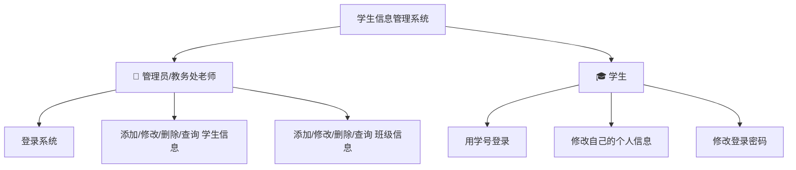

**角色一：管理员（教务处老师）**

> 想象成图书馆的管理员。普通读者只能看书、借书，但管理员可以添加新书、下架旧书、修改图书信息。

- 拥有系统最高权限
- 可以管理所有学生信息（增删改查）
- 可以管理所有班级信息（增删改查）
- 使用预设的账号密码登录

**角色二：学生**

> 想象成图书馆的读者。只能管理自己的借书证信息，不能动别人的，更不能动图书馆的书。

- 用学号和密码登录
- 只能查看和修改自己的个人信息（电话、地址等）
- 可以修改自己的密码
- 不能查看或修改其他学生的信息

### 1.3 系统有哪些功能？

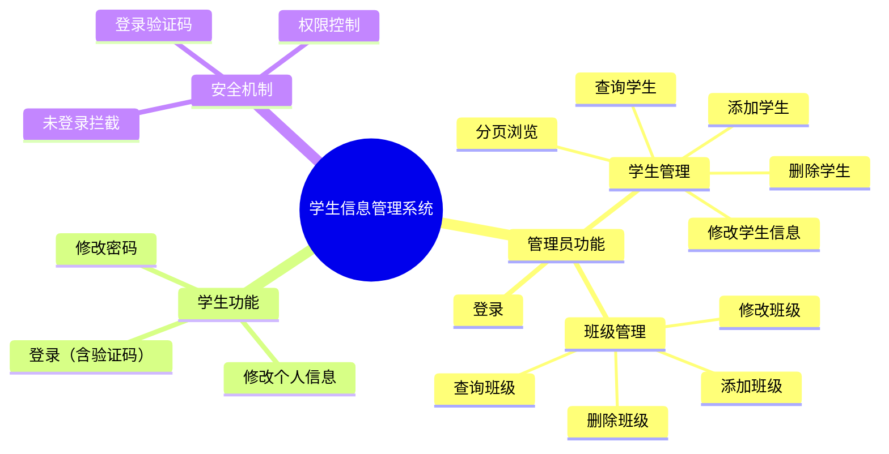

### 1.4 整个业务流程是什么样的？

以"管理员添加一个学生"为例：

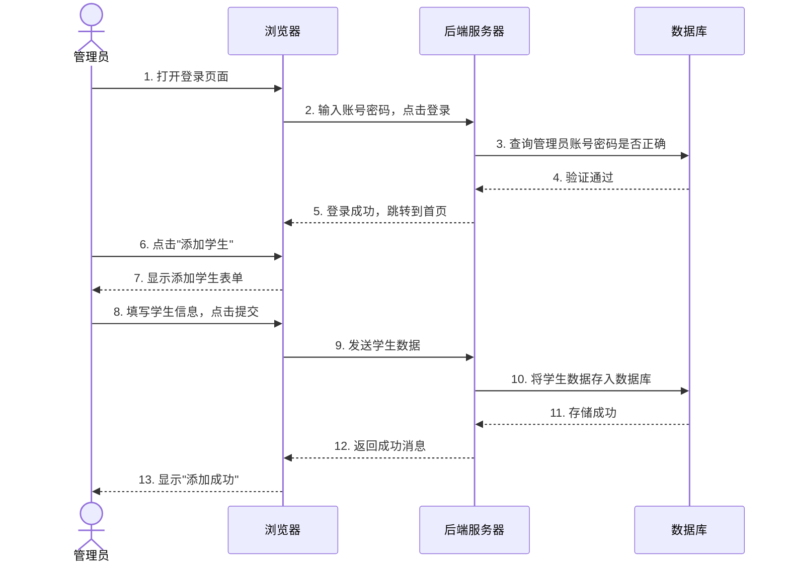

### 1.5 功能模块图

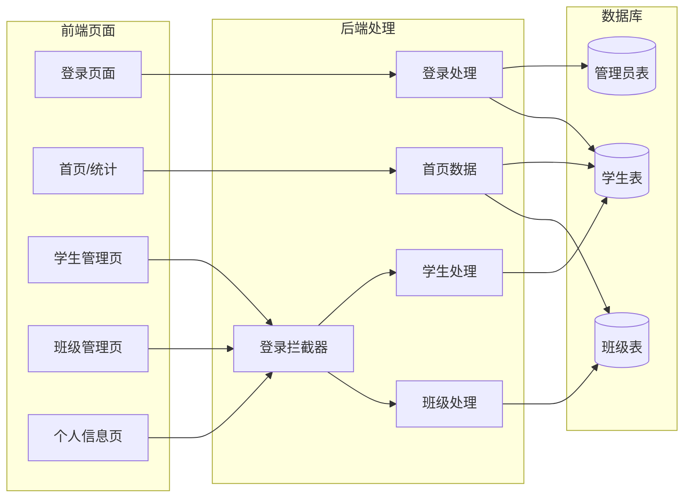

---

> ✅ **本章总结**：本章没有讲任何技术，只讲了一件事——这个系统**是什么**、**谁在用**、**能做什么**。这些理解是后面所有技术学习的基础。如果你不清楚业务就去写代码，就像不知道目的地就开始开车。
>
> ✅ **必须掌握**：系统的两个角色（管理员/学生）、各自的权限和功能
>
> ✅ **可以暂时不会**：任何技术术语都不需要现在理解
>
> ✅ **推荐继续学习**：试着自己画一遍业务流程图，加深理解

---

## 第二章 开发一个这样的项目需要哪些知识

> 知道要做什么之后，接下来问自己：我需要学会哪些东西才能把这个系统做出来？
>
> 本章不讲定义，只讲"为什么需要"。

### 2.1 为什么需要 Java？

**先看问题**：浏览器（前端）只能展示界面，但它不能直接操作数据库。为什么？

```
浏览器（用户电脑）  ──无法直接操作──>  数据库（服务器）
```

因为：
1. **安全原因**：如果浏览器能直接操作数据库，任何人都可以绕过界面直接删数据
2. **浏览器能力有限**：浏览器只能展示 HTML/CSS/JS，不会执行复杂的业务逻辑

**所以我们需要一个"中间人"**——它运行在服务器上，接收浏览器的请求，处理业务逻辑，然后操作数据库，最后把结果返回给浏览器。

> **生活类比**：你去餐厅吃饭。你（浏览器）不能直接进厨房（数据库）自己炒菜。你需要告诉服务员（Java后端）你要什么，服务员去厨房下单，厨师做好后服务员端给你。

Java 就是写这个"服务员"的语言。它的特点是：

- **稳定可靠**：企业级应用的首选，就像建筑用的钢筋混凝土
- **跨平台**：写一次代码，可以在 Windows、Linux、Mac 上运行
- **生态丰富**：有大量成熟的框架和工具，不需要重新造轮子

### 2.2 为什么需要数据库（MySQL）？

**先看问题**：不用数据库行不行？比如把学生信息存到文本文件里？

```
文件存储方式：
学生1: 2022001,吕布,123,男,...
学生2: 2022002,张飞,123,男,...
学生3: 2022003,貂蝉,123,女,...
```

问题来了：
- 想查"所有软件一班的学生"→ 必须读完整个文件，一行一行找
- 想改"张飞"的电话 → 必须找到那一行，修改，再写回整个文件
- 10000个学生时 → 文件变得巨大，每次操作都很慢
- 两个人同时修改 → 文件可能损坏

> **生活类比**：文本文件就像一本没有目录的厚书，找一个人只能一页一页翻。数据库就像这本书被数字化了，能按姓名搜索、按班级筛选、实时排序，几百万条记录也能秒查。

MySQL 是一个**关系型数据库**。什么是"关系型"？就是把数据存在**表（Table）**里，表之间通过**外键**建立关联。

在我们的系统中：

```
┌─────────────┐         ┌──────────────────┐
│  tb_clazz   │         │   tb_student      │
│  (班级表)   │ ←──┐    │   (学生表)       │
├─────────────┤    └────├──────────────────┤
│ clazzno(PK) │─────────│ clazzno(FK)       │
│ name        │         │ sno, name, ...    │
└─────────────┘         └──────────────────┘
```

> **关键理解**：一个班级有多个学生 → "一对多"关系。学生表里的 `clazzno` 是外键，指向班级表的主键。这样就知道每个学生属于哪个班了。

### 2.3 为什么需要 JDBC？

**先看问题**：Java 代码和 MySQL 数据库是两种完全不同的东西——Java 是编程语言，MySQL 是数据库软件。它们之间怎么"说话"？

```
Java代码  ──???──>  MySQL数据库
```

JDBC（Java Database Connectivity）就是**Java 和数据库之间的翻译官**。

> **生活类比**：你（Java）想跟一个法国人（MySQL）交流，但你们语言不通。JDBC 就是翻译。你告诉翻译"我要查所有学生"，翻译用法语告诉数据库，数据库返回结果，翻译再转回你能理解的形式。

JDBC 做了三件事：
1. **建立连接**：Java 程序通过 JDBC 连接到 MySQL 数据库
2. **执行 SQL**：Java 把 SQL 语句发给数据库执行
3. **获取结果**：把查询结果转成 Java 能处理的对象

```java
// JDBC 的核心操作（简化版）
Connection conn = DriverManager.getConnection(url, username, password);  // 1. 连接
PreparedStatement ps = conn.prepareStatement("SELECT * FROM tb_student"); // 2. 执行SQL
ResultSet rs = ps.executeQuery();  // 3. 获取结果
```

### 2.4 为什么需要 Servlet？

**先看问题**：浏览器发送了一个请求（比如"我要看学生列表"），Java 程序怎么知道这个请求来了？怎么知道要调用哪段代码？

```
浏览器 ──请求──> Java程序 ──???──> 哪段代码来处理？
```

Servlet 就是**专门用来接收和处理 HTTP 请求的 Java 类**。

> **生活类比**：你去政府办事大厅（服务器），有很多窗口（Servlet）。"登录窗口"处理登录请求，"学生管理窗口"处理学生增删改查。每个窗口只负责自己的事情。

在我们的项目中：
- `LoginServlet` → 专门处理登录请求
- `StudentServlet` → 专门处理学生增删改查
- `IndexServlet` → 专门处理首页数据

每个 Servlet 的职责单一，这样代码清晰、好维护。

### 2.5 为什么需要 JSP？

**先看问题**：数据库查出来的数据是 Java 对象，但浏览器只能理解 HTML。怎么把 Java 数据变成 HTML 页面？

```
Java数据 ──???──> HTML页面
```

JSP（Java Server Pages）就是**能写 Java 代码的 HTML 页面**。

> **生活类比**：Word 邮件合并功能。你有一个模板（HTML 页面），里面有空位（占位符），然后从数据库里取数据填入空位，生成最终的页面发给用户。

```jsp
<!-- JSP 页面示例（简化） -->
<table>
    <c:forEach items="${studentList}" var="stu">   <!-- 循环输出每个学生 -->
        <tr>
            <td>${stu.sno}</td>    <!-- 学号 -->
            <td>${stu.name}</td>   <!-- 姓名 -->
        </tr>
    </c:forEach>
</table>
```

### 2.6 为什么需要 Filter（过滤器）？

**先看问题**：我写好了学生管理页面，但如果有人直接输入网址 `http://xxx/student` 就能看到学生信息——他还没登录呢！

```
未登录用户 ──直接访问URL──> 学生管理页面 ❌ 不应该允许！
```

Filter 就是**一个看门的**。在请求到达 Servlet 之前，先检查用户有没有登录。

> **生活类比**：进电影院需要检票。即使你知道影厅在哪，没有票（未登录），检票员（Filter）也不会让你进去。

```java
// Filter 的逻辑（伪代码）
if (用户已登录) {
    放行，继续访问;
} else {
    跳转到登录页面，提示"请先登录";
}
```

### 2.7 为什么需要 MVC 模式？

**先看问题**：如果不分层，所有代码写在一个文件里会怎样？

```java
// 可怕的单一文件（千万别这样写！）
class 万能类 {
    处理登录请求() { ... }
    连接数据库() { ... }
    生成HTML页面() { ... }
    验证码生成() { ... }
    学生增删改查() { ... }
    // ... 全部混在一起
}
```

问题：
- 改一处可能坏一片
- 根本看不懂代码之间的关系
- 不能多人同时开发
- 没法复用

MVC 就是把代码**分成三层**：

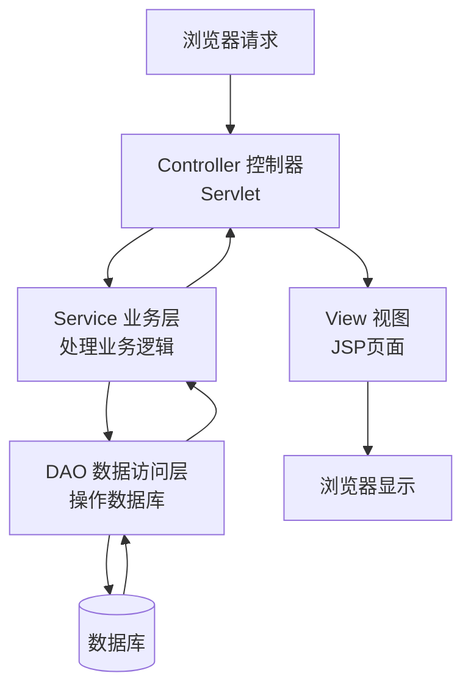

> **生活类比**：餐厅的三层分工。服务员（Controller）接待客人、传菜；厨师（Service）做菜、掌握配方；采购员（DAO）去仓库拿食材。如果让服务员同时做菜、采购，整个餐厅就乱套了。

| 层 | 对应角色 | 职责 | 项目中是什么 |
|----|---------|------|------------|
| Controller | 服务员 | 接待请求，调用业务，返回结果 | Servlet（如 LoginServlet） |
| Service | 厨师 | 处理业务逻辑，数据校验 | StudentService |
| DAO | 采购员 | 操作数据库，执行 SQL | StudentDao |
| View | 餐盘 | 展示数据给用户 | JSP 页面 |

### 2.8 为什么需要前端技术（HTML/CSS/JS/Bootstrap/Ajax）？

```
后端只管"数据是什么"  →  前端只管"数据怎么展示"
```

| 技术 | 做什么的 | 类比 |
|------|---------|------|
| HTML | 页面的骨架，决定有什么内容 | 房子的钢筋结构 |
| CSS | 页面的皮肤，决定长什么样 | 房子的装修 |
| Bootstrap | 现成的 CSS 组件库，直接用 | 宜家现成的家具 |
| JavaScript | 页面的行为，让页面动起来 | 房子的电路系统 |
| Ajax | 不刷新页面就能请求数据 | 发微信不用打电话 |

### 2.9 技术全景关系图

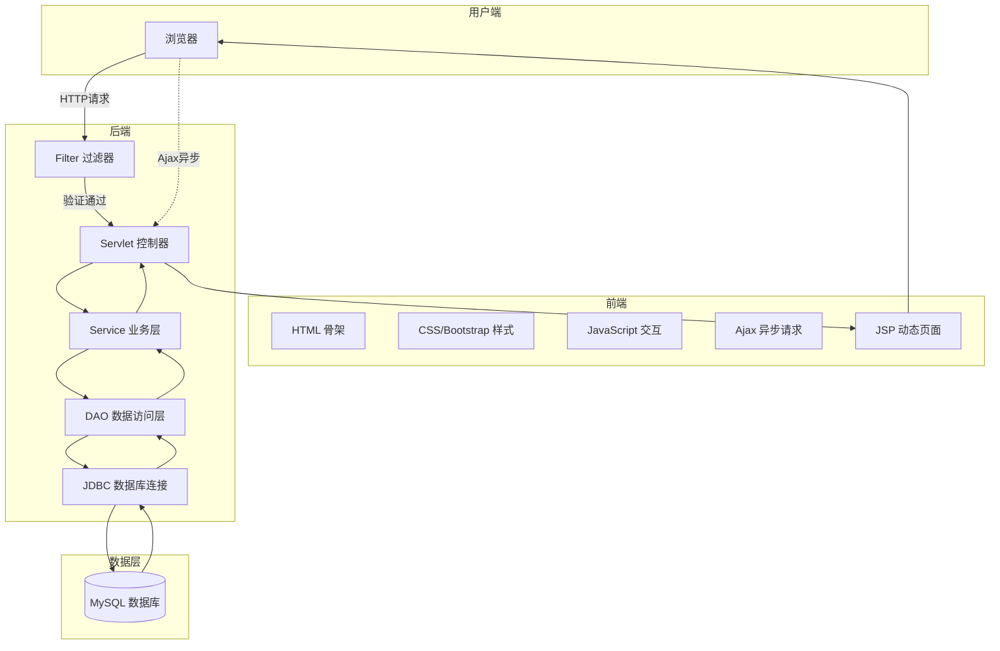

---

> ✅ **本章总结**：我们不讲每个技术是什么，而是解释了**为什么需要它**。当你理解"没有数据库会怎样"、"没有 MVC 会怎样"之后，再学它们就变得有动力。
>
> ✅ **必须掌握**：每个技术解决什么问题、它在整个系统中在哪个位置
>
> ✅ **可以暂时不会**：每个技术的具体语法和用法（后面会结合项目讲）
>
> ✅ **推荐继续学习**：试着把技术关系图画一遍，不看原图自己画

---

## 第三章 整个项目到底是怎么运行的

> 这是最重要的一章。别急着写代码，先彻底搞懂：点一下按钮，电脑里到底发生了什么？

### 3.1 一个完整的登录流程

让我带你追踪"管理员点击登录按钮"后，数据是怎么流动的。

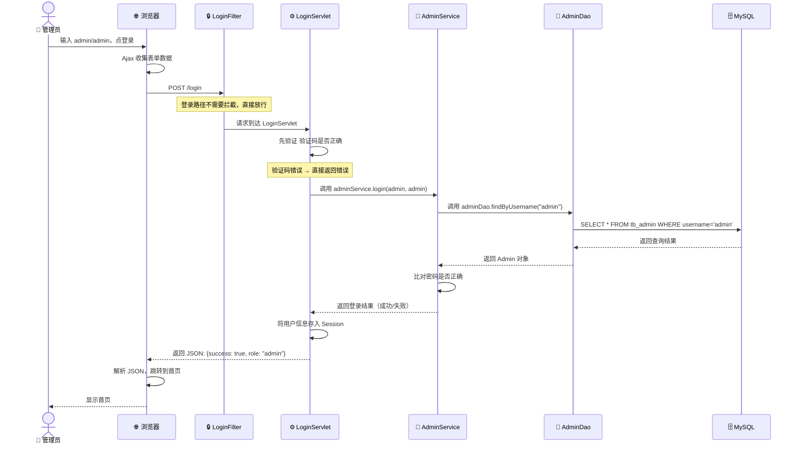

### 3.2 每一步详细解释

#### 第1步：浏览器收集表单数据

管理员在页面上输入了账号 `admin`、密码 `admin`、验证码，然后点击登录按钮。

这时浏览器里的 JavaScript 代码做了两件事：
1. 拦截表单提交（不让页面直接跳转）
2. 用 Ajax 把数据打包发给后端

```javascript
// 前端 Ajax 登录请求（简化版理解）
$.ajax({
    url: '/login',           // 发给谁
    type: 'POST',            // 用什么方式发
    data: {
        username: 'admin',   // 账号
        password: 'admin',   // 密码
        code: 'A3F2',       // 验证码
        userType: 'admin'   // 告诉后端这是管理员登录
    },
    success: function(result) {
        if (result.success) {
            window.location.href = '/index.jsp';  // 登录成功，跳转
        } else {
            alert(result.message);  // 登录失败，提示错误
        }
    }
});
```

#### 第2步：Filter 检查

请求到达服务器后，最先被 Filter 拦截。

但是登录请求（`/login`）是个例外——如果连登录都要检查登录，那永远登不进去。所以 Filter 配置了只拦截特定路径：

```java
@WebFilter(urlPatterns = {"/index.jsp", "/student/*", "/clazz/*"})
// 注意：/login 不在拦截范围内，所以直接放行
```

#### 第3步：LoginServlet 处理请求

```java
@WebServlet("/login")  // 这个 Servlet 专门处理 /login 路径
public class LoginServlet extends HttpServlet {
    
    protected void doPost(HttpServletRequest req, HttpServletResponse resp) {
        // 步骤一：先检查验证码
        String inputCode = req.getParameter("code");          // 用户输入的验证码
        String sessionCode = (String) req.getSession()
                              .getAttribute("checkCode");     // 正确的验证码
        if (!inputCode.equalsIgnoreCase(sessionCode)) {
            // 验证码不对，直接返回错误
            writeJson(resp, "验证码错误");
            return;
        }
        
        // 步骤二：调用 Service 验证账号密码
        String username = req.getParameter("username");
        String password = req.getParameter("password");
        String userType = req.getParameter("userType");
        
        if ("admin".equals(userType)) {
            Admin admin = adminService.login(username, password);
            if (admin != null) {
                // 步骤三：登录成功，把用户信息存到 Session
                req.getSession().setAttribute("user", admin);
                writeJson(resp, "登录成功");
            } else {
                writeJson(resp, "账号或密码错误");
            }
        }
    }
}
```

#### 第4步：Service 处理业务逻辑

```java
public class AdminService {
    public Admin login(String username, String password) {
        // 调用 DAO 去数据库查
        Admin admin = adminDao.findByUsername(username);
        if (admin != null && admin.getPassword().equals(password)) {
            return admin;  // 密码匹配，返回管理员信息
        }
        return null;  // 查无此人或密码不对
    }
}
```

#### 第5步：DAO 查询数据库

```java
public class AdminDao {
    public Admin findByUsername(String username) {
        String sql = "SELECT * FROM tb_admin WHERE username = ?";
        // 使用 JdbcHelper（封装了 JDBC 的工具类）执行 SQL
        ResultSet rs = JdbcHelper.executeQuery(sql, username);
        if (rs.next()) {
            Admin admin = new Admin();
            admin.setUsername(rs.getString("username"));
            admin.setPassword(rs.getString("password"));
            return admin;
        }
        return null;
    }
}
```

#### 第6步：结果一层一层返回

```
数据库返回数据 → DAO封装成Admin对象 → Service校验密码 → 
Servlet存入Session → 返回JSON给浏览器 → 浏览器跳转页面
```

### 3.3 再来一个例子：管理员查询学生列表

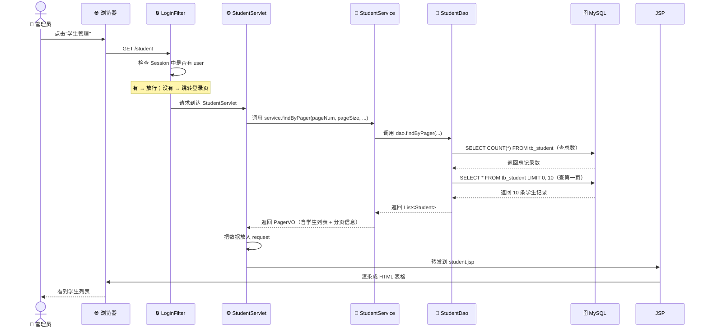

### 3.4 关键概念：Session 是什么？

Session 是服务器端保存的"用户身份牌"。

> **生活类比**：你去健身房办了一张会员卡。第一次去时前台登记你的信息（登录），给你一张手环（Session ID）。之后每次来，只要刷手环，前台就知道你是谁（免登录）。你离开超过一定时间（Session 过期），手环就失效了。

```java
// 登录成功后，服务器"发手环"
req.getSession().setAttribute("user", admin);

// 之后每次请求，服务器检查"手环"
Object user = req.getSession().getAttribute("user");
if (user != null) {
    // 已登录，继续
} else {
    // 没登录，跳转到登录页
}
```

### 3.5 关键概念：HTTP 请求的类型

我们的系统里用了两种 HTTP 方法：

| 方法 | 含义 | 在我们的项目中用于 |
|------|------|------------------|
| GET | 获取数据、查看页面 | 打开学生列表、查询学生 |
| POST | 提交数据、改变状态 | 登录、添加学生、删除学生 |

> **为什么删除也要用 POST？** 因为 GET 请求的数据在 URL 里可见（`/student?action=delete&sno=2022001`），如果有人把这个 URL 发给你，你一点就删除了数据。POST 请求的数据在请求体里，不会被缓存，相对更安全。

### 3.6 数据流全景图

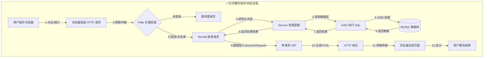

---

> ✅ **本章总结**：我们追踪了两个完整的流程——登录和学生列表查询。目的只有一个：让你真正理解**数据是怎么流动的**。以后再学具体技术时，你能在脑子里找到它在整个流程中的位置。
>
> ✅ **必须掌握**：用户点击→浏览器发请求→Filter检查→Servlet接收→Service处理→DAO查数据库→原路返回的完整流程
>
> ✅ **可以暂时不会**：每层的具体代码语法
>
> ✅ **推荐继续学习**：拿出纸笔画一遍数据流图，用你自己的话描述每一步

---

## 第四章 如果让我从零开始开发

> 现在你理解了项目是什么、用了哪些技术、数据怎么流动。接下来最实际的问题：如果从头开始开发，第一天该干什么？第二天干什么？
>
> 注意：本章不讲具体代码，而是讲**开发顺序**和**为什么是这个顺序**。

### 4.1 为什么开发顺序很重要？

很多新手一上来就开始写代码，结果：

- 写到一半发现表结构不对，推倒重来
- 前端写完了发现后端接口不匹配
- 自己写的代码一个月后自己都看不懂

正确的开发顺序应该是**从底层到上层**，就像盖房子：

```
打地基 → 砌墙 → 走水电 → 粉刷 → 买家具
```

对应到软件开发：

```
数据库设计 → 实体类 → DAO层 → Service层 → Servlet层 → 前端页面
```

### 4.2 第一步：搭建环境（第1天）

在写任何代码之前，先把工具准备好：

- [ ] 安装 JDK（Java 开发工具包）
- [ ] 安装 MySQL（数据库）
- [ ] 安装 Eclipse/IDEA（写代码的工具）
- [ ] 安装 Tomcat（运行 Web 项目的服务器）
- [ ] 创建项目，配置好各个工具的连接

> **为什么要先配环境？** 就像做饭前先把锅碗瓢盆洗干净摆好。如果做到一半发现 JDBC 连不上数据库，你无法判断是代码错了还是配置错了。

### 4.3 第二步：数据库设计（第2天上午）

> **为什么先做数据库？**

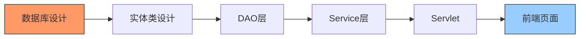

数据库是地基。数据库的结构决定了实体类的结构，实体类决定了后面每一层代码的结构。如果数据库设计错了，后面全错。

具体做什么：
1. **分析需求，确定有哪些"实体"**（现实中需要记录的东西）
2. **确定每个实体有哪些属性**
3. **确定实体之间的关系**
4. **画出 ER 图**
5. **写出建表 SQL**

我们项目中有三个实体：

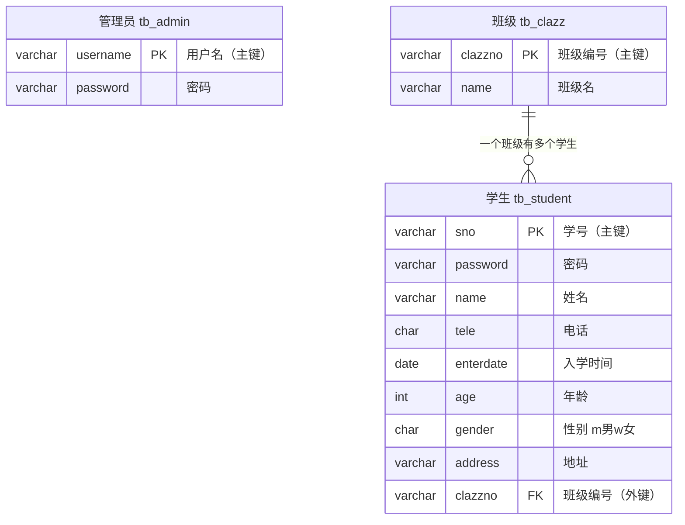

### 4.4 第三步：建库建表 + 准备工具类（第2天下午）

> **为什么第二步就写 JDBC 工具类？**

因为后面每一层（DAO、Service、Servlet）都需要连接数据库。先把连接数据库的公共代码抽出来做成工具类，后面就不用重复写了。

老师项目中的 `JdbcHelper` 就是干这个的——封装了获取连接、执行 SQL、关闭资源的操作。

```java
// JdbcHelper 的核心作用（理解即可，不需要记住）
public class JdbcHelper {
    // 获取数据库连接
    public static Connection getConnection() { ... }
    
    // 执行增删改操作，返回受影响的行数
    public static int executeUpdate(String sql, Object... params) { ... }
    
    // 执行查询操作，返回结果集
    public static ResultSet executeQuery(String sql, Object... params) { ... }
    
    // 关闭资源
    public static void close(Connection conn, PreparedStatement ps, ResultSet rs) { ... }
}
```

### 4.5 第四步：写实体类 Entity（第2天下午）

> **为什么先写实体类？**

实体类是数据的"搬运工"。数据库查出来的数据需要装在对象里在层与层之间传递。实体类最简单——就是属性 + getter/setter，不涉及任何业务逻辑。

```java
// 实体类的模式（以学生为例）
public class Student {
    private String sno;       // 学号
    private String name;      // 姓名
    private String password;  // 密码
    private String tele;      // 电话
    private String enterdate; // 入学时间
    private int age;          // 年龄
    private String gender;    // 性别
    private String address;   // 地址
    private String clazzno;   // 班级编号
    
    // getter 和 setter 方法...
}
```

> 🎯 **一个实体类对应数据库中的一张表**。属性名和表的字段名基本一致。

### 4.6 第五步：写 DAO 数据访问层（第3天）

> **为什么先写 DAO？**

DAO 是最底层、最独立的代码。它只做一件事：接收参数，拼 SQL，执行，返回结果。不依赖 Service，可以先写先测。

DAO 的核心方法模式：

```
增：INSERT INTO 表 VALUES(?,?,...)
删：DELETE FROM 表 WHERE 主键=?
改：UPDATE 表 SET 字段=?,... WHERE 主键=?
查：SELECT * FROM 表 WHERE 条件
```

```java
public class StudentDao {
    // 分页查询
    public PagerVO<Student> findByPager(int pageNum, int pageSize, String conditionSQL) { ... }
    // 添加
    public int insert(Student student) { ... }
    // 删除（按学号）
    public int deleteBySno(String sno) { ... }
    // 修改
    public int update(Student student) { ... }
    // 按学号查单个
    public Student findBySno(String sno) { ... }
}
```

> 🎯 **DAO 层的每个方法一般对应一条 SQL 语句**。

### 4.7 第六步：写 Service 业务层（第3-4天）

> **为什么 Service 在 DAO 之后？**

Service 会调用 DAO。如果 DAO 还没写，Service 没法测试。而且 Service 的代码依赖于 DAO 提供的方法签名。

Service 和 DAO 最关键的区别：

```java
// DAO：只负责和数据库打交道
public int insert(Student student) {
    return JdbcHelper.executeUpdate("INSERT INTO tb_student VALUES(?,?,...)", 
                                     student.getSno(), student.getName(), ...);
}

// Service：在调用 DAO 之前和之后，加入业务逻辑判断
public int addStudent(Student student) {
    // 调用 DAO 之前：数据校验（DAO不关心这些）
    if (student.getSno() == null || student.getSno().isEmpty()) {
        throw new RuntimeException("学号不能为空");
    }
    Student exist = studentDao.findBySno(student.getSno());
    if (exist != null) {
        throw new RuntimeException("学号已存在，不能重复添加");
    }
    
    // 调用 DAO
    int result = studentDao.insert(student);
    
    // 调用 DAO 之后：记录日志等（业务关心的事情）
    return result;
}
```

> 🎯 **DAO 只关心"能不能操作数据库"，Service 关心"该不该操作数据库"。**

### 4.8 第七步：写 Filter 过滤器（第4天）

> **为什么在写 Servlet 之前先写 Filter？**

Filter 是"安检"，Servlet 是"目的地"。先进安检（Filter），再进入目的地（Servlet）。Filter 不依赖 Servlet，可以先写好。

```java
@WebFilter(urlPatterns = {"/index.jsp", "/student/*", "/clazz/*"})
public class LoginFilter implements Filter {
    public void doFilter(ServletRequest req, ServletResponse resp, FilterChain chain) {
        HttpSession session = ((HttpServletRequest) req).getSession();
        if (session.getAttribute("user") != null) {
            chain.doFilter(req, resp);  // 已登录，放行
        } else {
            req.getRequestDispatcher("/login.jsp").forward(req, resp);  // 未登录，跳转
        }
    }
}
```

### 4.9 第八步：写 Servlet 控制器（第4-5天）

> **为什么 Servlet 最后写？**

Servlet 是"调度员"——它协调 Service、Session、Request、Response。它依赖所有底层组件，所以最后写。

```java
@WebServlet("/student")
public class StudentServlet extends HttpServlet {
    private StudentService studentService = new StudentService();
    private ClazzService clazzService = new ClazzService();
    
    // GET 请求：查询、页面跳转
    protected void doGet(HttpServletRequest req, HttpServletResponse resp) {
        String action = req.getParameter("action");
        if ("list".equals(action)) {
            // 分页查询学生列表
            PagerVO<Student> pager = studentService.findByPager(...);
            req.setAttribute("pager", pager);
            req.getRequestDispatcher("/student.jsp").forward(req, resp);
        } else if ("edit".equals(action)) {
            // 跳转到编辑页面
            ...
        }
    }
    
    // POST 请求：新增、修改、删除
    protected void doPost(HttpServletRequest req, HttpServletResponse resp) {
        String action = req.getParameter("action");
        if ("add".equals(action)) {
            // 新增学生
            Student student = buildStudentFromRequest(req);
            int result = studentService.addStudent(student);
            writeJson(resp, result > 0 ? "添加成功" : "添加失败");
        } else if ("delete".equals(action)) {
            // 删除学生
            ...
        }
    }
}
```

### 4.10 第九步：写前端 JSP 页面（第5-6天）

> **为什么最后写页面？**

前端页面需要从后端拿数据。如果后端接口还没写好，前端没法联调。后端的接口就像插座，前端页面就像电器——先装好插座，电器才能通电工作。

页面开发顺序：
1. 先写最核心的页面：登录页
2. 再写功能页面：学生管理、班级管理
3. 最后写展示页面：首页统计

### 4.11 第十步：联调测试（第7天）

所有代码写完后，必须逐功能测试：

- [ ] 管理员登录 → 登录成功/失败各种情况
- [ ] 未登录直接访问 `/student` → 是否跳转登录
- [ ] 添加学生 → 学号为空是否提示、学号重复是否提示
- [ ] 查询学生 → 分页是否正确、搜索是否生效
- [ ] 修改学生 → 数据是否保存、班级下拉框是否正确
- [ ] 删除学生 → 是否弹出确认、删除后列表是否刷新
- [ ] 学生登录 → 修改信息、修改密码

### 4.12 开发顺序全景图

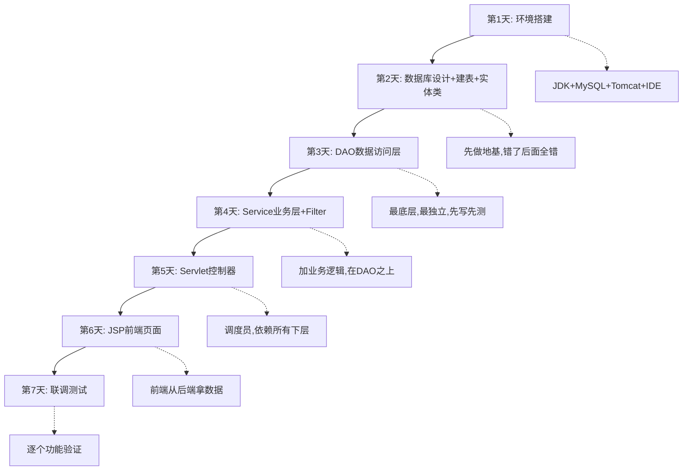

---

> ✅ **本章总结**：开发顺序不是随便定的，而是**从底层到上层、从独立到依赖**。数据库→实体类→DAO→Service→Filter→Servlet→前端，每一步都建立在上一步的基础上。
>
> ✅ **必须掌握**：为什么要先做数据库、为什么要最后写页面
>
> ✅ **可以暂时不会**：具体每层怎么写代码（后面会拆解）
>
> ✅ **推荐继续学习**：试着按这个顺序，自己动手搭建一个空项目

---

## 第五章 根据老师提供的资料进行分析

> 前四章我们理解了项目是什么、用了什么技术、数据怎么流动、开发顺序是什么。现在来看看老师给的项目资料，看老师是怎么设计的，为什么这样设计。

### 5.1 技术栈分析：老师为什么选这些技术？

老师的报告里列出的技术栈：

| 技术 | 老师的选型 | 为什么选它？ |
|------|-----------|-------------|
| 后端框架 | JavaWeb（原生 Servlet） | 零框架依赖，能看清底层原理 |
| 数据库连接 | JDBC | 最直接的数据库操作方式 |
| 前端页面 | JSP + Bootstrap + jQuery | JSP 能直接写 Java、Bootstrap 快速美化 |
| 异步请求 | Ajax（jQuery） | 不刷新页面就能提交数据和删除 |
| 架构模式 | MVC | 代码分层，职责清晰 |

> **老师为什么不用 SpringBoot？**
>
> 这就像学开车——如果先从卡丁车（原生 Servlet）学起，你会知道方向盘、油门、刹车分别控制什么。直接开自动挡特斯拉（SpringBoot），你只会踩油门，但不知道车是怎么跑起来的。
>
> 原生 Servlet 让你**看见 HTTP 请求是什么、响应是什么、Session 是什么**。SpringBoot 把这些都封装起来了，方便但不适合入门理解原理。

### 5.2 需求分析：老师到底要求我们做什么？

从报告来看，系统的需求分为两大块：

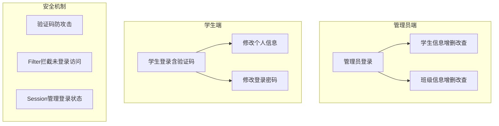

### 5.3 数据库设计分析

老师设计了三个表，表名加 `tb_` 前缀：

```sql
-- 表1：管理员表
create table tb_admin (
    username varchar(20),
    password varchar(20),
    PRIMARY KEY (`username`)
);

-- 表2：班级表
create table tb_clazz (
    clazzno varchar(20),
    name varchar(20),
    PRIMARY KEY (`clazzno`)
);

-- 表3：学生表
create table tb_student (
    sno varchar(20),
    password varchar(20),
    name varchar(20),
    tele char(11),
    enterdate date,
    age int,
    gender char(1),          -- m=男 w=女
    address varchar(100),
    clazzno varchar(100),    -- 外键，关联班级表
    PRIMARY KEY (`sno`)
);

-- 外键约束
alter table tb_student add CONSTRAINT frn_stu_clazz
 FOREIGN KEY(clazzno) REFERENCES tb_clazz (clazzno);
```

> **老师为什么这样设计？**

几个设计的细节值得注意：

**1. 为什么用 `varchar(20)` 而不是 `varchar(255)`？**
答案：节约存储空间。学号、姓名、密码都是固定长度的，20个字符足够了。如果设为255，数据库会预留不必要的空间。

**2. 为什么 `tele` 用 `char(11)`？**
答案：手机号码永远11位，用定长 `char` 比变长 `varchar` 效率更高。这就是"用什么类型，要看数据的特点"。

**3. 为什么 `gender` 用 `char(1)` 而不是存"男"/"女"？**
答案：存 `m`/`w` 比存中文节省空间，国际化时也更方便。展示时在 Java 代码里转换成中文就行。

**4. 为什么学生表要加外键约束？**
答案：防止"孤儿数据"。如果删了一个班级，但还有学生属于这个班级，数据就不一致了。外键约束能阻止这种操作。Service 层也应该加校验。

**5. 为什么不给 `password` 加密？**
答案：这是一个**学习项目**，不是生产环境。实际开发中密码**必须加密存储**（至少用 MD5 加盐，最好用 BCrypt）。这一点在第七章我们会详细说。

### 5.4 架构设计分析：老师为什么用 MVC？

从报告来看，老师的代码分为这些层：

```
┌─────────────────────────────────────┐
│         前端 JSP 页面                │  ← View 视图层
├─────────────────────────────────────┤
│  LoginServlet / StudentServlet ...  │  ← Controller 控制层
├─────────────────────────────────────┤
│  StudentService / ClazzService ...  │  ← Service 业务层
├─────────────────────────────────────┤
│  StudentDao / ClazzDao ...          │  ← DAO 数据访问层
├─────────────────────────────────────┤
│  JdbcHelper（工具类）               │  ← 数据库连接封装
├─────────────────────────────────────┤
│  MySQL 数据库                       │  ← 数据存储
└─────────────────────────────────────┘
```

> **如果不用 MVC 会怎样？**

假设把所有代码写在一个 Servlet 里：

```java
// 反例：一个文件干所有事（极其糟糕的设计！）
@WebServlet("/student")
public class StudentServlet extends HttpServlet {
    protected void doGet(req, resp) {
        // 直接在这里写 SQL
        Connection conn = DriverManager.getConnection(...);
        PreparedStatement ps = conn.prepareStatement("SELECT * FROM tb_student");
        ResultSet rs = ps.executeQuery();
        // 直接在这里拼 HTML
        out.println("<html><body><table>");
        while (rs.next()) {
            out.println("<tr><td>" + rs.getString("name") + "</td></tr>");
        }
        out.println("</table></body></html>");
        // 关闭资源...
    }
}
```

问题很明显：
- SQL、HTML、业务逻辑全部混在一起
- 如果数据库密码改了，要改几十处
- 如果页面样式要改，需要懂 Java 的前端来做
- 根本没法多人协作

> **MVC 的本质就是"各干各的"**——让懂数据库的人写 DAO，懂业务的人写 Service，懂前端的人写 JSP，互不干扰。

### 5.5 Filter 设计分析：老师为什么拦截这几个路径？

```java
@WebFilter(urlPatterns = {"/index.jsp", "/student/*", "/clazz/*"})
```

老师拦截了首页、学生管理所有页面、班级管理所有页面。

> **为什么 `/login` 不拦截？**
> 登录页面本身必须对所有人开放，否则永远登不进去。

> **如果换一种写法可以吗？**
>
> 有的项目反过来：默认拦截所有，然后设置白名单。这种更安全，因为新增页面默认受保护，不会忘记配置。
>
> ```java
> @WebFilter(urlPatterns = {"/*"})  // 拦截所有
> // 然后在代码里判断：如果是 /login、/register、/captcha 就放行
> ```

### 5.6 登录设计分析：老师为什么把管理员和学生登录写在一起？

老师的 `LoginServlet` 同时处理管理员登录和学生登录，通过 `userType` 参数区分。

```java
String userType = req.getParameter("userType");
if ("admin".equals(userType)) {
    // 验证管理员
} else if ("student".equals(userType)) {
    // 验证学生
}
```

> **优点**：前端只需要一个登录页面和接口，通过下拉框选择角色
> **缺点**：如果将来角色更多，这个 if-else 会越来越长

> **如果换一种写法**：管理员和学生各写一个 Servlet（`/admin/login` 和 `/student/login`），更清晰但代码重复多一些。两种写法都可以，取决于项目规模和团队偏好。

### 5.7 分页设计分析：老师为什么用 PagerVO？

报告中提到用 `PagerVO` 封装分页数据。为什么不直接返回 `List<Student>`？

```java
// PagerVO 大概长这样（封装分页相关的所有信息）
public class PagerVO<T> {
    private List<T> dataList;    // 当前页的数据
    private int currentPage;     // 当前第几页
    private int pageSize;        // 每页多少条
    private int totalCount;      // 总共多少条
    private int totalPage;       // 总共多少页
}
```

> **为什么需要这么多信息？**
>
> 前端分页控件需要知道"当前第几页"、"总共多少页"、"有没有上一页/下一页"这些信息。如果只返回10条学生数据，前端不知道总共有多少条，就没法生成翻页按钮。

### 5.8 验证码设计分析：为什么需要验证码？

报告的登录流程中首次验证的是验证码，验证码不对直接返回。

> **为什么验证码检查放在最前面？**
>
> 1. 防止暴力破解：如果有人写程序自动尝试密码，验证码能有效阻止
> 2. 减少数据库压力：验证码不对就不用查数据库，减少无效查询

```java
// 验证码检查放在最前面
if (!inputCode.equalsIgnoreCase(sessionCode)) {
    writeJson(resp, "验证码错误");
    return;  // 直接返回，不往后执行
}
// 验证码正确，再查数据库...
```

### 5.9 Ajax 异步请求分析：为什么登录和删除用 Ajax？

报告中提到，**登录**和**删除**使用 Ajax 异步请求。

> **登录为什么用 Ajax？**
>
> 传统方式：表单提交 → 整页刷新 → 显示结果。如果登录失败，之前的验证码就变了，用户要重新输入所有内容。
> Ajax 方式：不刷新页面，只在局部显示错误信息，验证码不变，用户体验更好。

> **删除为什么用 Ajax？**
>
> 传统方式：点击删除 → 整页刷新 → 回到列表。如果用户在第5页删除一条，刷新后可能回到第1页。
> Ajax 方式：删除成功 → 只刷新表格部分，停留在当前页。这才是用户期望的体验。

---

> ✅ **本章总结**：我们从需求、数据库、架构、Filter、登录、分页、验证码、Ajax 等角度分析了老师的报告设计。重点不是"老师写了什么代码"，而是"老师为什么这样设计"以及"有没有其他方案"。
>
> ✅ **必须掌握**：数据库三个表之间的关系、MVC 分层的意义、Filter 为什么拦截那些路径
>
> ✅ **可以暂时不会**：具体代码的实现细节
>
> ✅ **推荐继续学习**：试着自己分析：如果让你重新设计，你会有什么不同的选择？

---

## 第六章 每一个知识点都必须结合项目讲

> 这一章不讲概念定义，而是把每个知识点放到本项目里回答三个问题：
> 1. 它在学生管理系统里负责什么？
> 2. 它什么时候出现（请求走到了哪一步）？
> 3. 如果没有它会怎样？

### 6.1 Controller（Servlet）到底做了什么？

> **在项目中负责什么？**
>
> Servlet 是"交通警察"。浏览器发来的请求就像路上跑的汽车，Servlet 判断这辆车的目的地，指挥它去正确的车道。

以 `StudentServlet` 为例：

```java
@WebServlet("/student")
public class StudentServlet extends HttpServlet {
    
    // GET请求 = 用户想看东西（打开页面、查询数据）
    protected void doGet(HttpServletRequest req, HttpServletResponse resp) {
        String action = req.getParameter("action");
        // 像交通警察一样，根据 action 分发给不同处理逻辑
        
        if ("list".equals(action)) {
            // "我要看学生列表" → 调用查询方法 → 转发到 JSP
            handleList(req, resp);
        } else if ("toAdd".equals(action)) {
            // "我要打开添加页面" → 转发到添加表单
            req.getRequestDispatcher("/studentAdd.jsp").forward(req, resp);
        }
    }
    
    // POST请求 = 用户想改变数据（新增、修改、删除）
    protected void doPost(HttpServletRequest req, HttpServletResponse resp) {
        String action = req.getParameter("action");
        
        if ("add".equals(action)) {
            // "我要添加学生" → 收集数据 → 调用 Service → 返回结果
            handleAdd(req, resp);
        } else if ("delete".equals(action)) {
            // "我要删除学生" → 调用 Service → 返回 JSON
            handleDelete(req, resp);
        }
    }
}
```

> **什么时候出现？**
>
> 请求进入系统后，经过 Filter 验证，到达 Servlet。Servlet 是第一个处理请求的 Java 代码。

> **如果没有 Controller 层会怎样？**
>
> 所有路径的处理逻辑混在一起，改一个功能可能会影响其他功能。请求的入口不统一，出了问题难以排查。

### 6.2 Service 层到底做了什么？

> **在项目中负责什么？**
>
> Service 是"业务规则执行者"。它知道什么能做什么不能做。

以 `StudentService.addStudent()` 为例：

```java
public class StudentService {
    private StudentDao studentDao = new StudentDao();
    
    public int addStudent(Student student) {
        // Service 的职责：在操作数据前，先判断业务规则
        
        // 规则1：学号不能为空
        if (student.getSno() == null || student.getSno().isEmpty()) {
            throw new RuntimeException("学号不能为空");
        }
        
        // 规则2：学号不能重复
        Student exist = studentDao.findBySno(student.getSno());
        if (exist != null) {
            throw new RuntimeException("学号 " + student.getSno() + " 已存在");
        }
        
        // 规则3：年龄必须合理
        if (student.getAge() < 0 || student.getAge() > 150) {
            throw new RuntimeException("年龄不合法");
        }
        
        // 规则通过，才调用 DAO
        return studentDao.insert(student);
    }
}
```

> **什么时候出现？**
>
> Servlet 收到请求后，调用 Service 处理业务逻辑。Servlet 只负责接收和转发，Service 负责"动脑子"。

> **为什么这些校验不放 DAO 里？**
>
> DAO 只应该关心"能不能操作数据库"。今天用 MySQL，明天换 Oracle，DAO 要改，但业务规则（学号不能为空）永远不变。分开后，换数据库不影响业务逻辑。

> **如果 Service 和 DAO 合并会怎样？**
>
> ```java
> // 反例：业务逻辑和数据操作混在一起
> public class StudentDao {
>     public int insert(Student student) {
>         // DAO里写校验？如果其他DAO也要校验，代码会重复
>         if (student.getSno() == null) throw ...;  
>         return JdbcHelper.executeUpdate("INSERT INTO ...", ...);
>     }
> }
> ```
> 每个 DAO 方法都要写一遍校验，而且如果将来业务规则变了（比如年龄上限从150改到120），要改很多地方。

### 6.3 DAO 层到底做了什么？

> **在项目中负责什么？**
>
> DAO 是"数据库操作员"。它的全部工作就是拼 SQL 语句并执行。

```java
public class StudentDao {
    
    // 查询：查数据库 → 返回 Java 对象
    public Student findBySno(String sno) {
        String sql = "SELECT * FROM tb_student WHERE sno = ?";
        ResultSet rs = JdbcHelper.executeQuery(sql, sno);
        if (rs.next()) {
            Student s = new Student();
            s.setSno(rs.getString("sno"));
            s.setName(rs.getString("name"));
            // ... 设置所有属性
            return s;
        }
        return null;
    }
    
    // 新增：把 Java 对象的数据存到数据库
    public int insert(Student student) {
        String sql = "INSERT INTO tb_student(sno,password,name,tele,enterdate,age,gender,address,clazzno) VALUES(?,?,?,?,?,?,?,?,?)";
        return JdbcHelper.executeUpdate(sql, 
            student.getSno(), student.getPassword(), student.getName(),
            student.getTele(), student.getEnterdate(), student.getAge(),
            student.getGender(), student.getAddress(), student.getClazzno());
    }
    
    // 删除：按学号删
    public int deleteBySno(String sno) {
        String sql = "DELETE FROM tb_student WHERE sno = ?";
        return JdbcHelper.executeUpdate(sql, sno);
    }
}
```

> **什么时候出现？**
>
> Service 调用 DAO。DAO 是离数据库最近的 Java 代码。

> **为什么 DAO 不直接返回 ResultSet？**
>
> `ResultSet` 依赖数据库连接，连接一关就不能用了。DAO 把 `ResultSet` 转成 `Student` 对象后返回，调用方不用关心连接状态。另外，`Student` 对象有类型，IDE 能自动补全；`ResultSet` 只能用字符串取字段，容易写错。

### 6.4 为什么不能让前端直接访问数据库？

> 这是新手最容易困惑的问题之一。答案很简单：

```
前端直接访问数据库会发生什么？

  浏览器 ──直接操作──> MySQL
              ↑
         密码写在 JS 里？
         所有人都能看见！
```

1. **安全灾难**：连接数据库需要账号密码。前端 JS 代码任何人都能用 F12 打开看到，等于把数据库密码贴到公告栏上。
2. **无法控制权限**：任何人拿到连接信息，可以直接删库。而经过后端，你可以精确控制"管理员能做A，学生只能做B"。
3. **无法做业务逻辑**：比如"学号不能重复"这个规则，如果前端直接写数据库，每台电脑都要执行这个逻辑，无法统一管理。
4. **数据库连接数爆炸**：每个用户打开页面都会创建一个数据库连接，1000 个学生同时打开就是 1000 个连接，数据库撑不住。

> **后端充当的就是"保安"角色**——所有请求必须经过它检查和转发。

### 6.5 REST 接口为什么这样设计？

在本项目中，接口设计遵循了一定的规范：

| 操作 | HTTP方法 | URL | 说明 |
|------|---------|-----|------|
| 查看学生列表 | GET | `/student?action=list` | 获取数据，不变更 |
| 打开添加页面 | GET | `/student?action=toAdd` | 获取页面，不变更 |
| 新增学生 | POST | `/student?action=add` | 提交数据，发生变更 |
| 删除学生 | POST | `/student?action=delete` | 提交变更，发生变更 |

> **核心原则：GET 不改变数据，POST 改变数据。**

为什么要这样区分？
- GET 请求可以被缓存、可以被浏览器记住、可以被搜索引擎抓取
- POST 请求不会被缓存，每次都是真的提交
- 如果你用 GET 做删除，浏览器可能会"预加载"链接而误删数据

### 6.6 Session 为什么需要？

> **HTTP 本身是"无状态"的**——服务器不会记住你是谁。你发了第1个请求，再发第2个请求，服务器不知道这俩请求来自同一个人。

```
浏览器第1次请求: "我是管理员，我要看学生列表"
服务器: "你是谁？有证明吗？" → 登录 → 服务器发个Session ID

浏览器第2次请求: "我要修改学生信息"
服务器: "你的Session ID呢？" → 查到Session里有user信息 → 放行
```

这就是为什么登录后，Cookie 里会存一个 `JSESSIONID`——它就是服务器发的"手环编号"。

### 6.7 验证码为什么需要？

> 两个核心作用：

**1. 防止暴力破解**
没有验证码：攻击者写个脚本，一秒钟尝试 100 次密码
有验证码：每尝试一次要识别验证码，速度降到几秒一次

**2. 区分人和机器**
验证码的核心原理是：图片里的字人能看懂，机器难看懂。

> **在本项目中**，验证码生成后存在 Session 中，登录时比对。每次请求验证码会刷新，旧的立即失效。

---

> ✅ **本章总结**：我们深入分析了 Controller、Service、DAO、Session、验证码在本项目中的作用。核心思想就一个——**各层各司其职**，不要越权，不要混在一起。
>
> ✅ **必须掌握**：每一层的职责边界、为什么需要分层
>
> ✅ **可以暂时不会**：具体代码细节
>
> ✅ **推荐继续学习**：试试把 Servlet、Service、DAO 三层的职责说清楚给一个完全不懂编程的人听

---

## 第七章 开发过程中容易踩的坑

> 以下是根据本项目常见的真实错误整理出来的。每一个坑的背后，都有一群初学者踩过。

### 7.1 数据库相关

#### 坑1：中文乱码

**问题**：网页上显示的学生姓名是 `????` 或 `ä¹±ç  `

**原因**：编码不一致——数据库是 UTF-8，JSP 页面没声明编码，或者 Tomcat 没配置编码

**解决**：
```java
// 建数据库时指定 UTF-8
CREATE DATABASE stu_manage CHARACTER SET UTF8;

// JSP 页面最顶部
<%@ page contentType="text/html;charset=UTF-8" %>

// Servlet 中设置编码
request.setCharacterEncoding("UTF-8");
response.setContentType("text/html;charset=UTF-8");
```

#### 坑2：SQL 语句少逗号或多逗号

**问题**：`INSERT INTO tb_student VALUES('2022001' '张三' ...)` ← 少了一个逗号，SQL报错

**预防**：写完 SQL 后逐字段检查逗号，或者用格式化工具

#### 坑3：忘记 WHERE 条件做 UPDATE/DELETE

**问题**：
```sql
DELETE FROM tb_student;  -- 忘了加 WHERE，所有学生都被删了！
```

**预防**：写 DELETE/UPDATE 时先写 WHERE 条件，再回头写前面的部分

#### 坑4：字符串拼接 SQL 引发问题

```java
// 错误做法
String sql = "SELECT * FROM tb_student WHERE name = '" + name + "'";
// 如果 name 是 "张'三"，SQL 就变成了：
// SELECT * FROM tb_student WHERE name = '张'三' ← 引号不匹配！
```

**正确做法**：使用 `PreparedStatement` 的占位符 `?`
```java
String sql = "SELECT * FROM tb_student WHERE name = ?";
PreparedStatement ps = conn.prepareStatement(sql);
ps.setString(1, name);  // 自动处理特殊字符
```

> 这不仅仅是语法问题，还是**SQL注入**安全漏洞。攻击者可以通过精心构造的输入来盗取或破坏数据。

### 7.2 Java 代码相关

#### 坑5：实体类属性名和数据库字段名不一致

```java
// 实体类里是 className
public class Clazz {
    private String className;  // 驼峰命名
}

// 数据库字段是 name
// ResultSet.getString("className") → 找不到这个字段！报错！
```

**解决**：实体类属性名尽量和数据库字段名保持一致，或者在 DAO 中明确做映射。

#### 坑6：忘记关闭数据库连接

```java
public Student findBySno(String sno) {
    Connection conn = JdbcHelper.getConnection();
    // ... 查询操作
    return student;
    // 忘记 conn.close()！每次调用泄露一个连接！
}
```

**后果**：运行一段时间后，连接池耗尽，系统卡死。

**解决**：用 `try-finally` 确保连接一定被关闭
```java
Connection conn = null;
try {
    conn = JdbcHelper.getConnection();
    // ... 操作
} finally {
    if (conn != null) conn.close();
}
```

#### 坑7：doGet 和 doPost 方法名写错

```java
// 错误：把 doGet 写成了 doget（小写g）
protected void doget(...) { }  // 这个方法不会被调用！
```

**记忆方法**：`do` + `Get`/`Post`，两个单词首字母都大写 → `doGet`、`doPost`

### 7.3 前端相关

#### 坑8：Ajax 请求后前端不更新

```javascript
// 删除成功后
$.ajax({
    url: '/student',
    type: 'POST',
    data: { action: 'delete', sno: '2022001' },
    success: function(result) {
        if (result.success) {
            alert('删除成功');
            // 忘记刷新表格！用户看到的还是旧数据！
        }
    }
});
```

**解决**：删除/添加成功后，调用刷新函数重新请求数据
```javascript
success: function(result) {
    if (result.success) {
        location.reload();  // 简单做法：刷新整个页面
        // 或 loadStudentList();  // 更好：只刷新表格部分
    }
}
```

#### 坑9：JSP 页面中 EL 表达式不生效

```html
<!-- 页面上直接显示 ${student.name} 而不是实际姓名 -->
```

**原因**：JSP 的 EL 表达式默认是关闭的（某些旧版本）

**解决**：在 JSP 页面顶部加上
```jsp
<%@ page isELIgnored="false" %>
```

### 7.4 Filter 相关

#### 坑10：Filter 把登录页也拦截了

```java
@WebFilter(urlPatterns = {"/*"})  // 拦截所有
// 然后在 doFilter 中忘了判断登录页路径
// 结果：访问登录页 → 拦截 → 跳转登录页 → 拦截 → 无限循环
```

**解决**：在 Filter 中加白名单判断
```java
String path = request.getRequestURI();
if (path.contains("/login") || path.contains("/captcha")) {
    chain.doFilter(request, response);  // 白名单，放行
    return;
}
```

#### 坑11：资源文件（CSS/JS/图片）被 Filter 拦截

**现象**：登录页面样式全丢了

**原因**：Filter 拦截了 `.css` 和 `.js` 文件的请求

**解决**：把 `*.css`、`*.js`、`*.png` 等静态资源加入白名单

### 7.5 配置相关

#### 坑12：Tomcat 端口被占用

**现象**：启动 Tomcat 时报 `Address already in use: bind`

**原因**：上次的 Tomcat 没有正常关闭，或者有其他程序占用了 8080 端口

**解决**：关掉所有 Java 进程重新启动，或者换一个端口号

#### 坑13：JDBC 驱动找不到

**现象**：`ClassNotFoundException: com.mysql.jdbc.Driver`

**原因**：没有把 MySQL 的 JDBC 驱动 jar 包放到 `WEB-INF/lib` 下

**解决**：下载 `mysql-connector-java-x.x.x.jar`，放到项目的 `WebContent/WEB-INF/lib/` 目录

---

> ✅ **本章总结**：列出了本项目开发中13个最常见的坑，涵盖了数据库、Java、前端、Filter、配置五大类。很多坑你一定会遇到——遇到时回来看这一章，能帮你快速定位问题。
>
> ✅ **必须掌握**：SQL 注入怎么防、数据库连接怎么关、Filter 白名单怎么写
>
> ✅ **可以暂时不会**：具体的报错堆栈信息怎么看（这需要经验积累）
>
> ✅ **推荐继续学习**：每踩一个坑，在笔记里记录下来，形成自己的"踩坑知识库"

---

## 第八章 项目开发路线图

> 最后一章给你一个完整的路线图。不只是完成这个项目，而是成为能独立开发的 Java Web 工程师。

### 8.1 完整学习路线

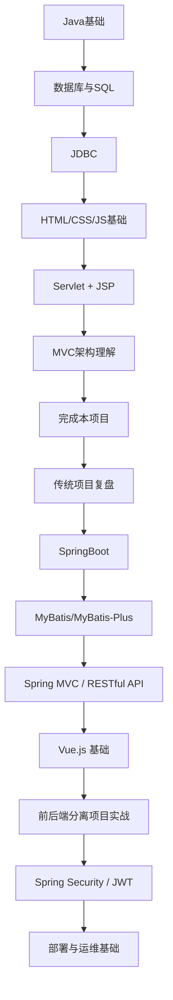

### 8.2 每一步详解

#### 第一步：Java 基础

> **为什么先学？** Java 是地基，后面的 Servlet、SpringBoot 都是 Java 写的。
>
> **需要掌握到什么程度？**
> - 类、对象、继承、接口 → 必须熟练
> - 集合（List、Map）→ 必须会用
> - 异常处理 → 看懂就行
> - IO流、多线程 → **本项目暂时不用**，以后再深入
>
> **本项目用到什么？** 实体类就是普通的 Java 类，Service 和 DAO 也是普通的 Java 类。

#### 第二步：数据库与 SQL

> **为什么接着学？** 任何一个系统最终都是在操作数据，不懂数据库就没法做后端。
>
> **需要掌握到什么程度？**
> - CREATE TABLE、INSERT、DELETE、UPDATE、SELECT → 必须熟练
> - WHERE、ORDER BY、LIMIT、COUNT → 必须会用
> - PRIMARY KEY、FOREIGN KEY → 必须理解
> - JOIN 多表查询 → 本项目主要用单表，多表可以先了解
>
> **本项目用到什么？** 三个表的建表语句、增删改查、分页查询（LIMIT + COUNT）。

#### 第三步：JDBC

> **为什么接着学？** JDBC 是 Java 和数据库之间的桥梁，理清了数据怎么从数据库到 Java 对象。
>
> **需要掌握到什么程度？**
> - Connection、PreparedStatement、ResultSet → 核心三个类
> - 占位符 `?` 防 SQL 注入 → 必须会用
> - try-finally 关闭资源 → 必须养成习惯
>
> **本项目用到什么？** `JdbcHelper` 工具类封装了 JDBC 操作，DAO 层通过它操作数据库。

#### 第四步：HTML/CSS/JS 基础

> **为什么接着学？** 后端处理数据，前端展示数据，必须两边都会一点。
>
> **需要掌握到什么程度？**
> - HTML 表单、表格 → 能看懂，能照着写
> - CSS → 能看懂基本的样式，会用 Bootstrap 就行
> - JavaScript / jQuery → 能写简单的事件处理和 Ajax 请求
>
> **本项目用到什么？** JSP 页面里嵌了 HTML 和 JS，Bootstrap 做样式，Ajax 做异步提交。

#### 第五步：Servlet + JSP

> **为什么接着学？** 这是传统 Java Web 的核心，也是理解 SpringBoot 的前提。
>
> **需要掌握到什么程度？**
> - `@WebServlet` 注解 → 会配置路径
> - `doGet` vs `doPost` → 会区分
> - `request.getParameter()`、`request.setAttribute()` → 会传数据
> - `getRequestDispatcher().forward()` → 会跳转
> - Session → 理解原理，会用 `getAttribute`/`setAttribute`
>
> **本项目用到什么？** 全部！LoginServlet、StudentServlet、IndexServlet 都是 Servlet。

#### 第六步：完成本项目（传统 JavaWeb）

> 到这里，你有了足够的基础来完成老师提供的这个项目。按照第四章的开发顺序来做。
>
> **里程碑**：能独立完成一个传统的 JavaWeb 项目，理解 MVC 分层，理解数据怎么从前端流到数据库再流回来。

#### 第七步：过渡到 SpringBoot

> **为什么要过渡？** 传统 Servlet 项目需要写大量配置（web.xml、Tomcat 配置等），代码重复多。SpringBoot 让一切变简单了。
>
> **学习重点**：
> - "约定大于配置"的理念
> - `@RestController` 替代 Servlet
> - `@Service`、`@Repository` 替代手写的 Service/DAO
> - `application.properties` 统一管理配置

```java
// 传统 Servlet 方式
@WebServlet("/student")
public class StudentServlet extends HttpServlet { ... }

// SpringBoot 方式（对比感受一下简洁度）
@RestController
@RequestMapping("/student")
public class StudentController {
    @GetMapping
    public List<Student> list() { ... }
    
    @PostMapping
    public Result add(@RequestBody Student student) { ... }
}
```

#### 第八步：MyBatis 替代手写 JDBC

> **为什么要替代？** 手写 JDBC 需要大量模板代码（打开连接、拼SQL、关闭连接）。MyBatis 用注解或 XML 自动完成这些。
>
> 原来：DAO 里手写 SQL + 手写 ResultSet 转对象
> MyBatis：写个接口 + 加个注解，自动查数据库、自动转对象

#### 第九步：前后端分离 + Vue

> **传统 JSP 的局限**：JSP 是后端渲染，页面逻辑和数据逻辑混在一起。前后端分离后，后端只提供 JSON API，前端完全独立开发。
>
> **Vue.js 的角色**：替代 JSP。不再是后端生成 HTML，而是 Vue 在前端动态渲染页面，通过 Axios 请求后端的 JSON 数据。

```
传统方式：
  浏览器 → JSP(后端渲染HTML) → 浏览器显示

前后端分离：
  浏览器 → Vue(前端渲染) → Axios请求 → SpringBoot返回JSON → Vue更新页面
```

#### 第十步：安全与部署

- **Spring Security / JWT**：替代 Session + Filter，更安全
- **Linux 基础**：把项目部署到真正的服务器上
- **Docker**：一键部署，不用手动配环境

### 8.3 完整的技能地图

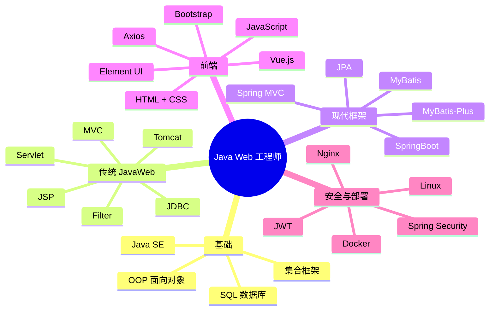

### 8.4 学习建议

> [!TIP] 最重要的三件事
> 1. **动手写**——看十遍不如写一遍。每学一个技术就写个小 demo 验证一下。
> 2. **理解为什么**——不要只是"我照着做了能跑"，要问"为什么这样设计"。
> 3. **先跑通再优化**——先让整个流程跑通，再考虑代码好不好看、能不能优化。

> [!WARNING] 新手最危险的陷阱
> - 在某个细节死磕太久 → 先跳过，后面理解了再回来
> - 只看不动手 → 眼睛会了，手不会
> - 追求一次写出完美的代码 → 第二版再优化，第一版跑通就行
> - 不看报错信息就到处问人 → 报错信息是最好的老师

---

> ✅ **全书总结**：
>
> 这本教程的目的不是让你"抄一份代码交作业"，而是让你**真正理解 Java Web 开发是怎么一回事**。
>
> 回顾八个章节：
> 1. 你知道了这个系统是干什么的
> 2. 你知道了每个技术解决了什么问题
> 3. 你理解了数据在系统中的流动过程
> 4. 你知道了开发的正确顺序
> 5. 你分析了老师的设计思路
> 6. 你深入理解了每一层的职责
> 7. 你知道了常见的坑怎么避开
> 8. 你有了完整的学习路线图
>
> 现在，打开 IDE，从建数据库开始，一步一步完成这个项目吧。
>
> **记住：真正学会的标准不是"我照着教程做完了"，而是"关上教程，我能从零开始独立做出来"。**

---

*本教程基于《JavaWeb 学生信息管理系统》实训项目编写*
*2026年7月*
