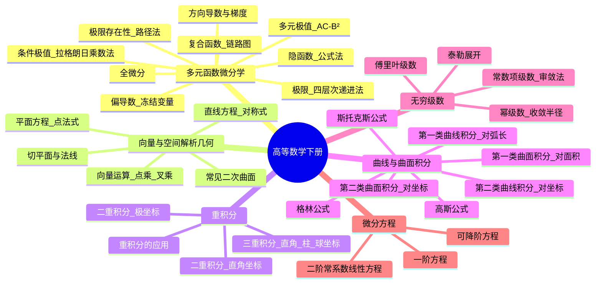
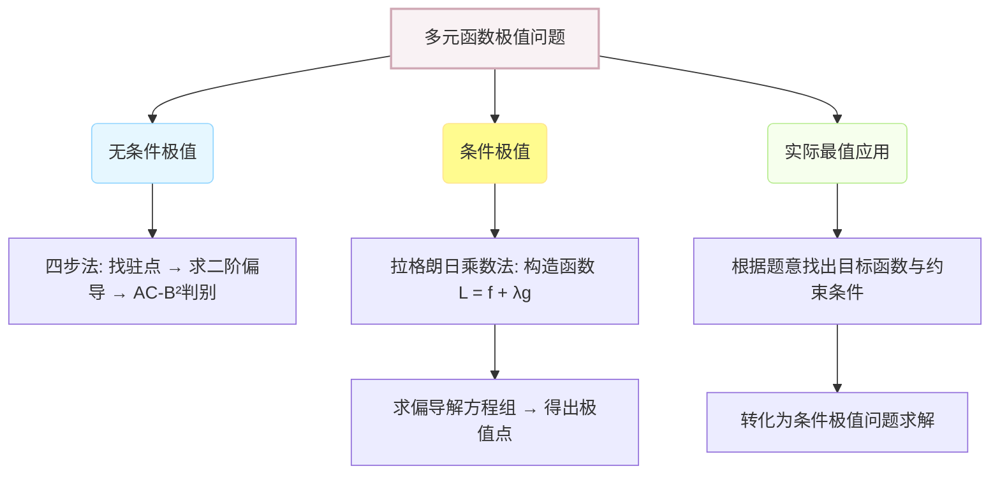
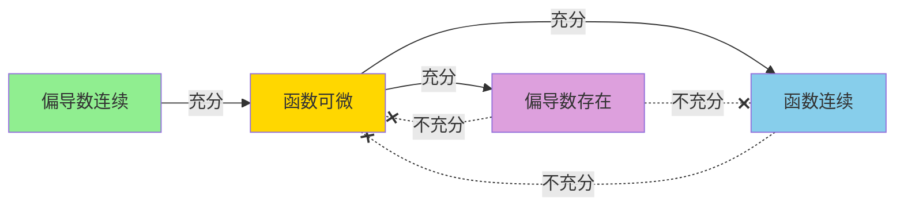
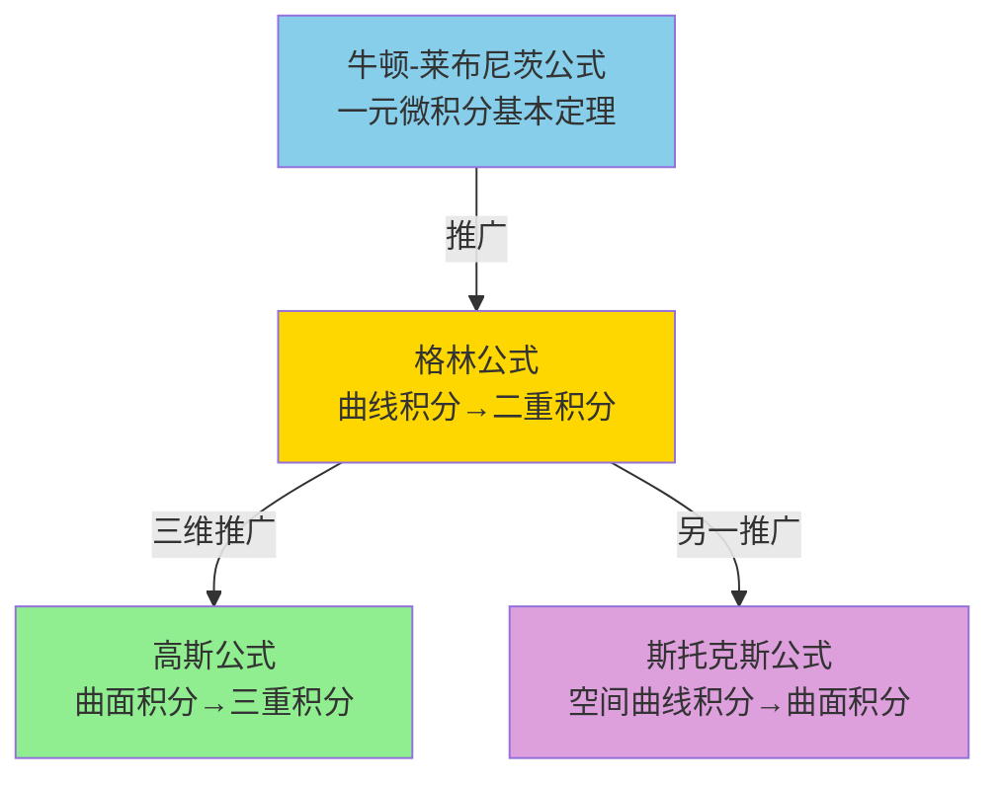

# 📖 高等数学（下册）完整知识体系

> [!abstract] **全局概览**
> 高等数学下册从一元推向多元，涵盖六大篇章：**多元函数微分学 → 向量与空间几何 → 重积分 → 曲线/曲面积分 → 无穷级数 → 微分方程**。核心思想是"降维打击"——通过累次积分、格林公式、高斯公式等工具，将所有高维问题转化为一维定积分来解决。

---

## 🗺️ 知识体系总图



---

# 第一篇：多元函数微分学

## 一、多元函数极限求解的层次递进逻辑

在面对多元函数极限求解时，应建立结构化的 **Checklist** 思考模型，由浅入深按四个层次逐步筛选：

### 1. 第一层次：直接代入法（连续性法则）

- **适用场景**：极限确定式。$f(x,y)$ 在趋近点 $(x_0, y_0)$ 处连续，且无 $0/0$、$\infty/\infty$ 等不定型。
- **底层逻辑**：依托初等函数的连续性定理。定义域包含该点且非孤立点，即可直接求值。

$$\lim_{(x,y)\to(0,1)} \frac{1-xy}{x^2+y^2} = \frac{1-0 \times 1}{0^2+1^2} = \frac{1}{1} = 1$$

### 2. 第二层次：无穷小量与有界函数乘积定理

- **适用场景**：极限式中包含明显趋于 $0$ 的因子 + 有界函数（常为 $\sin$ 或 $\cos$）

$$\lim_{(x,y)\to(1,0)} xy \cdot \sin\left(\frac{1}{xy}\right) = 0$$

**逻辑拆解**：
1. **找无穷小量**：$(x,y) \to (1,0)$ 时，$xy \to 1 \times 0 = 0$
2. **证有界性**：$\sin\left(\frac{1}{xy}\right)$ 始终在 $[-1, 1]$ 内
3. **用定理**：==无穷小量 × 有界函数 = 无穷小量==

### 3. 第三层次：分子/分母有理化法

- **适用场景**：$0/0$ 型，含根号差（如 $\sqrt{g(x,y)} - c$），乘共轭因式消零因子

$$\begin{aligned} \lim_{(x,y)\to(0,0)} \frac{xy}{\sqrt{xy+1}-1} &= \lim_{(x,y)\to(0,0)} \frac{xy(\sqrt{xy+1}+1)}{(\sqrt{xy+1}-1)(\sqrt{xy+1}+1)} \\ &= \lim_{(x,y)\to(0,0)} \frac{xy(\sqrt{xy+1}+1)}{(xy+1)-1} \\ &= \lim_{(x,y)\to(0,0)} (\sqrt{xy+1}+1) = 2 \end{aligned}$$

### 4. 第四层次：等价无穷小代换法

- **适用场景**：$0/0$ 型，含超越函数（$\sin u, \tan u, \ln(1+u), e^u-1$ 等），整体部分 $u(x,y) \to 0$

$$\lim_{(x,y)\to(3,0)} \frac{\sin(xy)}{y} = \frac{xy}{y} = x = 3$$

> [!warning] **关键验证**
> 多元函数的等价无穷小替换承袭自一元函数。唯一关键是必须验证：**"整体项（复合核）在极限过程中是否真正趋于 0"**。此处 $(x,y)\to(3,0)$ 时 $xy \to 0$，故 $\sin(xy)\sim xy$。

### 5. 综合考点：有理化 + 等价无穷小

期末考试常见套路：先**有理化**消去根号外壳 → 再**等价无穷小**化简超越函数内部 → 达到降阶、消零目的。

---

## 二、多元函数极限存在性的判定（路径法）

### 2.1 二元极限的底层几何逻辑

![[f2d9a80eb37795abcccfe34bb8087a3.jpg]]
> [!important] **"四面八方逼近"**
> 一元函数只需考虑左、右两个方向。二元函数在平面区域内向中心原点汇聚，路径有无穷多条（无数直线、无数抛物线、甚至更复杂曲线）。
>
> **只有当 $(x,y)$ 以任何方式、沿任何路径趋于 $(x_0,y_0)$ 时，函数值都趋于同一个常数，极限才存在。**

**经典例题**：$\lim_{(x,y)\to(0,0)} \dfrac{2x+y}{x+2y}$

> 分子分母关于 $x,y$ 同阶的齐次分式，在 $(0,0)$ 处的极限**都不存在**。

### 2.2 路径法实操三步走

**步骤 ①**：取路径 $y=x$ 代入：
$$I_1 = \lim_{x\to0} \frac{2x + x}{x + 2x} = \lim_{x\to0} \frac{3x}{3x} = 1$$

**步骤 ②**：取另一路径 $y=-x$ 代入：
$$I_2 = \lim_{x\to0} \frac{2x + (-x)}{x + 2(-x)} = \lim_{x\to0} \frac{x}{-x} = -1$$

**步骤 ③**：$I_1 = 1 \neq I_2 = -1$，极限**不存在**。

> [!tip] **更具普适性的做法：设 $y=kx$**
> $$\lim_{x\to0} \frac{2x+kx}{x+2kx} = \frac{2+k}{1+2k}$$
> 极限值依赖斜率 $k$，直接一步证明极限不存在。

---

## 三、偏导数与全微分

### 3.1 偏导数的核心要义

> [!tip] **核心口诀**
> ==对 $x$（或 $y$）求偏导，就将除 $x$（或 $y$）以外的未知数当作常数！==

**数学记号**（$u = f(x,y)$）：
- 对 $x$ 的偏导数：$\dfrac{\partial u}{\partial x}$
- 对 $y$ 的偏导数：$\dfrac{\partial u}{\partial y}$

**例题**：$u = x^2\sin(2y)$
- 对 $x$（$y$ 为常数）：$\dfrac{\partial u}{\partial x} = 2x\sin(2y)$
- 对 $y$（$x$ 为常数，注意链式法则）：$\dfrac{\partial u}{\partial y} = x^2 \cdot \cos(2y) \cdot 2 = 2x^2\cos(2y)$

> [!warning] **符号规范**
> 一元函数用 $d$，多元函数偏导必须用 $\partial$。考试混用极易扣分！

### 3.2 高阶偏导数

**纯偏导数**：
- $\dfrac{\partial^2 u}{\partial x^2}$：对 $x$ 连求 2 次
- $\dfrac{\partial^2 u}{\partial y^2}$：对 $y$ 连求 2 次

**混合偏导数**：
- $\dfrac{\partial^2 u}{\partial x \partial y}$：先 $x$ 后 $y$
- $\dfrac{\partial^2 u}{\partial y \partial x}$：先 $y$ 后 $x$

> [!tip] **克莱罗定理 (Clairaut's Theorem)**
> 若两混合偏导数在某点及其邻域内**连续**，则求导顺序可交换：
> $$\dfrac{\partial^2 u}{\partial x \partial y} = \dfrac{\partial^2 u}{\partial y \partial x}$$

### 3.3 全微分

全微分是多元函数局部线性化的核心，描述函数在某一点处的**总线性增量**。

- **二元函数**：$du = \dfrac{\partial u}{\partial x}dx + \dfrac{\partial u}{\partial y}dy$
- **三元函数**：$du = \dfrac{\partial u}{\partial x}dx + \dfrac{\partial u}{\partial y}dy + \dfrac{\partial u}{\partial z}dz$

---

## 四、复合函数求偏导：画"链路图"

> [!important] **🔥 链式法则精髓**
> ==同链路相乘，不同链路相加==

### 4.1 一般复合函数

**例题**：$z = u^2 + 3v$，其中 $u = 5x+y$, $v = xy$，求 $\dfrac{\partial z}{\partial x}$

$$\frac{\partial z}{\partial x} = \frac{\partial z}{\partial u} \cdot \frac{\partial u}{\partial x} + \frac{\partial z}{\partial v} \cdot \frac{\partial v}{\partial x}$$

> 若链路中某步是一元的（如 $u=5x+y$ 对 $x$），严格来说应写 $d$ 而非 $\partial$。

### 4.2 抽象复合函数（高频易错考点）

**例题**：$z = f(x^2-y^2, e^{xy})$，求 $\dfrac{\partial z}{\partial x}$

**规范步骤**：
1. 设元标号：$u = x^2-y^2$（第一位置），$v = e^{xy}$（第二位置），即 $z = f(u,v)$
2. 画链路图：$z \to u,v \to x,y$
3. 写算式：$\dfrac{\partial z}{\partial x} = \dfrac{\partial z}{\partial u} \cdot \dfrac{\partial u}{\partial x} + \dfrac{\partial z}{\partial v} \cdot \dfrac{\partial v}{\partial x}$
4. 代入：$= f_1' \cdot 2x + f_2' \cdot ye^{xy}$

> $f_1'$ = 对第 1 个位置的变量求偏导，$f_2'$ = 对第 2 个位置求偏导。这是规范写法。

### 4.3 全导数（补充）

若 $z = f(u,v,w)$，而 $u,v,w$ 都是一元函数 $u(t), v(t), w(t)$：

$$\frac{dz}{dt} = \frac{\partial z}{\partial u} \cdot \frac{du}{dt} + \frac{\partial z}{\partial v} \cdot \frac{dv}{dt} + \frac{\partial z}{\partial w} \cdot \frac{dw}{dt}$$

> 此时 $z$ 最终只是 $t$ 的一元函数，用 $d$ 而非 $\partial$。

---

## 五、隐函数求偏导：公式法

### 5.1 "三步法"

1. **构造 $F$ 函数**：将方程所有项移到一边，令 $F(x,y,z) = \text{左边} - \text{右边}$
2. **求偏导数**：$F_x, F_y, F_z$
3. **代入公式**：
   $$\frac{\partial z}{\partial x} = -\frac{F_x}{F_z}, \quad \frac{\partial z}{\partial y} = -\frac{F_y}{F_z}$$

> [!warning] **负号最容易忘！**

**例题**：由 $xy + yz + zx = 1$ 确定 $z = z(x,y)$，求 $\dfrac{\partial z}{\partial x}$

解：令 $F = xy + yz + zx - 1$，$F_x = y+z$，$F_z = y+x$，$\dfrac{\partial z}{\partial x} = -\dfrac{y+z}{x+y}$

### 5.2 方程组情形——雅可比行列式（补充）

#### 5.2.1 核心直觉：坐标变换的"局部缩放因子"

> [!tip] **一句话理解**
> 雅可比行列式 = 坐标变换时，每一小块**面积（或体积）被放大/缩小的倍数**。

```
  原空间 (u,v)                      变换后 (x,y)
  ┌─────────┐                      ╱ 变形后的网格
  │ ▓▓ du   │    拉伸/扭曲          ╱
  │ ▓▓ 小格  │   ==========>       ╱   小格面积 = |det(J)| × du×dv
  │ dv      │                     ╱
  └─────────┘                    ╱
  面积 = du × dv
```

- **雅可比矩阵 $J$**：描述变换在局部的线性近似（由所有偏导数排列而成）
- **雅可比行列式 $\det(J)$**：取矩阵的行列式，得到**面积缩放比**

$$dx\,dy = |\det(J)| \cdot du\,dv$$

> 这就是**二重积分换元**时，为什么必须在被积函数后面乘一个雅可比行列式！

---

#### 5.2.2 两层递进理解

**第一层：雅可比矩阵 = 局部线性近似**

将变换 $T: (u,v) \to (x,y)$ 在某点附近用直线近似：

$$\begin{aligned} \Delta x &\approx \frac{\partial x}{\partial u}\Delta u + \frac{\partial x}{\partial v}\Delta v \\ \Delta y &\approx \frac{\partial y}{\partial u}\Delta u + \frac{\partial y}{\partial v}\Delta v \end{aligned}$$

写成矩阵形式：

$$J = \begin{bmatrix} \dfrac{\partial x}{\partial u} & \dfrac{\partial x}{\partial v} \\ \dfrac{\partial y}{\partial u} & \dfrac{\partial y}{\partial v} \end{bmatrix} \quad \text{——这就是雅可比矩阵！}$$

**第二层：行列式 = 几何缩放比**

原来的小矩形 $du \times dv$ 经 $J$ 变换后变成小平行四边形，其面积是原来的 $|\det(J)|$ 倍。

> [!important] **与一维的完美类比**
>
> | 维度 | 导数/雅可比 | 缩放因子 | 换元公式 |
> |------|------------|----------|----------|
> | 一维 | $f'(x)$ | $|f'(x)|$ | $dx = |f'(u)|\,du$ |
> | 多维 | 雅可比矩阵 $J$ | $|\det(J)|$ | $dx\,dy = |\det(J)|\,du\,dv$ |
>
> 雅可比行列式就是把一维的"导数绝对值"推广到多维的"面积/体积缩放因子"！

---

#### 5.2.3 经典实例：极坐标变换

直角坐标 → 极坐标：$x = r\cos\theta,\ y = r\sin\theta$

**雅可比矩阵**：

$$J = \begin{bmatrix} \dfrac{\partial x}{\partial r} & \dfrac{\partial x}{\partial \theta} \\ \dfrac{\partial y}{\partial r} & \dfrac{\partial y}{\partial \theta} \end{bmatrix} = \begin{bmatrix} \cos\theta & -r\sin\theta \\ \sin\theta & r\cos\theta \end{bmatrix}$$

**雅可比行列式**：

$$\det(J) = \cos\theta \cdot r\cos\theta - (-r\sin\theta) \cdot \sin\theta = r(\cos^2\theta + \sin^2\theta) = r$$

> 🎯 **所以 $dx\,dy = r \cdot dr\,d\theta$** ——这正是极坐标换元公式！

**直觉理解 "r" 的来源**：

```
  r=1 时：dθ 扫过弧长 = 1×dθ   →   面积缩放 = 1
  r=2 时：dθ 扫过弧长 = 2×dθ   →   面积缩放 = 2
  r=10时：dθ 扫过弧长 = 10×dθ  →   面积缩放 = 10

  离原点越远，同样的 dθ 扫过的弧长越大，面积自然更大！
```

这也解释了 [[#十二、二重积分|二重积分]] 中极坐标的 $d\sigma = \rho\,d\rho\,d\theta$ 为什么多出一个 $\rho$。

---

#### 5.2.4 方程组隐函数的雅可比公式

> 回到隐函数方程组场景：

由 $\begin{cases} F(x,y,u,v) = 0 \\ G(x,y,u,v) = 0 \end{cases}$ 确定 $u = u(x,y), v = v(x,y)$：

$$\frac{\partial(u,v)}{\partial(x,y)} = \begin{vmatrix} F_u & F_v \\ G_u & G_v \end{vmatrix}$$

更一般地，求 $\dfrac{\partial u}{\partial x}, \dfrac{\partial v}{\partial x}$ 等偏导数时：

$$\frac{\partial u}{\partial x} = -\frac{\dfrac{\partial(F,G)}{\partial(x,v)}}{\dfrac{\partial(F,G)}{\partial(u,v)}} = -\frac{\begin{vmatrix} F_x & F_v \\ G_x & G_v \end{vmatrix}}{\begin{vmatrix} F_u & F_v \\ G_u & G_v \end{vmatrix}}$$

> 分母的雅可比行列式 $\dfrac{\partial(F,G)}{\partial(u,v)} \neq 0$ 是隐函数存在的前提。

---

#### 5.2.5 三个关键性质

| 性质 | 含义 |
|------|------|
| $\det(J) > 0$ | 变换保持方向（保向） |
| $\det(J) < 0$ | 变换翻转方向（手性改变） |
| $\det(J) = 0$ | ⚠️ 变换在该点"压扁"了（降维），不可逆 |

> [!warning] **三维推广**
> 3D 坐标变换中，雅可比行列式 = **体积缩放因子**。如球坐标：
> $$dx\,dy\,dz = r^2\sin\varphi \cdot dr\,d\varphi\,d\theta$$
> 其中 $|\det(J)| = r^2\sin\varphi$

---

## 六、方向导数与梯度

### 6.1 梯度

把各方向偏导数打包成**向量**：

$$\text{grad } f = \nabla f = \left( \frac{\partial f}{\partial x}, \frac{\partial f}{\partial y}, \frac{\partial f}{\partial z} \right)$$

**例题**：$f = 2xy^3 - 3yz^2 + 4z$ 在点 $(1,1,-2)$ 的梯度：
- $f_x = 2y^3 \implies 2$
- $f_y = 6xy^2 - 3z^2 \implies 6(1)(1) - 3(4) = -6$
- $f_z = -6yz + 4 \implies 16$
- $\text{grad } f(1,1,-2) = (2, -6, 16)$

### 6.2 方向导数三步法

1. 求该点的**梯度**
2. 求方向向量的**单位向量** $\vec{e}_l$
3. **点乘**：$\dfrac{\partial f}{\partial l} = \nabla f \cdot \vec{e}_l$

> [!important] **🔥 必考结论**
> **梯度的方向** = 方向导数取**最大值**的方向
> **梯度的模长** $|\nabla f|$ = 方向导数的**最大值**

---

## 七、多元函数的极值与最值

### 🗺️ 极值求解体系概览



---

### 🟢 7.1 无条件极值：$AC-B^2$ 判别法

无条件极值是指在定义域内寻找函数的局部最高点或最低点，没有任何附加限制。

> [!warning] ⚠️ **核心避坑理论**
> **驻点不一定是极值点，极值点也不一定是驻点！**
> 驻点只是偏导数为 $0$ 的点，它可能是极值点，也可能是鞍点。只有当函数在该点可导时，极值点才一定是驻点。

#### 判别极值"四步法"

**第一步：求偏导**。求出 $f_x$ 和 $f_y$。

**第二步：令偏导 = 0 求驻点**。解方程组 $\begin{cases} f_x = 0 \\ f_y = 0 \end{cases}$，得出所有的驻点 $(x_0, y_0)$。

**第三步：求二阶偏导**。求出三个关键值（在驻点处的值）：
$$A = f_{xx}(x_0, y_0), \quad B = f_{xy}(x_0, y_0), \quad C = f_{yy}(x_0, y_0)$$

**第四步：代入公式判别极值**。计算判别式 $\Delta = AC - B^2$：

| $AC - B^2$ | $A$ 符号 | 结论 |
|------------|---------|------|
| $> 0$ | $A > 0$ | **极小值** |
| $> 0$ | $A < 0$ | **极大值** |
| $< 0$ | — | **不是极值点**（鞍点） |
| $= 0$ | — | **失效**（需用定义另判） |

> [!example] **实战例题：求无条件极值**
> **题目**：求 $f(x,y) = 3x^2y + y^3 - 3x^2 - 3y^2$ 的极值。
>
> **解题步骤**：
> 1. **求一阶偏导并找驻点**：
>    $$f_x = 6xy - 6x = 0 \implies 6x(y - 1) = 0 \implies \mathbf{x = 0 \text{ 或 } y = 1}$$
>    $$f_y = 3x^2 + 3y^2 - 6y = 0$$
>
>    当 $x = 0$ 时，代入 $f_y$：$3y^2 - 6y = 0 \implies y=0$ 或 $y=2$。得驻点 $(0,0), (0,2)$。
>
>    当 $y = 1$ 时，代入 $f_y$：$3x^2 + 3 - 6 = 0 \implies 3x^2 = 3 \implies x=\pm 1$。得驻点 $(1,1), (-1,1)$。
>
> 2. **求二阶偏导**：
>    $$A = f_{xx} = 6y - 6, \quad B = f_{xy} = 6x, \quad C = f_{yy} = 6y - 6$$
>
> 3. **逐点判别**（将四个驻点分别代入 $A,B,C$ 和 $AC-B^2$ 即可完成全题）。

---

### 🟡 7.2 条件极值：拉格朗日乘数法

条件极值是指在满足某些特定条件（约束方程 $g(x,y,z)=0$）下，求目标函数 $f(x,y,z)$ 的极值。这是考研和期末压轴计算题的**绝对霸主**，步骤极度套路化。

#### 拉格朗日五步法

**第一步**：确定目标函数 $f$ 与条件函数 $g=0$。

**第二步**：构造拉格朗日目标函数 $L = f + \lambda g$（$\lambda$ 为拉格朗日乘数）。

**第三步**：求偏导，令各偏导 $=0$，写出方程组（包括 $L_x, L_y, L_z$ 以及原约束条件 $L_\lambda$）。

**第四步**：解方程组求驻点。（技巧：**优先消去 $\lambda$**，找出 $x,y,z$ 的比例关系）。

**第五步**：将求得的驻点代入原目标函数，算出极值。

> [!example] **实战例题：经典拉格朗日极值题**
> **题目**：求 $f = x^2 + y^2 + z^2$ 在条件 $x + 2y + 3z = 14 \ (x,y,z \ge 0)$ 下的最小值。
>
> **解题步骤**：
> 1. **构造函数**：目标 $f = x^2 + y^2 + z^2$，约束 $g = x + 2y + 3z - 14 = 0$。
>    $$L(x,y,z,\lambda) = x^2 + y^2 + z^2 + \lambda(x + 2y + 3z - 14)$$
> 2. **列方程组**：
>    $$\begin{cases} L_x = 2x + \lambda = 0 \\ L_y = 2y + 2\lambda = 0 \\ L_z = 2z + 3\lambda = 0 \\ x + 2y + 3z = 14 \end{cases}$$
> 3. **消去 $\lambda$**：由前三式得 $x = -\dfrac{\lambda}{2},\ y = -\lambda,\ z = -\dfrac{3\lambda}{2}$。
>    代入第四个条件：$(-\dfrac{\lambda}{2}) + 2(-\lambda) + 3(-\dfrac{3\lambda}{2}) = 14$
>    $$-7\lambda = 14 \implies \mathbf{\lambda = -2}$$
> 4. **得驻点**：代入得 $x=1,\ y=2,\ z=3$。
> 5. **得极值**：$f_{\min} = 1^2 + 2^2 + 3^2 = \mathbf{14}$

> 多约束推广：$L = f + \lambda \varphi + \mu \psi$

---

### 🔴 7.3 极值的应用：求实际最值

实际问题中的求最值，本质上是自己通过读题列出目标函数和约束条件，然后化归为"拉格朗日乘数法"进行求解。

> [!tip] 💡 **核心提示**
> 与条件极值的计算方法完全相同！关键是**读懂题意**，正确提炼出目标函数和约束条件。

> [!example] **实战例题：水箱用料最省问题**
> **题目**：某厂要用铁板做成一个体积为 $8\text{m}^3$ 的有盖长方体水箱，问当长、宽和高各取怎样的尺寸时，才能使用料最省？
>
> **转化为数学模型**：
> 1. **设变量**：设长、宽、高分别为 $x, y, z$。
> 2. **找约束条件**：体积 $8\text{m}^3$ → $xyz = 8$ → $g(x,y,z) = xyz - 8 = 0$。
> 3. **找目标函数**：用料最省 = 表面积最小。有盖水箱共六个面：
>    $$f(x,y,z) = 2(xy + yz + zx)$$
> 4. **回归套路**：求目标函数 $f = 2(xy + yz + zx)$ 在条件 $xyz = 8$ 下的最小值。
>
> （接下来的做法完全套用拉格朗日五步法即可。）

---

### 7.4 闭区域上的最值

比较三种点：**驻点 + 偏导不存在的点 + 边界极值点**，取最大/最小者。

---

## 八、核心概念关系图

> [!important] **🔥 终极逻辑链（判别题必考）**



- ==偏导数连续 $\implies$ 可微 $\implies$ 连续==
- ==可微 $\implies$ 偏导数存在==
- ❌ 偏导数存在 $\not\implies$ 连续
- ❌ 连续 $\not\implies$ 可微
- ❌ 偏导数存在 $\not\implies$ 可微

---

# 第二篇：向量代数与空间解析几何

## 九、向量及其运算

### 9.1 基本概念

- **模长**：$|\vec{a}| = \sqrt{a_x^2 + a_y^2 + a_z^2}$
- **单位向量**：$\vec{e}_a = \dfrac{\vec{a}}{|\vec{a}|}$（长度变为 1，方向不变）
- **方向余弦**：$\cos\alpha = \dfrac{a_x}{|\vec{a}|}$, $\cos\beta = \dfrac{a_y}{|\vec{a}|}$, $\cos\gamma = \dfrac{a_z}{|\vec{a}|}$，满足 $\cos^2\alpha + \cos^2\beta + \cos^2\gamma = 1$

### 9.2 点乘（内积/数量积）——结果是一个数

$$\vec{a} \cdot \vec{b} = a_x b_x + a_y b_y + a_z b_z = |\vec{a}||\vec{b}|\cos\theta$$

- **几何意义**：$\cos\theta = \dfrac{\vec{a} \cdot \vec{b}}{|\vec{a}| \cdot |\vec{b}|}$（求夹角）
- **垂直判定**：$\vec{a} \perp \vec{b} \iff \vec{a} \cdot \vec{b} = 0$

### 9.3 叉乘（外积/向量积）——结果是一个新向量

$$\vec{a} \times \vec{b} = \begin{vmatrix} \vec{i} & \vec{j} & \vec{k} \\ a_x & a_y & a_z \\ b_x & b_y & b_z \end{vmatrix}$$

- **几何意义**：结果向量 $\perp$ 原两向量构成的平面，方向由右手定则确定
- **模长的几何意义**：$|\vec{a} \times \vec{b}| = |\vec{a}||\vec{b}|\sin\theta$ = 平行四边形面积
- **平行判定**：$\vec{a} \parallel \vec{b} \iff \vec{a} \times \vec{b} = \vec{0} \iff$ 对应坐标成比例

### 9.4 混合积（补充）

$$[\vec{a}\vec{b}\vec{c}] = (\vec{a} \times \vec{b}) \cdot \vec{c} = \begin{vmatrix} a_x & a_y & a_z \\ b_x & b_y & b_z \\ c_x & c_y & c_z \end{vmatrix}$$

- 几何意义：平行六面体体积
- 共面判定：三向量共面 $\iff$ 混合积 $= 0$

---

## 十、平面与空间直线

> [!important] **核心思想："定点 + 定向"**

### 10.1 平面方程

| 形式 | 方程 | 要素 |
|------|------|------|
| **点法式** | $A(x-x_0) + B(y-y_0) + C(z-z_0) = 0$ | 法向量 $\vec{n}=(A,B,C)$ + 定点 $M_0$ |
| **一般式** | $Ax + By + Cz + D = 0$ | $\vec{n} = (A,B,C)$ |
| **截距式** | $\dfrac{x}{a} + \dfrac{y}{b} + \dfrac{z}{c} = 1$ | $a,b,c$ 为截距 |

### 10.2 空间直线方程

| 形式 | 方程 | 要素 |
|------|------|------|
| **点向式（对称式）** | $\dfrac{x-x_0}{m} = \dfrac{y-y_0}{n} = \dfrac{z-z_0}{p}$ | 方向向量 $\vec{s}=(m,n,p)$ + 定点 |
| **参数式** | $\begin{cases} x = x_0 + mt \\ y = y_0 + nt \\ z = z_0 + pt \end{cases}$ | $t$ 为参数 |
| **交线式** | $\begin{cases} A_1 x + B_1 y + C_1 z + D_1 = 0 \\ A_2 x + B_2 y + C_2 z + D_2 = 0 \end{cases}$ | 两平面交线 |

### 10.3 位置关系与夹角

| 关系 | 判定 |
|------|------|
| 面∥面 / 线∥线 | 法向量/方向向量平行 |
| 面⊥面 / 线⊥线 | 法向量/方向向量点乘 = 0 |
| 线∥面 | $\vec{s} \cdot \vec{n} = 0$ |
| 线⊥面 | $\vec{s} \parallel \vec{n}$ |

- **面面角 / 线线角**：$\cos\theta = \dfrac{|\vec{n}_1 \cdot \vec{n}_2|}{|\vec{n}_1||\vec{n}_2|}$
- **线面角**：⚠️ $\sin\theta = \dfrac{|\vec{n} \cdot \vec{s}|}{|\vec{n}||\vec{s}|}$（线面角与向量夹角互余）

> [!tip] **构造法向量的必考套路**
> 已知平面内两不共线向量，对其叉乘即得法向量：$\vec{n} = \vec{a} \times \vec{b}$

---

## 十一、空间曲面与曲线（补充）

### 🌀 11.1 旋转曲面与常见曲面方程
![[47eb2b67023353cd7f9f303affcd147.jpg]]


#### 一、旋转曲面的神仙口诀

旋转曲面是考研和期末必考的基础构造题。

> [!tip] 💡 **黄金口诀：绕谁谁不变，根下添新元！**
>
> 当一条平面曲线绕某一坐标轴旋转时：
> - **绕哪个轴**，方程里该变量就**保留原样不变**
> - **另一个变量**，替换为 $\pm\sqrt{\text{自己}^2 + \text{第三个变量}^2}$

> [!example] **实战例题：抛物线旋转**
> **题目**：求 $yOz$ 平面上的抛物线 $z = y^2$ 绕 $z$ 轴旋转一周后形成的曲面方程。
>
> **秒杀解析**：
> - 绕 $z$ 轴 → $z$ **保持不变**
> - 原方程中的 $y$ → 替换为 $\pm\sqrt{y^2 + x^2}$（引入空间中的 $x$ 轴）
> - 代入原方程：$z = (\pm\sqrt{y^2 + x^2})^2$
>
> **最终结果**：$z = x^2 + y^2$（这就是经典的**旋转抛物面**）

---

#### 二、常见二次曲面

| 曲面名称 | 标准方程 | 特征 |
|----------|----------|------|
| 球面 | $(x-a)^2 + (y-b)^2 + (z-c)^2 = R^2$ | 三变量全平方，系数相同 |
| 椭球面 | $\dfrac{x^2}{a^2} + \dfrac{y^2}{b^2} + \dfrac{z^2}{c^2} = 1$ | |
| 单叶双曲面 | $\dfrac{x^2}{a^2} + \dfrac{y^2}{b^2} - \dfrac{z^2}{c^2} = 1$ | 中部收缩 |
| 双叶双曲面 | $\dfrac{x^2}{a^2} - \dfrac{y^2}{b^2} - \dfrac{z^2}{c^2} = 1$ | 两片分离 |
| 椭圆抛物面 | $z = \dfrac{x^2}{a^2} + \dfrac{y^2}{b^2}$ | 碗状 |
| 双曲抛物面 | $z = \dfrac{x^2}{a^2} - \dfrac{y^2}{b^2}$ | 马鞍形 |
| 圆柱面 | $x^2 + y^2 = R^2$ | 只有两个变量（缺失的维度无限延伸） |
| 圆锥面 | $z^2 = x^2 + y^2$ | 带根号的锥体 |
| **旋转抛物面** | $z = x^2 + y^2$ | 抛物线绕 $z$ 轴旋转 |

> [!tip] **降维打击（减元法）**
> 在曲面方程中令某个未知数为 $0$（即去掉一个未知数），得到的是该曲面在某坐标面上的**投影截口**，方便画图想象。

---

### ⚔️ 11.2 微分学的几何应用：曲面 vs 曲线

> [!important] **这里是全书最容易搞混的"重灾区"**
> **曲面对应的是法向量，曲线对应的是切向量！**

| 几何对象 | 方程形式 | 求导对象 | 得到的核心向量 | 对应的几何结构 |
|----------|----------|----------|---------------|---------------|
| **曲面** (Surface) | 隐函数 $F(x,y,z)=0$ | 偏导数 $(F_x, F_y, F_z)$ | **法向量** $\vec{n}$（⊥ 曲面） | 切平面（点法式） |
| **曲线** (Curve) | 参数方程 $\begin{cases}x=x(t)\\y=y(t)\\z=z(t)\end{cases}$ | 导数 $(x', y', z')$ | **切向量** $\vec{s}$（∥ 曲线） | 法平面（点法式） |

> 🔑 **记忆诀窍**：曲面 → 求偏导 → 法向量 → 切平面 / 法线（点向式）
> 　　　　　　　曲线 → 求导数 → 切向量 → 法平面 / 切线（点向式）

---

### 11.3 曲面的切平面与法线（求偏导）🔵

曲面 $\Sigma: F(x,y,z) = 0$：
- **法向量**：$\vec{n} = (F_x, F_y, F_z)\big|_{M_0}$
- **切平面**：$F_x(M_0)(x-x_0) + F_y(M_0)(y-y_0) + F_z(M_0)(z-z_0) = 0$
- **法线**：$\dfrac{x-x_0}{F_x(M_0)} = \dfrac{y-y_0}{F_y(M_0)} = \dfrac{z-z_0}{F_z(M_0)}$

> [!example] **实战例题：隐函数曲面**
> **题目**：求曲面 $x^2z - xyz = 4$ 在点 $(1, 0, 2)$ 处的切平面与法线方程。
>
> **规范步骤**：
> 1. **构造 $F$ 函数**：令 $F(x,y,z) = x^2z - xyz - 4 = 0$
> 2. **求偏导数**：
>    $F_x = 2xz - yz, \quad F_y = -xz, \quad F_z = x^2 - xy$
> 3. **代入切点 $(1,0,2)$**：$F_x = 2(1)(2) - 0 = 4,\quad F_y = -(1)(2) = -2,\quad F_z = 1^2 - 0 = 1$
>    → 法向量 $\vec{n} = (4, -2, 1)$
> 4. **切平面**（点法式）：$4(x-1) - 2(y-0) + 1(z-2) = 0 \implies \mathbf{4x - 2y + z - 6 = 0}$
> 5. **法线**（对称式）：$\mathbf{\dfrac{x-1}{4} = \dfrac{y}{-2} = \dfrac{z-2}{1}}$

---

### 11.4 曲线的切线与法平面（求导数）🟠

曲线 $\Gamma: x = x(t), y = y(t), z = z(t)$：
- **切向量**：$\vec{s} = (x'(t_0), y'(t_0), z'(t_0))$
- **切线**：$\dfrac{x-x_0}{x'(t_0)} = \dfrac{y-y_0}{y'(t_0)} = \dfrac{z-z_0}{z'(t_0)}$
- **法平面**：$x'(t_0)(x-x_0) + y'(t_0)(y-y_0) + z'(t_0)(z-z_0) = 0$

> [!example] **实战例题：参数方程曲线**
> **题目**：求空间曲线 $x=t, y=3t^2, z=-t^3+t$ 在点 $(1, 3, 0)$ 处的切线和法平面。
>
> **规范步骤**：
> 1. **找对应 $t_0$**：令 $x = t = 1$，验证 $y=3(1)^2=3,\ z=-1+1=0$ 吻合 → $t_0 = 1$
> 2. **分别求导**：$x'(t)=1,\quad y'(t)=6t,\quad z'(t)=-3t^2+1$
> 3. **代入 $t_0=1$**：$x'(1)=1,\quad y'(1)=6,\quad z'(1)=-2$
>    → 切向量 $\vec{s} = (1, 6, -2)$
> 4. **切线**（对称式）：$\mathbf{\dfrac{x-1}{1} = \dfrac{y-3}{6} = \dfrac{z}{-2}}$
> 5. **法平面**（点法式）：$1(x-1) + 6(y-3) - 2(z-0) = 0 \implies \mathbf{x + 6y - 2z - 19 = 0}$

---

> [!warning] ⚠️ **考场避坑指南**
> - 只要是**"面"**，就一定对应 $A(x-x_0) + B(y-y_0) + C(z-z_0) = 0$（点法式）
> - 只要是**"线"**，就一定对应 $\dfrac{x-x_0}{m} = \dfrac{y-y_0}{n} = \dfrac{z-z_0}{p}$（对称式）
>
> 别搞反！曲面 → 法向量 → 切平面是"面"；曲线 → 切向量 → 法平面是"面"。

---

# 第三篇：重积分

## 十二、二重积分

核心思想：**"化为两次定积分（累次积分）"**

### 12.1 直角坐标计算（五步法）

1. **画出区域图形**（不画图必错）
2. **选择投影方式**（X型 or Y型）
3. **切片法确定顺序**：
   - **X型（先 $y$ 后 $x$）**：$x \in [a,b]$（常数），$y \in [y_1(x), y_2(x)]$
   - **Y型（先 $x$ 后 $y$）**：$y \in [c,d]$（常数），$x \in [x_1(y), x_2(y)]$
4. **确定上下限**：常数放外层，变量放内层
5. **列式计算**：由内向外算

### 12.2 交换积分次序（四步曲）

当内层积不出原函数（如 $\int e^{x^2}dx$）时必须换序：
1. 提取边界方程
2. 画出积分区域
3. 换方向重新定限
4. 重新列式

#### 12.2.1 👑 实战例题：交换积分次序（分块拼接大法）

这是一道必须掌握的经典例题，展示了如何通过"画图拼接"将两个繁琐的积分合并为一个完美的整体。

**原题**：交换以下积分的次序：

$$\int_0^1 dx \int_x^{2x} f(x,y) dy + \int_1^2 dx \int_x^2 f(x,y) dy$$

**解题四步曲实操**：

**① 找边界（提取信息）**

| 区域 | 外层 $x$ | 内层 $y$ 下→上 | 边界线 |
|------|----------|---------------|--------|
| $D_1$（前半段） | $x \in [0, 1]$ | $y: x \to 2x$ | $y=x,\ y=2x,\ x=0,\ x=1$ |
| $D_2$（后半段） | $x \in [1, 2]$ | $y: x \to 2$ | $y=x,\ y=2,\ x=1,\ x=2$ |

**② 画图拼接（绝对核心）** ⭐

```
  y ↑
  2 ┤          ●(2,2)
    │         ╱│
    │        ╱ │  D₂
    │   (1,2)  │
    │   ●──────┤
    │  ╱│      │
    │ ╱ │  D₁  │
    │╱  │      │
  0 └───┴──────┴──→ x
    0   1      2
```

> [!tip] **关键发现**
> $D_1$ 和 $D_2$ 在 $x=1$ 这条线上**完美贴合**，拼接成了一个完整的封闭大三角形区域 $\triangle(0,0)-(1,2)-(2,2)$！

**③ 重新切片（X型 → Y型）**

原本是**垂直切片**（先 $y$ 后 $x$），现在我们改为**水平切片**（先 $x$ 后 $y$）：

- **外层（常数范围）**：整个大区域在 $y$ 轴上的总投影范围是 $y \in [0, 2]$，所以外层积分限为 $\int_0^2 dy$
- **内层（穿针引线）**：拿一根水平的针从左向右穿过区域：
  - 🔵 **先碰到**的线是 $y=2x$ → 转化为 $x = \dfrac{y}{2}$
  - 🟠 **后穿出**的线是 $y=x$ → 转化为 $x = y$

**④ 列出新式** ✅

大功告成，原本需要算**两次**的式子，现在只需算**一次**：

$$I = \int_0^2 dy \int_{\frac{y}{2}}^y f(x,y) dx$$

> [!important] **核心技巧提炼**
> 1. **分块先画图**：把每个积分的边界线画出来，看它们是否"接壤"
> 2. **拼接降复杂度**：能拼成一个整体就拼，积分个数越少越好
> 3. **切片方向对调**：X型（竖切）↔ Y型（横切），转化边界方程是关键
> 4. **验证**：换序后内层积分限的上下限，大的在上面，小的在下面

### 12.3 极坐标计算

**适用场景**：积分区域是圆/扇形/圆环，或被积函数含 $x^2+y^2$

$$\begin{aligned} x &= \rho\cos\theta \\ y &= \rho\sin\theta \\ x^2 + y^2 &= \rho^2 \\ d\sigma &= \rho\, d\rho\, d\theta \quad \text{(⚠️ 多出一个 }\rho\text{！)} \end{aligned}$$

> [!warning] **面积元素 $d\sigma = \rho \, d\rho \, d\theta$，$\rho$ 绝对不能忘！**

### 12.4 🪞 积分领域的降维神技：利用对称性解决问题

在二重积分、三重积分以及曲面积分中，**对称性**是考研和期末考试中最常考的"秒杀"技巧。一旦看透，那些看起来极其骇人的复杂函数瞬间就能化为 $0$，或者变成小学几何题。

---

#### 一、核心法则（奇偶性、轮换性与几何意义）

**三大黄金法则**：

| 法则 | 内容 | 说明 |
|------|------|------|
| **看面积（几何意义）** | $\iint_{\Sigma} 1 \, dS = S_{\Sigma}$ | 被积函数为 $1$ 时，积分 = 曲面积 |
| **看奇偶** | "关于谁对称，就看谁的奇偶" | 对称区间 × 奇函数 = $0$ |
| **轮换对称性** | $\iint f(x,y) = \iint f(y,x)$ | 变量互换后积分值不变 |

**奇偶性详解**：

| 对称类型 | 条件 | 结论 |
|----------|------|------|
| $D$ 关于 $x$ 轴对称 | $f$ 对 $y$ 是奇函数 | $\iint_D f d\sigma = 0$ |
| $D$ 关于 $x$ 轴对称 | $f$ 对 $y$ 是偶函数 | $\iint_D f d\sigma = 2\iint_{D_{\text{上}}} f d\sigma$ |
| $D$ 关于 $y=x$ 对称 | 轮换对称性 | $\iint_D f(x,y) d\sigma = \iint_D f(y,x) d\sigma$ |

> 推广到三维：
> - 若曲面关于 **$xOz$ 面对称**（即 $y \to -y$ 方程不变），且被积函数关于 $y$ 为**奇函数**，积分 = $0$
> - 同理适用于关于 $xOy$ 面（看 $z$ 的奇偶）和 $yOz$ 面（看 $x$ 的奇偶）
>   ![[81b4aac3729d6d6fa4fd01cf11196ea.jpg]]

---

#### 二、实战例题：半球面上的曲面积分（经典秒杀）

> [!example] **题目**：计算 $\iint_{\Sigma} (1+y^3z) dS$，其中 $\Sigma$ 为曲面 $x^2+y^2+z^2=4 \ (z \ge 0)$。

**极速步骤**：

**① 拆分积分**：遇到多项式加减，果断拆成两部分。

$$I = \iint_{\Sigma} 1 \, dS + \iint_{\Sigma} y^3z \, dS$$

**② 消灭复杂项（抓奇偶性）**：

- **察区域**：$\Sigma$ 是上半球面 $x^2+y^2+z^2=4$，方程含 $y^2$，关于 **$xOz$ 面对称**
- **察函数**：$y^3z$ 中把 $y \to -y$ 变成 $-y^3z$，是 $y$ 的**奇函数**
- **结论**：对称区间积奇函数 = $0$！

$$\iint_{\Sigma} y^3z \, dS = 0$$

**③ 处理前半部分（几何意义）**：

$\iint_{\Sigma} 1 \, dS$ = 半球的表面积。

球面积公式 $4\pi R^2$，$R=2$，半球 = $\dfrac{1}{2} \cdot 4\pi \cdot 2^2 = 8\pi$

**④ 最终结果**：

$$I = 8\pi + 0 = 8\pi$$

---

> [!tip] **💡 考场心法（极度重要）**
> 在多重积分、曲线积分或曲面积分的大题里，只要被积函数里混入了一大串极其复杂的奇怪项（如 $x^3, \sin y, y^5z, xe^{y^2}$ 等），**第一反应绝对应该是找区域的对称性！**
>
> 出题人不是想让你去死算这些项——它们几乎 100% 都是**凑数吓唬人的**，通过奇偶性全都会化为 $0$！

---

## 十三、三重积分（补充）

### 13.1 直角坐标（投影法）

$$\iiint_\Omega f dv = \iint_{D_{xy}} \left[ \int_{z_1(x,y)}^{z_2(x,y)} f dz \right] dxdy$$

### 13.2 柱面坐标

**适用**：积分区域在 $xOy$ 面投影是圆/扇形

$$\begin{cases} x = \rho\cos\theta \\ y = \rho\sin\theta \\ z = z \end{cases} \quad dv = \rho\, d\rho\, d\theta\, dz$$

### 13.3 球面坐标

**适用**：积分区域是球体、锥体、球冠

$$\begin{cases} x = r\sin\varphi\cos\theta \\ y = r\sin\varphi\sin\theta \\ z = r\cos\varphi \end{cases} \quad dv = r^2\sin\varphi \, dr\, d\varphi\, d\theta$$

- $r$：原点到点的距离
- $\varphi$：与正 $z$ 轴夹角，$0 \le \varphi \le \pi$
- $\theta$：投影与 $x$ 轴夹角，$0 \le \theta \le 2\pi$

---

## 十四、重积分的应用（补充）

### 几何应用
- 面积：$A = \iint_D d\sigma$
- 曲面面积：$S = \iint_{D_{xy}} \sqrt{1 + z_x^2 + z_y^2} \, dxdy$
- 体积：$V = \iiint_\Omega dv$

### 物理应用
- 质量：$m = \iiint_\Omega \rho \, dv$
- 质心：$\bar{x} = \dfrac{1}{m} \iiint_\Omega x\rho \, dv$
- 转动惯量：$I_x = \iiint_\Omega (y^2 + z^2)\rho \, dv$

---

# 第四篇：曲线积分与曲面积分

## 十五、曲线积分

### 15.1 第一类曲线积分（对弧长）

- **物理意义**：求曲线的质量（线密度已知）
- **计算**：
  1. 代入参数方程
  2. 替换 $ds$：
     - $y=y(x)$：$ds = \sqrt{1+(y')^2}dx$
     - 参数方程：$ds = \sqrt{(x')^2+(y')^2}dt$
  3. 确定参数范围（⚠️ **下限 < 上限**，无方向性！）
  4. 列式计算

> [!tip] 第一类曲线积分**与方向无关**。

### 15.2 第二类曲线积分（对坐标）

- **物理意义**：变力沿曲线做功。形式为 $\int_L Pdx + Qdy$
- **计算**：参数方程代入，$dx = x'(t)dt$, $dy = y'(t)dt$

> [!warning] **致命考点：方向性**
> 上下限由**起点和终点**决定。起点 = 下限，终点 = 上限。（可能下限 > 上限，正常！）

---

## 十六、格林公式

> 沟通"曲线积分"与"二重积分"的桥梁（二维微积分基本定理）

$$\oint_L Pdx + Qdy = \iint_D \left( \frac{\partial Q}{\partial x} - \frac{\partial P}{\partial y} \right) dxdy$$

**适用条件**：$D$ 闭区域，$L$ 封闭曲线且取正向（逆时针），$P,Q$ 有一阶连续偏导。（注意方向）
![[ccd3787a2d4d15cdc34024b3da716c3.jpg]]

#### 👑 实战例题：格林公式的两大"降维打击"套路

当题目不满足格林公式的使用条件（曲线不封闭，或区域内存在奇点）时，需要通过"几何改造"强行创造条件。这是期末和考研的必考压轴题型。

---

### 16.1 套路一：缺线补线型（处理"不封闭"曲线）

> **核心思想**：格林公式的前提是"封闭曲线"。如果题目给的曲线 $L$ 不封闭（例如半圆弧），我们就**人为添加一条辅助线段 $l$**（通常沿着 $x$ 轴或 $y$ 轴，使 $dx=0$ 或 $dy=0$ 方便计算）使其封闭。算出大区域的二重积分后，再**减去**这根辅助线上的积分。

**公式表达**：

$$\int_L = \oint_{L+l} - \int_l = \iint_D \left( \frac{\partial Q}{\partial x} - \frac{\partial P}{\partial y} \right) dxdy - \int_l Pdx + Qdy$$

> [!example] **代表例题：半圆弧上的曲线积分**
> **题目**：计算曲线积分 $\int_L (e^x\sin y + x - 2y)dx + (e^x\cos y + 2x)dy$。其中 $L$ 为逆时针方向的上半圆周 $(x-2)^2 + y^2 = 4 \ (y \ge 0)$。
>
> **解题步骤**：
> 1. **发现缺陷**：$L$ 只是个上半圆弧（起点 $(4,0)$，终点 $(0,0)$），没有封闭，不能直接用格林公式。
> 2. **人为补线**：添加一条沿 $x$ 轴的直线段 $l$，从 $(0,0)$ 到 $(4,0)$。此时 $L + l$ 构成了一个完整的逆时针半圆区域 $D$。
> 3. **计算偏导差**：
>    $P = e^x\sin y + x - 2y, \quad Q = e^x\cos y + 2x$
>    $\dfrac{\partial Q}{\partial x} = e^x\cos y + 2, \quad \dfrac{\partial P}{\partial y} = e^x\cos y - 2$
>    $\dfrac{\partial Q}{\partial x} - \dfrac{\partial P}{\partial y} = 4$
> 4. **代入公式**：
>    $$I = \iint_D 4 \,dxdy - \int_l (e^x\sin y + x - 2y)dx + (e^x\cos y + 2x)dy$$
>    - 前半部分：$\iint_D 4 \,dxdy = 4 \times \dfrac{1}{2}\pi(2)^2 = 8\pi$
>    - 后半部分：在 $l$ 上，$y=0, dy=0$，$x$ 从 $0$ 到 $4$。$\int_0^4 (0 + x - 0)dx = \dfrac{1}{2}x^2 \Big|_0^4 = 8$
> 5. **最终结果**：$I = 8\pi - 8$

---

### 16.2 套路二：挖洞型 / 奇点型（处理"分母挂零"问题）

> **核心思想**：被积函数在区域内部某点（通常是原点 $(0,0)$）分母为零，无意义。此时**绝对不能**直接在整个闭区域用格林公式。我们需要在奇点周围"挖"一个小圆，剔除这个坏点，在剩下的"圆环"区域内使用格林公式。

> [!example] **代表例题：经典原点奇点题（必背过程）**
> **题目**：计算 $\oint_L \dfrac{xdy - ydx}{x^2+y^2}$，其中 $L$ 为包围原点的任意正向闭曲线。
>
> **解题步骤**：
> 1. **验算偏导数**：
>    $P = \dfrac{-y}{x^2+y^2}, \quad Q = \dfrac{x}{x^2+y^2}$
>    分别求偏导后会发现：**$\dfrac{\partial Q}{\partial x} = \dfrac{\partial P}{\partial y} = \dfrac{y^2-x^2}{(x^2+y^2)^2}$**
>    即 $\dfrac{\partial Q}{\partial x} - \dfrac{\partial P}{\partial y} = 0$。
> 2. **识别奇点**：原点 $(0,0)$ 处分母为 $0$，是奇点。
> 3. **实施"挖洞"**：
>    在 $L$ 内部作一个以原点为心、半径为 $r$ 的微小正向圆周 $C$ ($x^2+y^2=r^2$)。
>    根据多连通区域的格林公式，大圈 $L$ 和小圈 $C$ 之间的圆环区域内没有奇点，且偏导差为 $0$。
>    因此，沿外圈 $L$ 的积分**等于**沿内圈 $C$ 的积分：
>    $$\oint_L \frac{xdy - ydx}{x^2+y^2} = \oint_C \frac{xdy - ydx}{x^2+y^2}$$
> 4. **降维打击（把分母变常数）**：
>    在小圆 $C$ 上，$x^2+y^2 = r^2$，代入分母提取出来：
>    $$= \frac{1}{r^2} \oint_C xdy - ydx$$
> 5. **对内圈用格林公式**：
>    此时内圈被积函数变成了多项式！直接对内部圆区域 $D_c$ 用格林公式：
>    $$= \frac{1}{r^2} \iint_{D_c} \left(\frac{\partial (x)}{\partial x} - \frac{\partial (-y)}{\partial y}\right) dxdy = \frac{1}{r^2} \iint_{D_c} 2 \,dxdy = \frac{1}{r^2} \cdot 2 \cdot \pi r^2 = 2\pi$$
>
> > 🎯 **终极结论**：只要闭曲线包围原点，这个经典积分的结果永远是 **$2\pi$**！

---

### 16.3 💡 格林公式进阶：在全微分与路径无关中的应用

当格林公式中的 $\dfrac{\partial Q}{\partial x} - \dfrac{\partial P}{\partial y} = 0$，即 **$\dfrac{\partial Q}{\partial x} = \dfrac{\partial P}{\partial y}$** 时，二重积分部分直接变为 $0$。这意味着在这个区域内，曲线积分**与路径无关**，且表达式 $Pdx + Qdy$ 是某个原函数 $u(x,y)$ 的**全微分**（$du = Pdx + Qdy$）。

这部分通常有两种经典考法：

---

#### 考法一：逆向求未知常数（参数判定题）

这类题目利用"全微分的充要条件"反推式子中的未知参数。

> [!example] **代表例题：求常数 $a$**
> **题目**：已知 $\dfrac{(x+ay)dx + ydy}{(x+y)^2}$ 为某一函数 $u(x,y)$ 的全微分，求常数 $a$ 的值。
>
> **规范步骤**：
> 1. **提取 $P$ 和 $Q$**：
>    $P = \dfrac{x+ay}{(x+y)^2}, \quad Q = \dfrac{y}{(x+y)^2}$
> 2. **利用充要条件**：既然是全微分，则必定满足 $\dfrac{\partial Q}{\partial x} = \dfrac{\partial P}{\partial y}$。
> 3. **分别求偏导**（注意商的求导法则）：
>    - $\dfrac{\partial Q}{\partial x} = \dfrac{0 \cdot (x+y)^2 - y \cdot 2(x+y)}{(x+y)^4} = \dfrac{-2y(x+y)}{(x+y)^4} = \dfrac{-2y}{(x+y)^3}$
>    - $\dfrac{\partial P}{\partial y} = \dfrac{a(x+y)^2 - (x+ay) \cdot 2(x+y)}{(x+y)^4} = \dfrac{a(x+y) - 2(x+ay)}{(x+y)^3} = \dfrac{(a-2)x - ay}{(x+y)^3}$
> 4. **联立求解**：
>    令 $\dfrac{-2y}{(x+y)^3} = \dfrac{(a-2)x - ay}{(x+y)^3}$
>    对比分子系数，必须对任意 $x,y$ 成立：
>    $$a-2 = 0 \implies a = 2, \quad -a = -2 \implies a = 2$$
>    ✅ **结论**：$a = 2$。

---

#### 考法二：利用"折线法"秒求原函数

当已知曲线积分与路径无关时，为了计算方便，我们绝对不会去走复杂的斜线或曲线，而是选择**平行于坐标轴的折线**进行积分（因为在平行于坐标轴的线段上，总有一个微分为 $0$，可以直接消去一项）。

> [!example] **代表例题：求原函数 $u(x,y)$**
> **题目**：在整个 $xOy$ 面内，$xy^2 dx + x^2y dy$ 是函数 $u(x,y)$ 的全微分，求这个函数。
>
> **"折线法"步骤**：
> 1. **验证**：$P=xy^2, Q=x^2y$。显然 $P_y = 2xy = Q_x$，积分与路径无关。
> 2. **设定起点与终点**：起点 $(0,0)$，终点任意 $(x,y)$。
>    $$u(x,y) = \int_{(0,0)}^{(x,y)} xy^2 dx + x^2y dy$$
> 3. **构造阶梯折线**：
>    ```
>    y ↑              ● (x,y)
>      │              │
>      │          L₂  │  dx=0, x 为常数
>      │              │
>      │ (0,0)────────┘──→ x
>      │      L₁: y=0, dy=0
>    ```
>    - **路径 $L_1$**：从 $(0,0)$ 沿 $x$ 轴走到 $(x,0)$。此时 $y=0$ 且 $dy=0$。
>    - **路径 $L_2$**：从 $(x,0)$ 沿垂直方向走到 $(x,y)$。此时 $x$ 为常数且 $dx=0$。
> 4. **分段积分**：
>    $$u(x,y) = \int_{L_1} + \int_{L_2}$$
>    - $L_1$：代入 $y=0, dy=0$ → $\int_0^x 0 \,dx = 0$
>    - $L_2$：代入 $dx=0$ → $\int_0^y x^2y \,dy$（$x^2$ 当常数提出）
>      $= x^2 \int_0^y y \,dy = x^2 \left[ \dfrac{1}{2}y^2 \right]_0^y = \dfrac{1}{2}x^2y^2$
> 5. **最终结果**：
>    $$u(x,y) = \dfrac{1}{2}x^2y^2 + C$$

> [!tip] **💡 折线法精髓**
> 不管 $Pdx+Qdy$ 多么复杂：
> - 沿 $x$ 轴走 → 所有含 $y$ 和 $dy$ 的项**瞬间清零**
> - 拐弯沿 $y$ 轴走 → 所有含 $dx$ 的项**瞬间清零**
>
> 这就是路径无关带来的"降维打击"红利！

---

## 十七、曲面积分

### 17.1 第一类曲面积分（对面积）

- **物理意义**：曲面的质量（面密度已知）

**核心："一投、二代、三计算"**
1. 投影曲面到 $xOy$，得 $D_{xy}$
2. 将 $z=z(x,y)$ 代入被积函数
3. 面积微元转换：
   $$dS = \sqrt{1 + \left(\frac{\partial z}{\partial x}\right)^2 + \left(\frac{\partial z}{\partial y}\right)^2} \, dxdy$$

### 17.2 第二类曲面积分（对坐标）（补充）

形式：$\iint_\Sigma P dydz + Q dzdx + R dxdy$

以 $dxdy$ 为例：$\iint_\Sigma R(x,y,z) dxdy = \pm \iint_{D_{xy}} R(x,y,z(x,y)) dxdy$
- 上侧（锐角）：$+$
- 下侧：$-$

---

## 十八、高斯公式（补充）

> 格林公式的三维推广！沟通"曲面积分"与"三重积分"

$$\oiint_{\Sigma} P dydz + Q dzdx + R dxdy = \iiint_\Omega \left( \frac{\partial P}{\partial x} + \frac{\partial Q}{\partial y} + \frac{\partial R}{\partial z} \right) dv$$

- $\Sigma$ 取**外侧**
- 被积函数 = **散度**：$\text{div } \vec{F} = \dfrac{\partial P}{\partial x} + \dfrac{\partial Q}{\partial y} + \dfrac{\partial R}{\partial z}$

> 与格林公式一脉相承：不封闭时**补面**，含奇点时**挖球**。

---

## 十九、斯托克斯公式（补充）

> 格林公式的另一种推广！沟通"空间曲线积分"与"曲面积分"

$$\oint_L Pdx + Qdy + Rdz = \iint_\Sigma \begin{vmatrix} dydz & dzdx & dxdy \\ \frac{\partial}{\partial x} & \frac{\partial}{\partial y} & \frac{\partial}{\partial z} \\ P & Q & R \end{vmatrix}$$

- $L$ 是 $\Sigma$ 的边界曲线，方向符合**右手法则**
- 被积向量 = **旋度**：$\text{rot } \vec{F} = \nabla \times \vec{F}$

---

## 二十、四大公式演进图



---

# 第五篇：无穷级数

## 二十一、常数项级数

### 21.1 收敛基本定义

部分和 $S_n = u_1 + u_2 + \dots + u_n$

- $\lim_{n\to\infty} S_n$ 存在 $\implies$ **收敛**
- $\lim_{n\to\infty} S_n$ 不存在 $\implies$ **发散**

> [!tip] **收敛的必要条件**：$\lim_{n\to\infty} u_n = 0$
> ⚠️ 仅是必要非充分！如调和级数 $\sum \frac{1}{n}$ 一般项趋于 0 但级数发散。

### 21.2 两个基准级数

- **等比级数** $\sum aq^{n-1}$：$|q|<1$ 收敛，和 $= \dfrac{a}{1-q}$；$|q| \ge 1$ 发散
- **$p$-级数** $\sum \dfrac{1}{n^p}$：$p>1$ 收敛，$p \le 1$ 发散

### 21.3 正项级数审敛法

| 方法            | 计算 | 判定 |
| ------------- | ---------------------------------- | ----------------------------------- |
| **比值法（达朗贝尔）** | $\lim \dfrac{u_{n+1}}{u_n} = \rho$ | $\rho<1$ 收敛；$\rho>1$ 发散；$\rho=1$ 失效 |
| **根值法（柯西）**   | $\lim \sqrt[n]{u_n} = \rho$ | 同上 |
| **比较法**       | 与已知级数比 | 大的收敛→小的收敛；小的发散→大的发散 |
| **比较法极限形式**!  | $\lim \dfrac{u_n}{v_n} = l$ | $0<l<\infty$ 同敛同散 |

![[2635e620c2fbfe4249061bf13df0dd5.jpg]]
> [!tip] **解题策略**：先试比值法（最简单），$\rho=1$ 时再用比较法。

### 21.4 交错级数——莱布尼茨判别法

$\sum (-1)^{n-1} a_n \ (a_n > 0)$，两个条件缺一不可：
1. 单调递减：$a_n \ge a_{n+1}$
2. 趋于零：$\lim a_n = 0$

### 21.5 绝对收敛 vs 条件收敛（先加绝对值）

- 加绝对值后收敛 $\implies$ **绝对收敛**
- 原级数收敛，加绝对值后发散 $\implies$ **条件收敛**

> [!important] **🔥 铁律：绝对收敛 $\implies$ 收敛**（反之不真）

---

## 二十二、幂级数（补充）

### 22.1 收敛半径与收敛域

$\sum a_n (x - x_0)^n$ 的收敛半径：

$$R = \lim_{n\to\infty} \left| \frac{a_n}{a_{n+1}} \right| \quad \text{或} \quad R = \frac{1}{\lim_{n\to\infty} \sqrt[n]{|a_n|}}$$

- $|x-x_0| < R$：绝对收敛
- $|x-x_0| > R$：发散
- $|x-x_0| = R$：⚠️ **必须单独判断端点**

### 22.2 必背麦克劳林展开式

| 函数 | 展开式 | 收敛域 |
|------|--------|--------|
| $e^x$ | $\sum_{n=0}^{\infty} \dfrac{x^n}{n!}$ | $(-\infty, +\infty)$ |
| $\sin x$ | $\sum_{n=0}^{\infty} (-1)^n \dfrac{x^{2n+1}}{(2n+1)!}$ | $(-\infty, +\infty)$ |
| $\cos x$ | $\sum_{n=0}^{\infty} (-1)^n \dfrac{x^{2n}}{(2n)!}$ | $(-\infty, +\infty)$ |
| $\dfrac{1}{1-x}$ | $\sum_{n=0}^{\infty} x^n$ | $(-1, 1)$ |
| $\ln(1+x)$ | $\sum_{n=1}^{\infty} (-1)^{n-1} \dfrac{x^n}{n}$ | $(-1, 1]$ |
| $(1+x)^\alpha$ | $1 + \alpha x + \dfrac{\alpha(\alpha-1)}{2!}x^2 + \cdots$ | $(-1, 1)$ |

> [!tip] **展开策略**：先凑出 $\dfrac{1}{1-x}$ 或 $e^x$ 等形式，再用逐项积分/求导。

### 22.3 幂级数求和

常考手法：逐项求导消分母的 $n$ → 等比求和 → 逐项积分回来

---

## 二十三、傅里叶级数（补充）

### 23.1 周期 $2\pi$ 的傅里叶级数

$$f(x) = \frac{a_0}{2} + \sum_{n=1}^{\infty} (a_n \cos nx + b_n \sin nx)$$

$$a_n = \frac{1}{\pi} \int_{-\pi}^{\pi} f(x) \cos nx \, dx, \quad b_n = \frac{1}{\pi} \int_{-\pi}^{\pi} f(x) \sin nx \, dx$$

### 23.2 狄利克雷收敛定理

- 连续点处 $\to f(x)$
- 间断点处 $\to \dfrac{f(x^-) + f(x^+)}{2}$
- 端点 $\pm\pi$ 处 $\to \dfrac{f(-\pi^+) + f(\pi^-)}{2}$

### 23.3 正弦级数与余弦级数

- $f(x)$ 奇函数 $\implies$ $a_n = 0$（正弦级数）
- $f(x)$ 偶函数 $\implies$ $b_n = 0$（余弦级数）

### 23.4 一般周期 $2l$

$$f(x) = \frac{a_0}{2} + \sum_{n=1}^{\infty} \left( a_n \cos \frac{n\pi x}{l} + b_n \sin \frac{n\pi x}{l} \right)$$

$$a_n = \frac{1}{l} \int_{-l}^{l} f(x) \cos \frac{n\pi x}{l} dx, \quad b_n = \frac{1}{l} \int_{-l}^{l} f(x) \sin \frac{n\pi x}{l} dx$$

---

# 第六篇：微分方程

## 🗺️ 微分方程知识体系导图

```mermaid
mindmap
  root((微分方程))
    基础概念
      本质::寻找未知函数
      阶数::最高阶导数的阶数
      通解::含有独立任意常数的解
      特解::代入初值确定了常数的解
    一阶微分方程
      可分离变量型
        特征::可化为 f(y)dy = g(x)dx
        解法::两边同时积分
        避坑::千万别漏掉常数 C
      一阶线性型
        标准式::y' + P(x)y = Q(x)
        解法::万能通解公式
    二阶常系数线性
      齐次 y''+py'+qy=0
        解法::特征方程法
        判别::两个异根 / 两个等根 / 一对复根
      非齐次 y''+py'+qy=f(x)
        解法::解的叠加原理
        公式::y = Y(齐次通解) + y*(非齐次特解)
        特解求法::待定系数法
```

---

## 二十四、基本概念

- **本质**：寻找未知函数（微分方程的解是一个函数，不是一个数！）
- **阶**：方程中最高阶导数的阶数
- **通解**：含有独立任意常数，个数 = 阶数
- **特解**：代入初始条件后确定了常数的解

> [!warning] **千万别漏 $C$！** 每次不定积分都要加常数。

---

## 二十五、一阶微分方程

### 25.1 可分离变量方程

> **核心思想**：通过代数变形，将含 $y$ 的项和 $dy$ 放在等式一边，含 $x$ 的项和 $dx$ 放在另一边。

$\dfrac{dy}{dx} = f(x)g(y)$ → 分离 → **两边同时积分**：$\displaystyle\int \frac{1}{g(y)} dy = \int f(x) dx$

> [!example] **实战例题：求解 $\dfrac{dy}{dx} = y \cos x$**
> 1. **分离变量**：将 $y$ 除过去，$dx$ 乘过去
>    $$\frac{1}{y} dy = \cos x \, dx$$
> 2. **两边同积分**：
>    $$\int \frac{1}{y} dy = \int \cos x \, dx$$
> 3. **得出结果**：
>    $$\ln|y| = \sin x + C$$
>
> > [!warning] ⚠️ 积分完成后，千万不要漏了常数 $C$！这是阅卷中最常见的扣分点。

### 25.2 齐次方程（补充）

$\dfrac{dy}{dx} = \varphi(\frac{y}{x})$，令 $u = \frac{y}{x}$，则 $y = ux$，$\frac{dy}{dx} = u + x\frac{du}{dx}$，化为可分离变量。

### 25.3 一阶线性微分方程（万能公式法）

标准形式：$\dfrac{dy}{dx} + P(x)y = Q(x)$

> [!important] **🔥 核心通解公式（必须死记）**
> $$y = e^{-\int P(x)dx} \left[ \int Q(x) e^{\int P(x)dx} dx + C \right]$$
>
> ⚠️ 使用前务必确认为标准型（$y'$ 系数必须为 $1$），注意 $P(x)$ 的正负号！

### 25.4 伯努利方程（补充）

$\dfrac{dy}{dx} + P(x)y = Q(x)y^n \ (n \neq 0,1)$，令 $z = y^{1-n}$ 化为一阶线性。

---

## 二十六、可降阶的高阶方程（补充）

| 类型 | 特点 | 降阶方法 |
|------|------|----------|
| $y^{(n)} = f(x)$ | 纯 $x$ | 连续积分 $n$ 次 |
| $y'' = f(x, y')$ | 不显含 $y$ | 令 $y' = p$，$y'' = p'$ |
| $y'' = f(y, y')$ | 不显含 $x$ | 令 $y' = p$，$y'' = p\frac{dp}{dy}$ |

---

## 👑 二十七、二阶常系数线性微分方程（期末/考研必考大题）

这是微分方程的绝对核心，解法极其"套路化"。

方程形式：$y'' + py' + qy = f(x)$

> [!important] **终极解题逻辑**
> $$\text{通解 } y = Y\text{ (齐次通解)} + y^*\text{ (非齐次特解)}$$

---

### 27.1 第一步：求齐次通解 $Y$ —— 特征方程法

令右边 $=0$：$y'' + py' + qy = 0$，写出**特征方程**：$r^2 + pr + q = 0$

根据 $\Delta$ 判别三种情况：

| 根的情况 | 判别 | 通解 $Y$ |
|----------|------|----------|
| 两不等实根 $r_1 \neq r_2$ | $\Delta > 0$ | $Y = C_1 e^{r_1 x} + C_2 e^{r_2 x}$ |
| 两相等实根 $r_1 = r_2 = r$ | $\Delta = 0$ | $Y = (C_1 + C_2 x) e^{r x}$ |
| 共轭复根 $\alpha \pm \beta i$ | $\Delta < 0$ | $Y = e^{\alpha x} (C_1 \cos \beta x + C_2 \sin \beta x)$ |

![[0269dd09a1b18240aeaf7631ae1a4d0.jpg]]
---

### 27.2 第二步：求非齐次特解 $y^*$ —— 待定系数法

观察等号右侧 $f(x)$ 的"长相"，设出一个"长得差不多"的特解形式，代入原方程反解系数。

**情况一**：$f(x) = P_m(x) e^{\lambda x}$

设 $y^* = x^k Q_m(x) e^{\lambda x}$，其中：
- $k=0$：$\lambda$ **不是**特征根
- $k=1$：$\lambda$ 是**单**特征根
- $k=2$：$\lambda$ 是**重**特征根

**情况二**：$f(x) = e^{\alpha x}[P_l(x)\cos\beta x + P_n(x)\sin\beta x]$

设 $y^* = x^k e^{\alpha x}[R_m^{(1)}(x)\cos\beta x + R_m^{(2)}(x)\sin\beta x]$，$m = \max(l,n)$
- $k=0$：$\alpha \pm \beta i$ 不是特征根
- $k=1$：$\alpha \pm \beta i$ 是特征根

---

### 27.3 👑 保姆级例题拆解（期末压轴真题）

> [!example] **题目**：求微分方程 $y'' - 3y' + 2y = 2x^2 + 1$ 的通解

**【步骤 1：求齐次通解 $Y$】**

齐次方程：$y'' - 3y' + 2y = 0$

特征方程：$r^2 - 3r + 2 = 0$

十字相乘：$(r-1)(r-2) = 0 \implies r_1 = 1, r_2 = 2$（两不等实根）

$$Y(x) = C_1 e^x + C_2 e^{2x}$$

**【步骤 2：设出并求非齐次特解 $y^*$】**

观察右边 $f(x) = 2x^2 + 1$：这是二次多项式，$\lambda = 0$（可以看作乘了 $e^{0x}$）。

检查是否冲突：$\lambda = 0$ 不是特征根（特征根是 $1$ 和 $2$），所以 **$k = 0$**，不需要乘 $x$。

设出特解：$y^*(x) = ax^2 + bx + c$

求导准备代入：

$$(y^*)' = 2ax + b, \quad (y^*)'' = 2a$$

代入原方程：

$$(2a) - 3(2ax + b) + 2(ax^2 + bx + c) = 2x^2 + 1$$

合并同类项，按 $x$ 降幂排列：

$$\underbrace{2a}_{x^2} x^2 + \underbrace{(2b - 6a)}_{x} x + \underbrace{(2a - 3b + 2c)}_{\text{常数}} = 2x^2 + 0x + 1$$

对比系数得方程组：

$$\begin{cases} 2a = 2 &\implies \mathbf{a = 1} \\ 2b - 6a = 0 &\implies 2b = 6 \implies \mathbf{b = 3} \\ 2a - 3b + 2c = 1 &\implies 2 - 9 + 2c = 1 \implies \mathbf{c = 4} \end{cases}$$

得出特解：

$$y^*(x) = x^2 + 3x + 4$$

**【步骤 3：叠加写出最终通解】**

$$y = Y + y^* = C_1 e^x + C_2 e^{2x} + x^2 + 3x + 4$$

> ✅ 满分拿下！

---

### 27.4 叠加原理

若 $f(x) = f_1(x) + f_2(x)$，则 $y^* = y_1^* + y_2^*$

---

# 附篇

## 🔢 全册核心公式速查表

| 章节 | 核心公式 | 要点 |
|------|----------|------|
| 极限层次 | 代入→无穷小×有界→有理化→等价无穷小 | 四层次递进 |
| 路径法 | 设 $y=kx$ 代入 | 证极限不存在 |
| 偏导数 | $\dfrac{\partial u}{\partial x}$（冻结其余变量） | 多元用 $\partial$ |
| 链式法则 | $\dfrac{\partial z}{\partial x} = \sum \dfrac{\partial z}{\partial u_i}\dfrac{\partial u_i}{\partial x}$ | 同链乘，异链加 |
| 隐函数 | $\dfrac{\partial z}{\partial x} = -\dfrac{F_x}{F_z}$ | 别忘负号 |
| 梯度 | $\nabla f = (f_x, f_y, f_z)$ | 方向导数最大方向 |
| 方向导数 | $\dfrac{\partial f}{\partial l} = \nabla f \cdot \vec{e}_l$ | 梯度投影 |
| 极值判别 | $AC - B^2$ | $>0$ 且 $A>0$ 极小 |
| 拉格朗日 | $L = f + \lambda \varphi$ | 条件极值 |
| 点乘 | $\vec{a} \cdot \vec{b} = |\vec{a}||\vec{b}|\cos\theta$ | 判垂直 |
| 叉乘 | $\vec{a} \times \vec{b}$ = 行列式 | 求法向量 |
| 平面 | $A(x-x_0)+B(y-y_0)+C(z-z_0)=0$ | 点法式 |
| 直线 | $\dfrac{x-x_0}{m}=\dfrac{y-y_0}{n}=\dfrac{z-z_0}{p}$ | 对称式 |
| 二重积分 | $d\sigma = \rho d\rho d\theta$ | 极坐标别忘 $\rho$ |
| 三重积分 | 柱：$dv=\rho d\rho d\theta dz$；球：$dv=r^2\sin\varphi dr d\varphi d\theta$ | |
| 格林 | $\oint Pdx+Qdy = \iint (Q_x - P_y) d\sigma$ | 闭曲线→二重 |
| 高斯 | $\oiint = \iiint (P_x+Q_y+R_z) dv$ | 闭曲面→三重 |
| 斯托克斯 | $\oint = \iint$ 行列式 | 空间曲线→曲面 |
| 比值审敛 | $\lim \frac{u_{n+1}}{u_n} = \rho$ | $\rho<1$ 收敛 |
| 收敛半径 | $R = \lim |\frac{a_n}{a_{n+1}}|$ | 端点单独判 |
| 一阶线性 | $y = e^{-\int P}[\int Q e^{\int P}dx + C]$ | 万能公式 |
| 特征方程 | $r^2 + pr + q = 0$ | 看根写通解 |

---

## 🎯 Top 10 高频易错点

1. 多元极限不能只沿 $y=x$ 就说存在——必须所有路径都趋于同一个值
2. 偏导符号：多元必须用 $\partial$，一元用 $d$，混用扣分
3. 隐函数公式的**负号**最容易漏
4. 极坐标 $d\sigma = \rho d\rho d\theta$，**$\rho$ 别忘了**
5. 第二类曲线积分：起点=下限，终点=上限（可能下限 > 上限）
6. 格林公式：曲线必须封闭且正向，不封闭先补线
7. 比值法 $\rho=1$ **失效**，不能断言发散
8. 绝对收敛 $\implies$ 收敛，但收敛不一定绝对收敛
9. 微分方程积分后**必须加 $C$**
10. $AC-B^2=0$ 时判别法**失效**，需另判

---

#🧠高数 #高数下册 #完整笔记 #考研数学 #期末复习 #Obsidian
